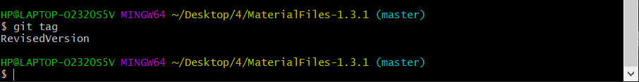

# 软件工程试验报告：项目协同开发管理与工具集成实验环境
高明晨 181840064
## git的基本操作

使用指令

    git status

可以查看当前的文件状态，是否有新的修改

---
在项目开发的过程中，使用指令

    git add .
    git commit -m "commit message"

来进行代码的提交修改

---
而查看所有的commit历史记录，则可以使用指令

    git log

---

当目前版本出现问题，需要回退到某个版本，使用指令

    git reset --hard [commit id]

来进行代码的回退

---
此外，通过指令

    git branch [branch name]

可以创建新的分支

通过指令
    
    git branch

可以查看当前所有分支

通过指令

    git checkout [branchname]

可以切换分支

## 实验三开发
针对实验三的开发过程，使用git进行开发管理。

对每个子任务都新建一个branch，每个任务都需要合理的commit提交，最后通过git merge进行分支合并到master上。具体开发过程中的提交、分支信息这里略去，可以通过git log进行历史查询。

---

git merge结果如下：

可见没有合并冲突，不需要额外处理

---

git log --graph结果如下：

---

最后使用

    git tag [tag name]

给最后的版本打上标签，标签展示如下

## 问题与感悟

### Q:使用git的好处
使用git可以便捷的进行代码的管理与版本控制。例如，当完成某一部分任务时，可以使用git commit命令进行保存和提交；当前版本出错是，可以使用git revert进行版本地快速回退；而git branch和git merge则可以进行代码多人的开发合作，也可以进行一些尝试探索

### Q:使用远程仓库的好处
使用远程仓库，可以为代码提供异地容灾备份，防止一些因为软硬件意外造成的代码损失。同时，使用远程仓库，也可以实现多设备开发，随时随地将代码拷贝到任意一台机器中进行开发，而无需进行端到端的代码传输。

### Q:在开发中使用分支的好处
使用分支，可以将目前不稳定和正在开发的版本和稳定的版本隔离开，再不影响主版本正常运行的前提下，进行代码的进一步开发。即使是开发失败，造成了无法挽回的结果，也因为与主分支隔离而不会影响正常运行的版本。此外，使用分支还可以使得多个开发者各使用一个分支，分别进行开发，最后再进行项目的合并，合并到主分支，完成代码的多人协作开发。

### Q:实际开发中的体会和经验
要善于使用git的各项功能。要在合理的地方进行commit保存，一般是已经稳定调试好某个功能的代码点。而在下一步探索尝试失败时，及时通过revert功能进行快速回退到某个存档点，可以避免一步步的撤销。总之，要善于使用git的各种功能，这样可以使得开发过程更加便利。
