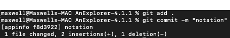
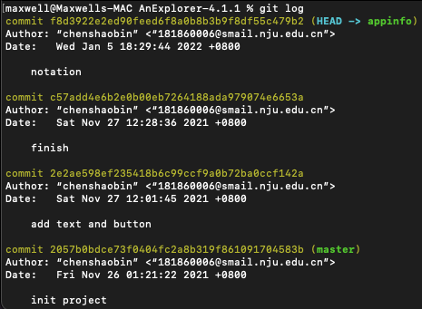
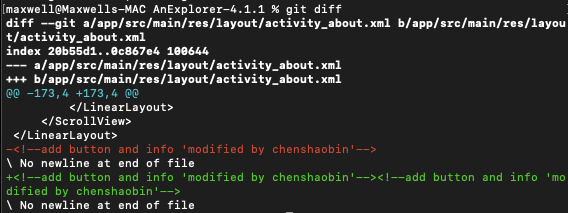
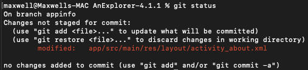
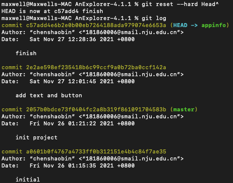
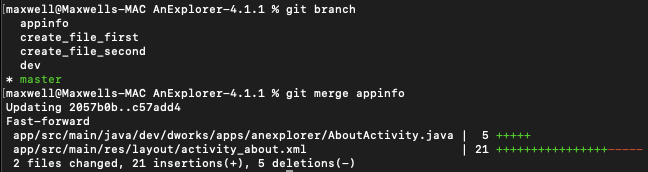
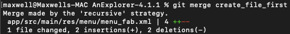
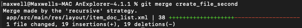
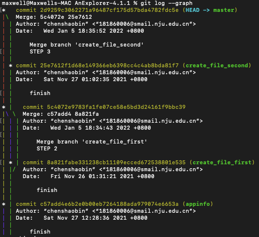

# 软件工程实验6

## 181860006 陈劭彬

### 一、git本地修改，提交，回退

##### 1、本地修改和提交
（1）在本地修改完成后，使用下图所示命令，来进行内容的添加：

（2）添加完成后，使用git log来查看所有的commit记录：
 

##### 2. 本地回退和查看
（1）首先继续在上述commit的基础上再次进行修改后，使用git diff和git status命令可以查看到修改的内容：

（2）之后尝试将当前的本地代码版本回退到上次commit的再上一个版本，即如1中所示的finish记录处。使用git reset命令来完成，使用git log命令来查看：

    可以看到，本地代码版本已经回退到了finish所在的版本，原来的HEAD指针指向notation，现在HEAD指针指向finish。
    
### 二、git分支合并
（1）实验三中，共创建3个分支来完成不同的任务，首先切换到master分支，使用git merge命令，分别合并3个分支：

（2）合并后，使用git log --graph命令进行查看：

### 三、git添加标签

（1）使用git tag命令，在合并后的主分支处做标签v1.0

### 四 其他问题

##### 1、使用git的好处
（1）适合分布式开发，可以git clone来克隆一个本地版本，然后在本地进行操作，在本地可以完成一个完整的版本控制。
（2）git分支十分灵活，分支之间可以任意切换。都可以在本地进行操作可以不同步到远程。
（3）任意两个开发者之间可以很容易的解决冲突，可以先pull远程到本地，在本地合并分支，解决好冲突，再push到远程。
（4）允许离线工作，可以在本地完成开发，等联网后再提交、合并等操作。

##### 2 使用远程仓库的好处
（1）便于进行开发工作备份。
（2）便于进行协作、分布式开发。
（3）便于进行广泛的交流。

##### 3 在开发中使用分支的好处
（1）确保每个人有自己的独立分支而不是全部在master分支上开发。如果所有开发者全部在master分支上开发，需要面临大量的冲突解决，导致开发效率低下。
（2）防止对稳定版本代码的污染，影响到正常的版本迭代。
