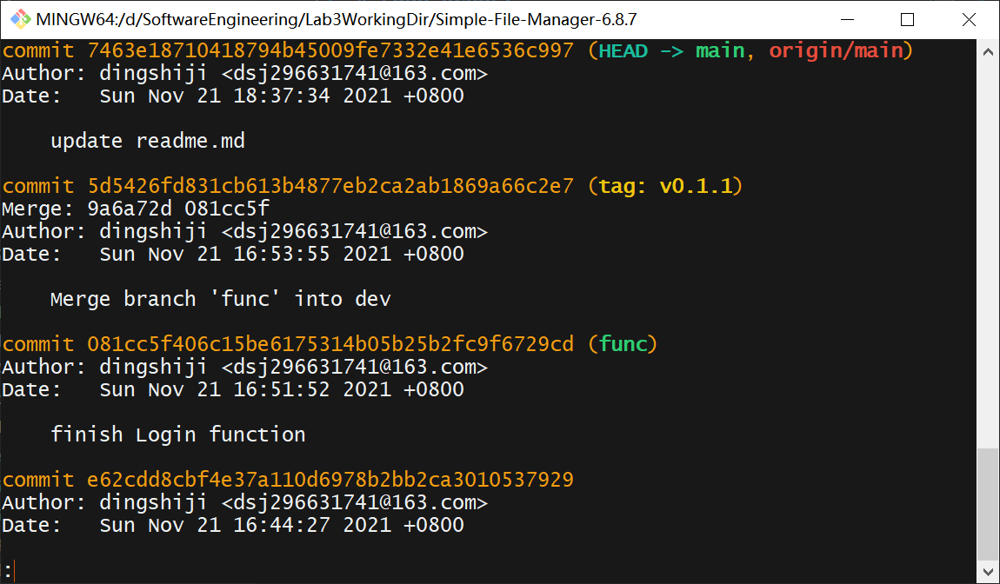
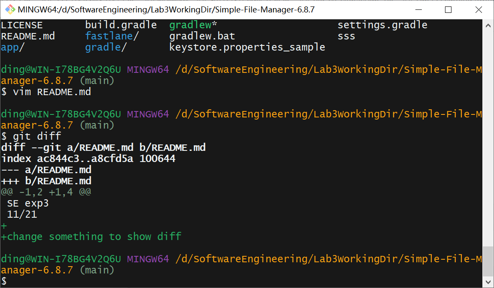
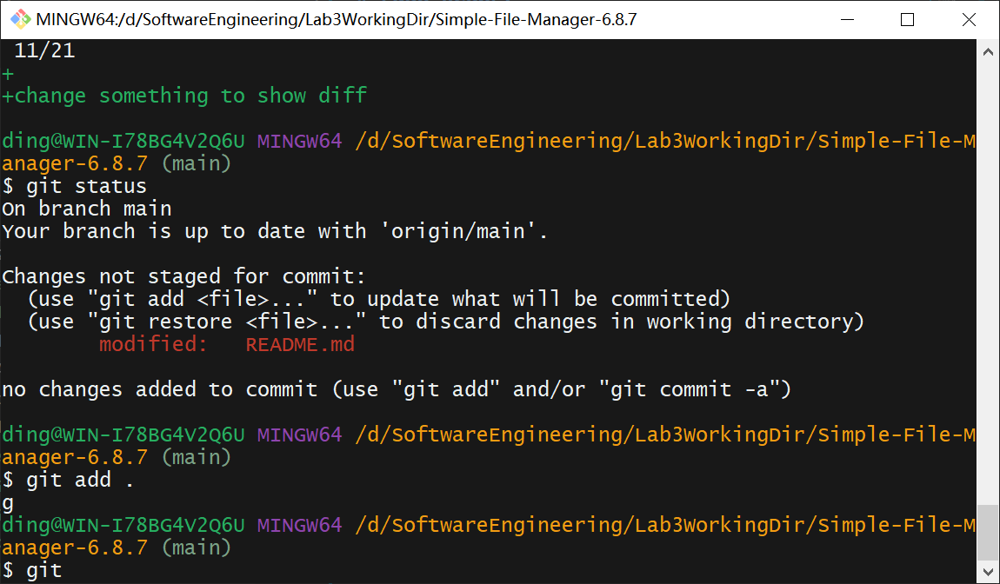
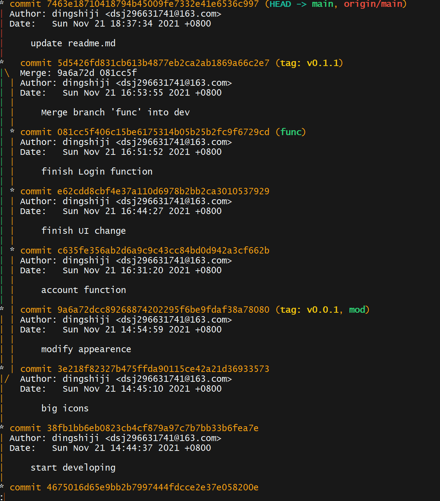
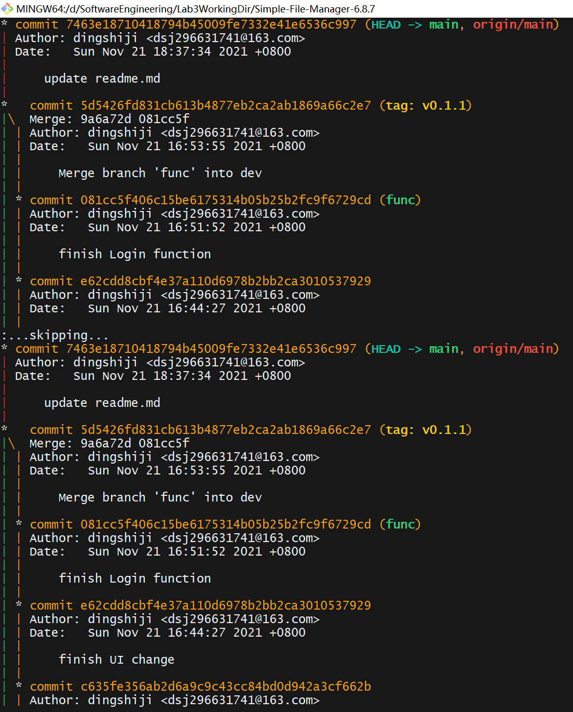

# Lab6 Report 
181860014 丁世纪

## git基础操作

1.  修改, 提交, 回退的过程. 用diff, log, status 展示区别
    1.  git log 此处已完成, 最后几个log是合并分支
    2.  git diff 显示修改后, 未被git追踪的文件
    3.  git status 显示git的状态. 这里图片中更改后未add. 如果add, commit, 则会显示on Branch XXX, working tree clean. 
2.  为每个任务创建一个分支并合并到main上. 用git log --graph展示分支合并图

## 回答问题

1.  使用git的好处?
    1.  容易从错误中恢复. 当一个修改使得程序出现严重bug时, 使用git可以撤销更改, 回到稳定版本.
    2.  版本控制. 不会因为需要保留两个版本而复制完整的工程.
2.  使用远程仓库的好处?
    1.  备份. 避免因本地磁盘故障丢失开发进度.
    2.  易于分享. 只要fork一下就可以得到别人的代码.
3.  开发中使用分支的好处?
    1.  多人合作. 多人并行开发, 然后可以合并代码. 
    2.  每个人的代码在分支上开发, 合并到主分支时自动测试, 尽快发现bug.
4.  实际开发中有哪些体会和经验?
    1.  以前不使用git时, 每当出现严重bug, 尝试手动复制备份回退版本时, 往往出现更多问题. 由于ide的帮助, 某些地方更新的代码并不是我自己完成的, 导致手动回退时没有修改. 产生更多报错. 而git可以完美解决这个问题

## 进阶操作
1.  merge和rebase区别?
    1.  merge后, 提交记录会保留. 提交树仍然是一棵有分叉的树
    2.  rebase之后, 合并的提交记录变成了一条线. 
    3.  pull默认是fetch+merge. --rebase参数可以改成rebase.
2.  reset和revert的区别
    1.  reset时, HEAD回到之前的commit, 就像新的commit没有发生过
    2.  revert则是复制要恢复的commit, 让HEAD移动到这个要恢复的commit.
    3.  因为reset恢复到了之前的commit, 远程仓库可能提示你落后了. revert不会.
3.  cherry-pick的使用
    1.  cherry-pick 可以让你选择性的合并某个分支的某几次提交. 通过hashID来指定合并哪些commit