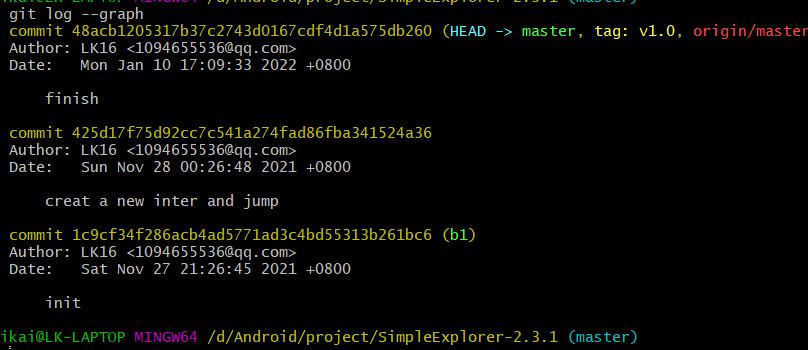

### git 操作

git log



git tag

在项目结束后打了一个tag 

``` 
git tag v1.0
```

因为是修改在统一个分支上进行的，所以创建分支的时候创建了b1分支，后面直接merge后没有产生新的提交，

```
git checkout -b b1//创建了分支
git merge b1//在master下合并了b1分支
```

使用git的好处是可以方便代码管理，因为大型项目代码熟练过多，版本修改什么的靠人工完成不现实，费时费力，也不能保证准确性。而且代码出错了之后可以回退到之前的版本。

使用github的好处是可以和多人共同开发一个项目，修改之后push了参与项目的人同事都能看到这个修改，不用自己在手动的和项目中其他人说。

分支的好处是可以给自己一个尝试的机会吧，就开发的时候不一定确保自己的工作是正确的，所以新建一个分支来尝试，如果最后确保没有问题之后再合并到主分支上。还有将自己和他人的工作分开，互不干扰。

