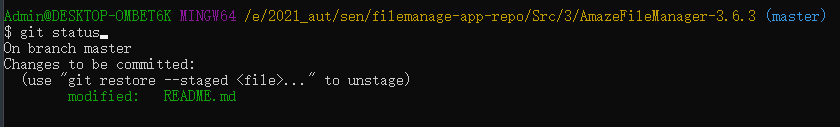
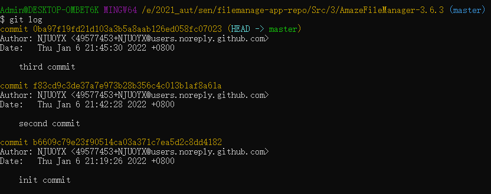
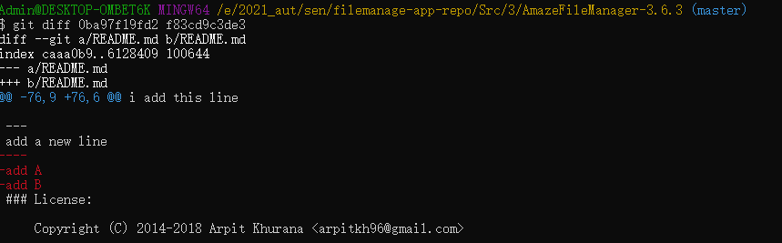
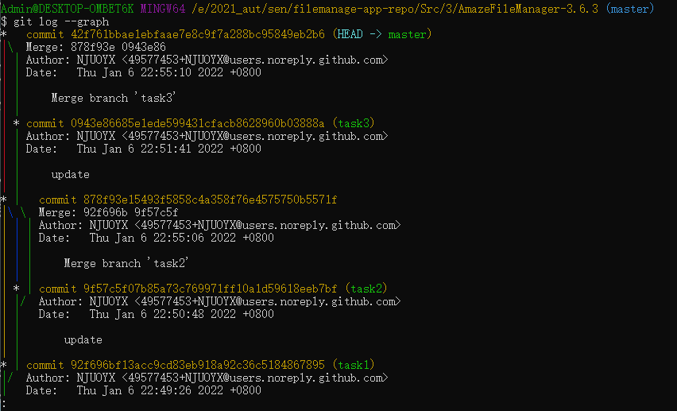

# lab6 实验报告

## **git** 的基本操作
在本地进行了对文件的几次修改，每次修改后都进行了```git add```与```git commit```操作，结果如下所示。

* 这是在进行了```git add```操作后，还未进行提交时的状态：


* 这是在进行了几次```git commit```操作之后的状态：



## **git** 的分支操作

在```master```目录的基础上分别创建```task1```,```task2```,```task3```三个分支，分别在三个分支上进行修改与提交，最终在```master```分支上依次合并三个分支，最终结果如下：



## 使用```git```的好处
软件开发过程中可能遇到需要撤销一部分修改的情况，在这种情况下，如果没有版本控制系统的帮助，人工回退版本会变得非常困难而且无法保证正确性，这个时候，```git```管理下的开发过程能够对开发过程中的修改进行记录，能够进行高效的版本切换，因此能有效解决上述问题。


## 使用远程仓库的好处
远程仓库的好处在于，它实现了软件开发的团队协作。现代软件开发已经是一个人难以解决的问题，团队成员的高效协作是保证软件开发效率和质量的关键。使用远程仓库，团队中的开发者都能从远程仓库中clone一个副本到本地，各个成员在各自本地仓库副本上的开发互不干扰，保障了各自开发的独立性；远程仓库接受来自各个开发者的pull-request实现远程仓库的更新，而各个开发者的本地仓库也能迅速pull到远程仓库的更新，因此保证了协作开发的高效性。

## 在开发中使用分支的好处
* 软件开发是一个不断完善的过程，开发过程中，必须对软件进行不断地debug和修改，而要实现这一点，就得在一个软件项目的不同副本上进行修改，然后筛选合并到一起。这个工作也是人工难以有效完成的，而```git```的分支、标签管理系统能够有效地管理软件开发过程中的这些活动，提高软件开发的效率和灵活性。
* 在实际的开发过程中，我会在尝试添加软件的新特性的时候创建一个debug分支，从而可以在不干扰主分支中的良好代码的情况下，随意进行开发工作，而一旦在该分支上的开发完成，同时debug也完成了，就能在这个分支上创建一个feature分支，标志着软件的一个新特性，可以在需要的情况下合并到主分支里。这样的开发方式相当高效，尤其是确保了在开发过程中不会向原来开发好的代码里引入bug，同时使得开发过程更加灵活。
