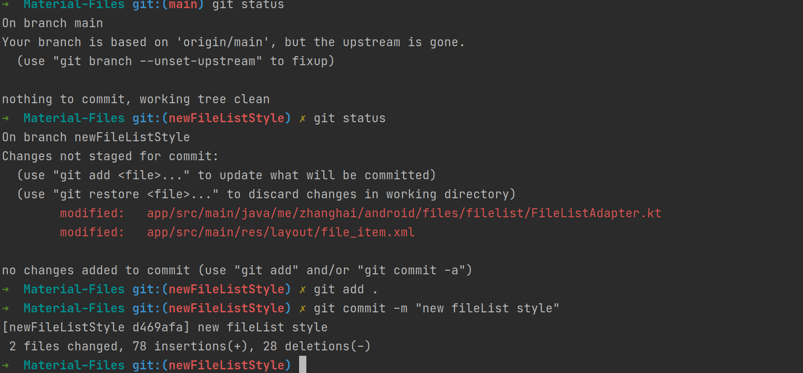
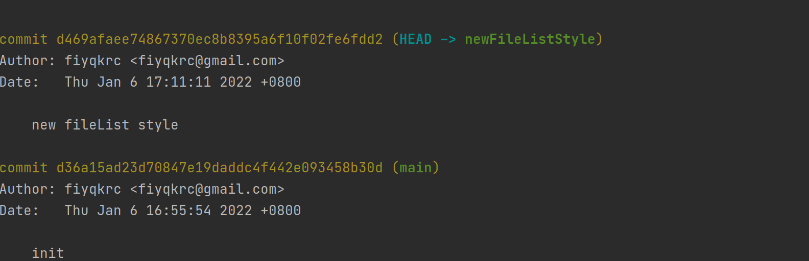
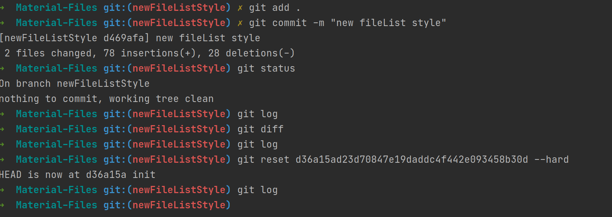
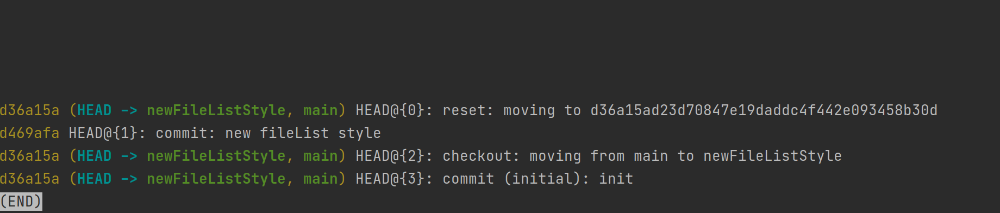
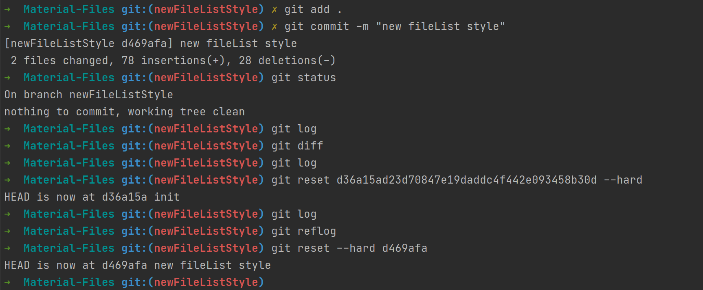
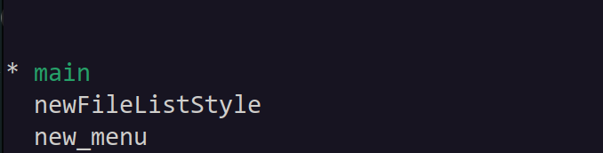
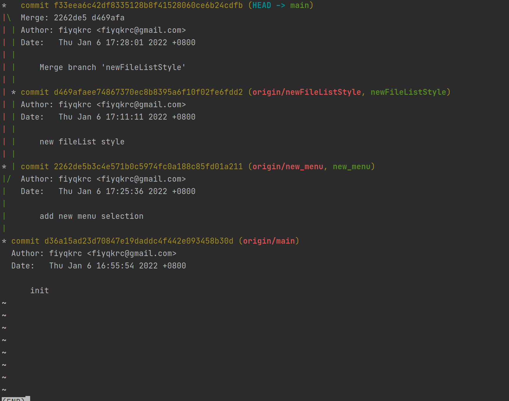
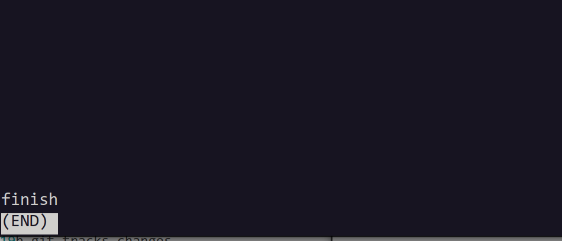

# 软件工程实验六: 项目协同开发管理与工具集成环境实验

## 实验目的

- 了解协同开发与持续集成过程

- 学会使用项目协同开发管理工具 git/github 

- 了解持续集成并使用 jenkins 自动构建项目

## 实验内容

### 修改、提交、回退项目

1. 提交项目
2. 使用`git log`查询历史提交记录
3. `git reset`回退历史版本
4. 使用`git reflog`向后查询版本并回退
4. 回到回退之前的历史版本

  ### 针对实验三几个页面进行微调的任务，在本地为每个子任务创建一个分支并在各分支上进行开发

  #### 创建两个额外分支分别表示主界面和菜单项的调整：

  

  #### 将两个子分支合并到main分支上，使用`git log --graph`查看：  

### 为稳定版本打上标签

`git tag finish`将当前版本标注为finish

`git tag`查看标签：

`git push --tags`:推送标签到远程仓库中

## 思考题

1. 使用git的好处？

   git为开发者提供了软件版本管理的功能，开发者在不同的版本之间随时切换；

   提供代码合并，查看版本差异，分支创建管理等功能，利于团队合作；

2. 使用远程仓库的好处？

   将项目代码托管在远程，利于项目代码在成员之间的分发和同步；

   远程仓库搭配git等版本控制工具，有利于成员之间代码的合并工作；

   防止本地故障导致的项目代码丢失；

3. 在开发中使用分支的好处？你在实际开发中有哪些体会和经验？

​		将项目中不同功能添加分成多个分支由不同开发人员参与，可以减少开发人员与主分支同步的频率，减少不同开发人员间同时修改相同部分代码带来的互相干扰；在功能开发完成后由专业人员审核代码并同步至主分支，可以提高对代码质量、仓库结构的管理，减少因程序员经验不足带来巨大损失的概率。
