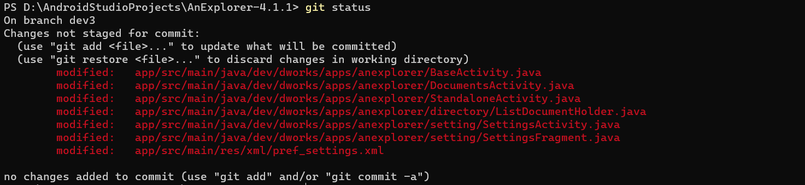
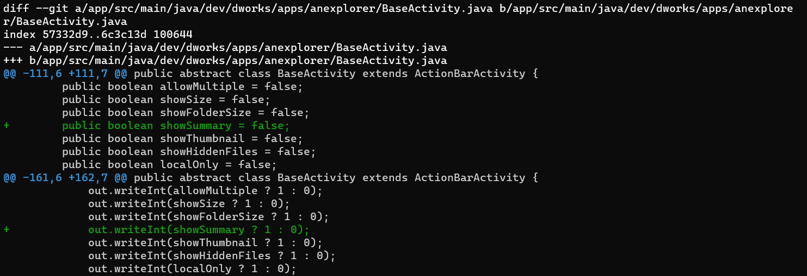
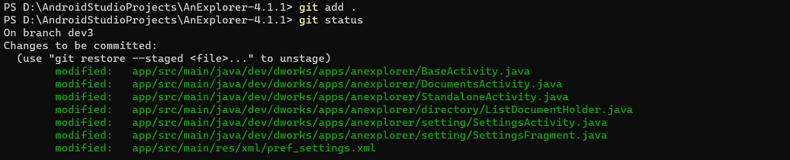
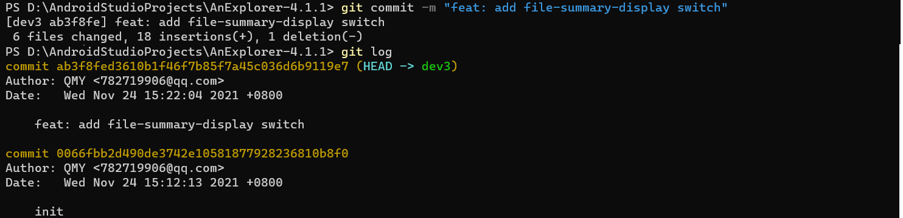
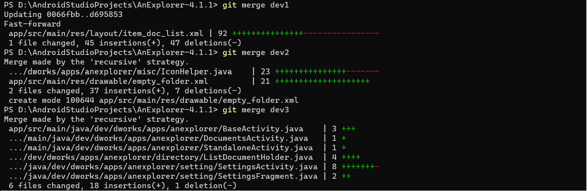
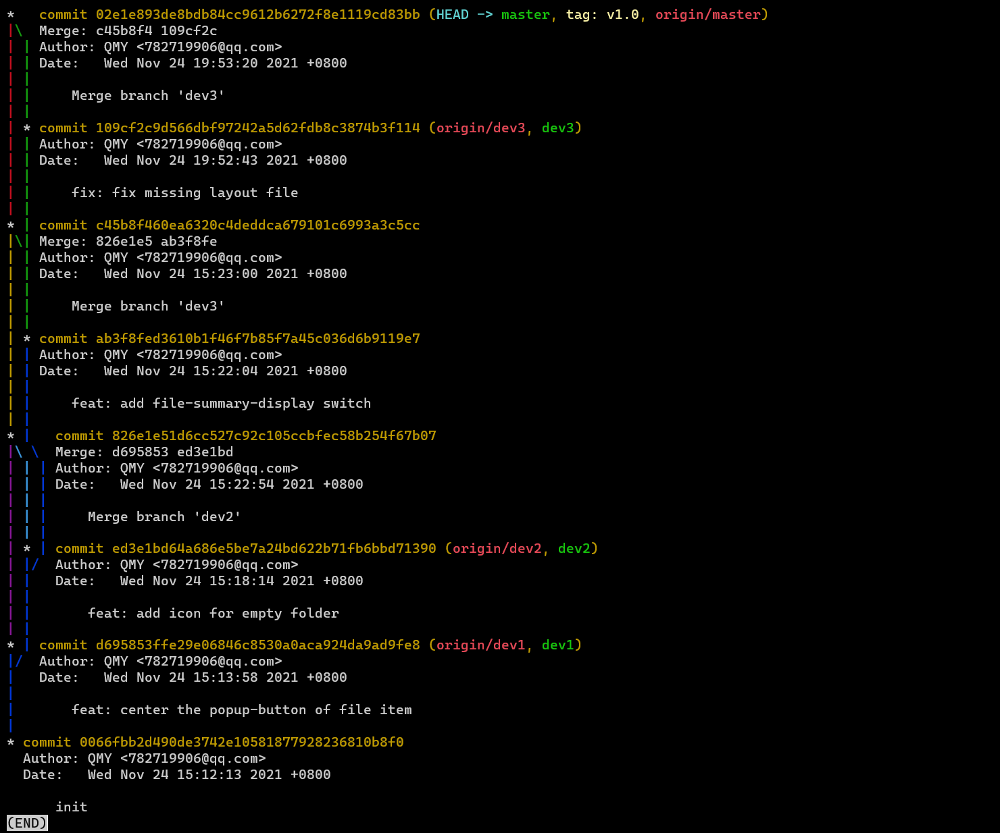

# 实验六 项目协同开发管理与工具集成环境实验

### Git 操作

+ 修改后查看差异

  > \>   git status 

  
  
  > \>   git diff
  
  

+ 添加到暂存区

  > \>   git add

  

+ 提交

  > \>   git commit -m \<message\>

  

+ 分支

  > \>   git checkout -b dev1
  > \>   git checkout -b dev2
  > \>   git checkout -b dev3
  > \>   git merge dev1
  > \>   git merge dev2
  > \>   git merge dev3
  
  

+ 分支合并图与标签

  

### 问题

+ 使用 git 的好处

  利于进行版本控制，可以便捷地回到/查看之前的提交，并清晰地了解当前已完成哪些修改

+ 使用远程仓库的好处

  利于进行协同开发，通过提交到远程仓库以完成团队成员代码的合并

  提高了存储可靠性，在本地仓库丢失的情况下可以从远程重新拉取

+ 在开发中使用分支的好处

  分支之间互相隔绝，在某一分支上的失败不会影响其他分支，减少了提交时冲突的频率，提升了开发效率
