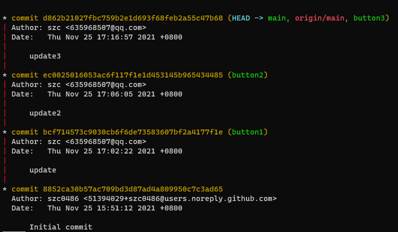

#lab6 report
181860081 宋子辰
## 实验截图
* git log

* git diff

* git status

* 创建分支、合并

## 回答问题
1. 使用 git 的好处？
方便撤销更改，管理版本等。
可以轻松记录代码更新时间等信息

2. 使用远程仓库 (如 github/gitee 等) 的好处？
可作为本地代码的保存备份，避免本地故障而丢失代码。
易于分享和多人协同开发。

3. 在开发中使用分支的好处？你在实际开发中有哪些体会和经验？
写比较独立的不同需求时，也可将代码独立编写并测试，避免大脑混乱
多人协同时，可以开发不同分支，提升效率。

## 进阶操作
1. merge 和 rebase 的区别
merge是与目标分支合并，而rebase是将自身修改移到目标分支上

