# 软件工程 Lab6 Report

## 项目协同开发管理与工具集成环境实验

### 姓名：田晓滨

### 学号：181860089

### 实验内容(git的使用)：

#### 版本控制：

**1.修改文件后示例：**

在additem1分支中更改了文件信息(未提交)

使用git diff：

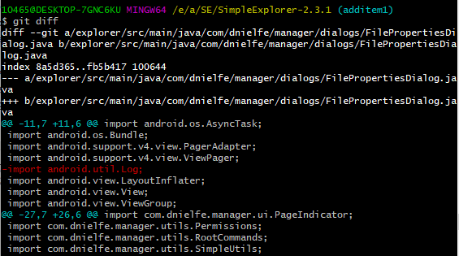

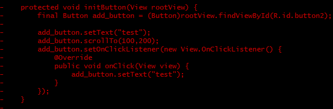

可以看得出删减的代码会通过标红显示，添加的代码会通过标绿显示，直观方便看出修改。

使用git log：

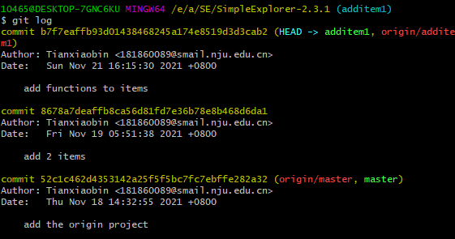

可以看到该分支从一开始创建(包括复制的原始分支)到目前为止commit的内容，由于此次的修改未提交，所以还没信息。

使用git status：

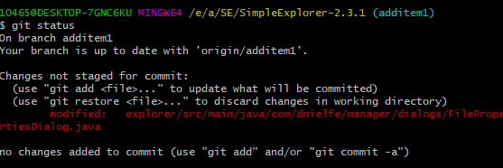

可以看到修改的文件信息，并且提示改变还没到暂存区。

**2.提交文件示例：**

先只是git add .

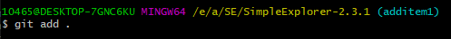

使用git diff：

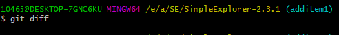

为空，可以看得出将工作区内容提交到暂存区后二者就没有区别了，为空。

使用git log：

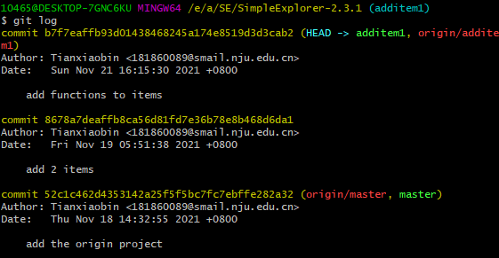

可以看的出还没有新的commit，因为只是存到了暂存区。

使用git status：

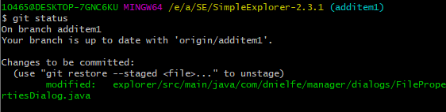

可以看的出此时也可以看到修改的文件信息，但是此时已到暂存区。

接着使用git commit

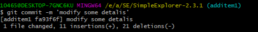

使用git diff：

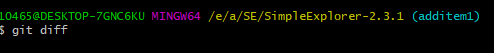

因为与暂存区一致，所以依然为空。

使用git log：

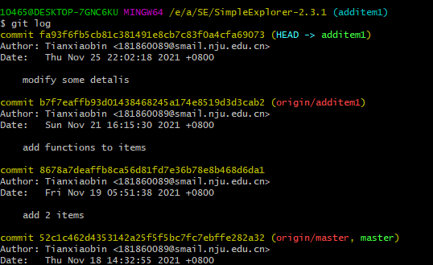

可以看得出多了刚刚的commit内容。

使用git status

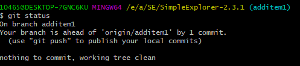

可以看得出提交后，没有修改文件。

**3.回退示例：**

根据网上的资料可以了解到：

hard模式下：HEAD改变，工作区与暂存区都改变到HEAD指向的commit处版本。

soft模式下：HEAD改变，工作区与暂存区保持之前HEAD指向的commit处版本。

mixed模式下：HEAD改变，工作区不变，暂存区改变到HEAD指向的commit处版本。

使用hard模式：

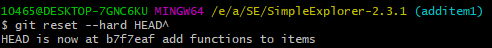

可以看得出HEAD改变了，回退到最近一次commit之前一次commit情况。

使用git diff：

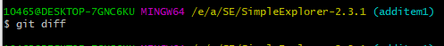

为空，因为使用的是hard模式，会重置暂存区与工作区到HEAD的新位置相同的内容。

使用git log：

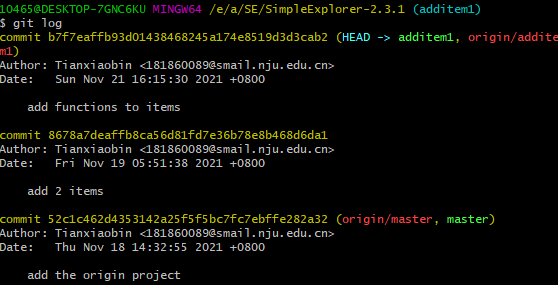

可以看得出之前最新一次的commit没有了，因为reset操作，让HEAD回退到了之前一次的commit。

使用git status：

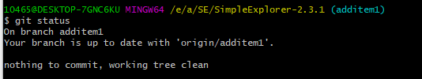

可以看得出因为是hard模式，所以工作区与暂存区都变为当前HEAD指向的commit处的情况，因此没有要提交的内容。

使用soft模式：

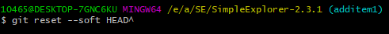

使用git diff：

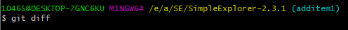

可以看得出暂存区与工作区一致，没有改变。

使用git log：

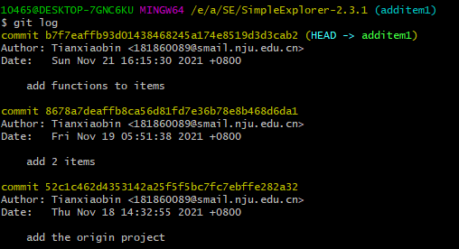

可以看得出之前最新一次的commit没有了，因为reset操作，让HEAD回退到了之前一次的commit。

使用git status：

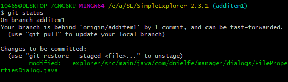

可以看得出由于HEAD的改变，而工作区与暂存区没改变，保持之前HEAD指向的commit的情况，所以这时相当于暂存区的内容还没被commit。

使用mixed模式：

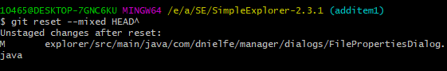

使用git diff：

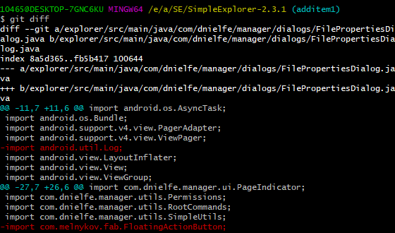

可以看得出此时工作区与暂存区出现差异，工作区保持之前HEAD指向的commit的情况，而暂存区到达现在HEAD指向的commit的情况。

使用git log：

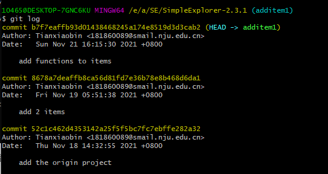

可以看得出之前最新一次的commit没有了，因为reset操作，让HEAD回退到了之前一次的commit。

使用git status：

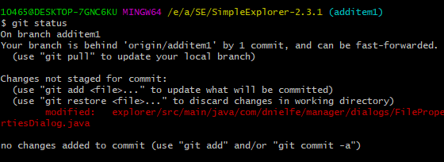

与上述分析一致，工作区与暂存区出现差异，工作区保持之前HEAD指向的commit的情况，而暂存区到达现在HEAD指向的commit的情况，于是有未被存储暂存区的文件信息显示。

此时如果要再回到该commit之后一次最新commit的情况，那么可以使用git reflog操作查看commit id。

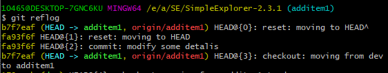

可以看得到最新一次commit对应id为fa93f6f，于是可以通过git reset操作回退到它

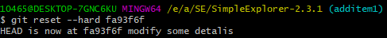

使用git diff：

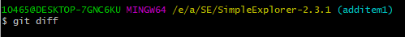

为空，因为使用的是hard模式，会重置暂存区与工作区到HEAD的新位置相同的内容。

使用git log：

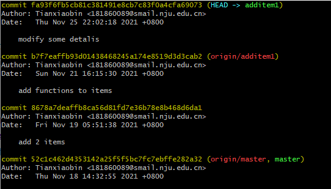

可以看得出此时最新的commit回来了

使用git status：

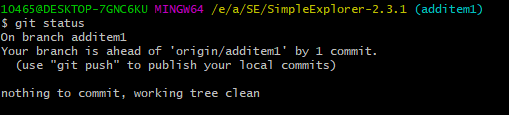

可以看得出因为是hard模式，所以工作区与暂存区都变为当前HEAD指向的commit处的情况，因此没有要提交的内容。

**4.提交远程仓库示例：**

在一开始远程没有当前分支时，需要进行与远程仓库进行关联：

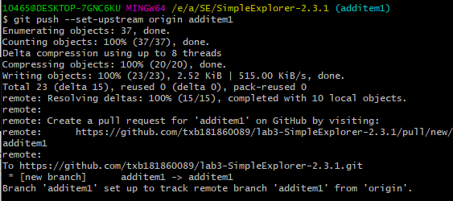

后面就可以直接git push

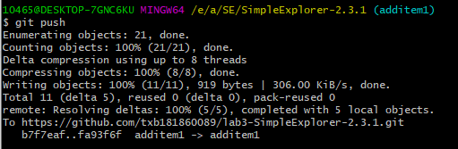

使用git status：

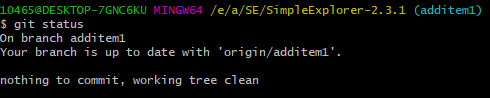

此时不再提醒git push。

**5.打标签示例：**

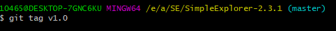

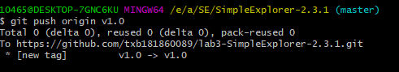

#### 分支管理：

**1.更换分支示例：**

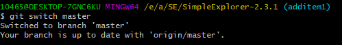

使用git diff：

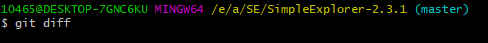

为空，可以看得出更换分支后工作区与暂存区一致。

使用git status：

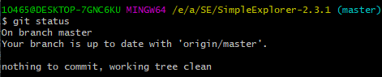

可以看得出更换分支后没有要提交的内容。

使用git log：

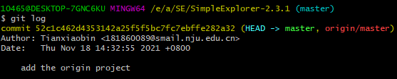

可以看的出变为当前分支的commit情况。

**2.创建分支示例：**

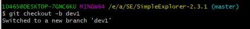

使用git diff：

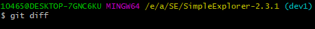

可以看得出创建分支后，新分支工作区与暂存区保持一致。

使用git status：

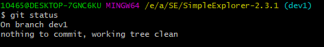

可以看得出创建分支后，新分支没有内容要提交。

使用git log：

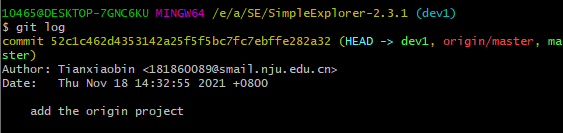

可以看得出新分支刚创建时与原分支的commit情况一致。

与上述一样使用git checkout-b操作创建了三个任务分支，分别为

修改控件任务modified1：

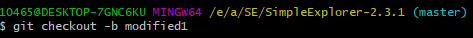

添加控件任务additem1：

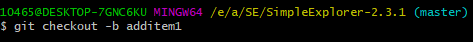

添加界面任务addinterface1：

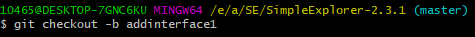

使用git branch -a查看所有分支。

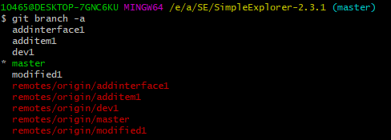

可以看到本地与远程的分支都被列出。

**3.合并分支：**

将第一个任务分支modified1合并到dev1分支：

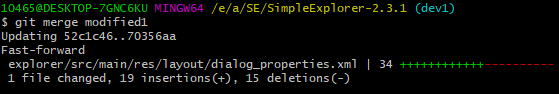

可以看得出是直接进行更新，应该是因为dev1分支为modifed1分支上的子线。

使用git log --graph：

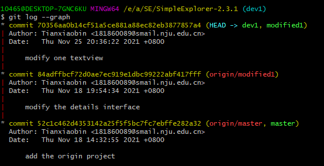

可以看得出此时分支线路与modified1的一致，只是是在dev1分支上。

将第二个任务分支additem1合并到dev1分支：

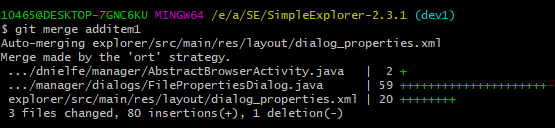

可以看得出此时出现了合并文件信息。

使用git log --graph：

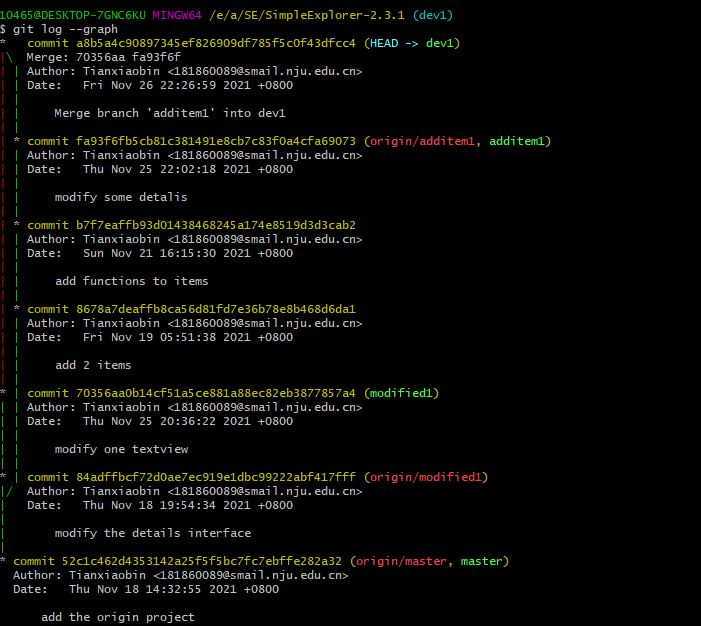

可以看的出两条线路在第一次commit后就开始各自进行commit，然后在这次merge中进行了汇合。

将第三个任务分支addinterface1合并到dev1分支：

可以看到出现冲突CONFLICT需要解决。

使用vscode打开相应文件，可以看到冲突的地方：

点击Compare Changes可以看到更直观的区别：

由于需要的是左边的情况，即Current Changes，所以回到原文件，点击Accept Current Change，于是解决冲突，文件内容更新如下。

其他的位置解决冲突的方法与上面一样，都是找到不一致的地方根据相应需要选择改变，不再赘述，在使用上述方法更改完全部冲突后：

使用git dff：

可以看得出刚刚的修改让工作区与暂存区出现不同。

使用git status：

可以看到修改文件信息。

使用git log：

可以看得出此次merge还未成功。

使用git add.：

使用git status：

可以看到此时除了告诉修改文件信息，还提示此时所有conflicts被解决，可以使用git commit进行结束此次merge。

使用git commit：

可以看得出merge状态结束，merge成功。

使用git diff：

为空，因为此时工作区与暂存区依然保持一致。

使用git status：

没有要提交的内容，因为刚刚已经commit。

使用git log：

比起之前多了一次刚刚merge的commit。

使用git log --graph：

可以看得出三条线路都是一开始从同一个点出发，然后各自commit。dev1线路先更新到与modified1一致的线路，接着与additem1线路先合并，然后再与addinterface1线路合并。

然后切换到master分支，使用git merge将dev1分支合并。

可以看得出时直接更新，应该是因为master分支为dev1分支上的子线。

使用git log

可以看得出与dev1的情况一致，只是此时在master分支上。

### 问答题

#### 使用git的好处：

1.可以进行版本管理，有版本库，每次完成代码可以通过commit到版本库进行一次记录。后面想要到相应版本只要查询相应commit的id即可回退到相应代码版本，即可以灵活控制代码版本。同时也可以对版本之间进行差异查询等操作，方便获得版本信息。

2.可以支持分支开发，在不同分支上根据不同任务独立开发，可以不受其他任务影响，提高开发效率，同时分支之间也可以进行快速灵活的切换。

3.版本库属于本地，离线工作，于是可以让每个开发者在自己的版本库上进行任意操作而不影响他人，方便协作开发。

4.根据查询资料可知，比起其他版本控制系统，像是SVN，git更快，更灵活。

#### 使用远程仓库的好处：

1.可以管理各种git库，当本地出现故障时，可以有效备份数据。

2.可以方便的基于一个已经存在的项目创建新的项目，可以在远程仓库中找到项目并派生该项目，然后进行修改。

3.方便协作开发，提高效率，每个开发者可以在fork了一个项目后分别独立进行开发，然后通过pull requests来让原始开发者来选择是否接受其到正式项目。

4.可以追踪push到存储库的所有修改，方便多人协作开发时追踪错误。

5.提供可视化的网页界面，方便操作。

#### 使用分支的好处：

1.可以在不同分支上根据不同任务进行并行的功能开发，不受其他任务影响，提高效率。

2.每个开发者有自己的独立分支，分别开发，等到最后开发完成，没有问题才并到主分支，保证主分支上代码的稳定性与完整性，规范化开发流程，有效保证项目的质量，提高对项目的管理效率。

3.可以有效进行版本的控制与开发，当要同时进行不同版本的开发时，就可以进行分支操作，在不同分支上进行不同开发。

#### 实际开发的体会和经验：

1.使用分支开发不同任务时，可以每次回到原始项目开始各自功能的开发，不用受到之前任务的影响，只用考虑当前任务的需求，提升了自己的开发效率。

2.在有冲突时，可以通过编辑器方便的查看差异处，根据自己的需要方便的选择相应代码解决。

3.可以创建分支预先进行各种操作，等到版本稳定了才合并到master分支，保证了项目的开发质量。

### 额外学习：

**git reset和git revert的区别：**

git reset是回到相应的commit id，将相应的commit id以后的所有提交都删除，而且没有产生新的commit。

而git revert是将相应commit id进行的操作进行反做，撤销它的操作，然后再产生一个commit，不会对其他commit产生影响。

git revert示例：

先看现有的commit

然后对modify some mistakes这个commit进行revert。

可以看到build.gradle被修改(那次commit中改变的文件)，但是其他文件没有被更改。

进行git log：

可以看到之前的commit都没变，但是多了个revert的commit。

**git stash：**

可以将原本修改的内容(未提交的修改)保存到堆栈中，方便后面恢复当前的工作。

示例：

修改了某文件：

进行stash操作：

可以看到相应内容被保存，此时便清空了修改如下：

要是想恢复修改，可以通过git stash pop操作弹出修改如下：

此时查看状态与不同：

可以看到修改恢复。

git stash其他常用命令：

git stash list：查看stash进行的存储情况：

git stash show：查看stash修改的情况(默认第一个修改)

git stash drop：删除stash的存储(默认删除第一个修改)

**git cherry-pick：**

可以将一个分支的某次提交的修改进行获取，然后进行新的commit。用于不想与另一个分支全部合并，只是想获取其某次commit的修改。

示例：

先看到additem1分支中commit id为8678a7deaffb8ca56d81fd7e36b78e8b468d6da1的提交进行了2个控件相关的代码添加：

而additem1分支与test1分支的差别如下：

在test1分支中对additem1commit id为8678a7deaffb8ca56d81fd7e36b78e8b468d6da1的提交进行cherry-pick：

可以看到只有一个文件被改变，即添加控件的文件，而其他的未变。

