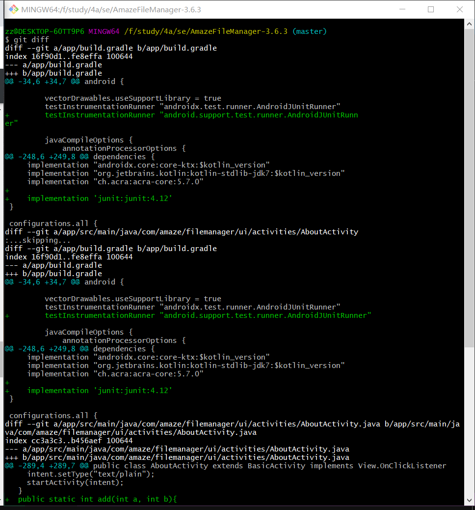
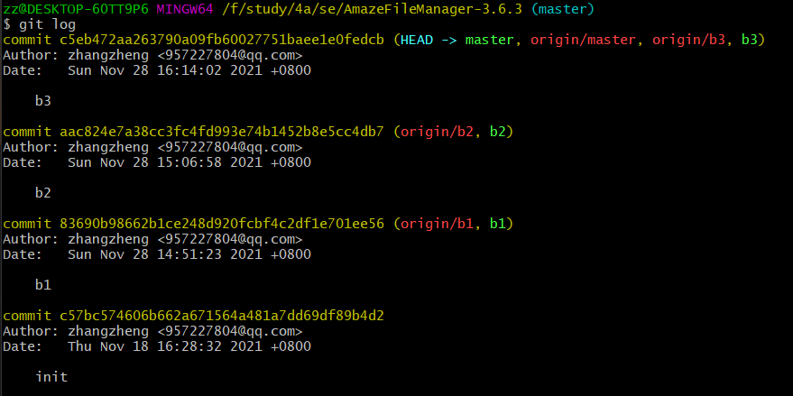
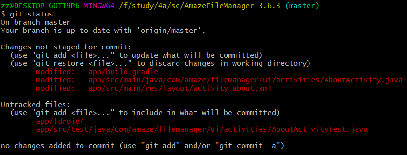
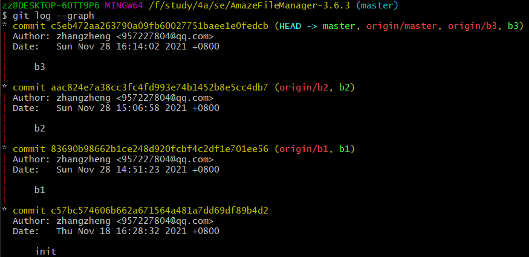

# 软件工程lab6实验报告
## 181860143 张政
## 实验截图
* git diff

* git log

* git status

* git log --graph

## 回答问题
### 使用 git 的好处？
1. 本地拥有版本库，随时进行版本后退
2. 非常简单的建立分支
3. 速度更快，特别是熟悉 git 命令后
4. 指定和若干不同的远端代码仓库进行交互

### 使用远程仓库 (如 github/gitee 等) 的好处？
1. 持续集成和持续交付，远程仓库可以自动化团队的工作流程，按照自己的方式编译、测试、部署代码。
2. 提供安全的开发环境，远程仓库会自动扫描各种威胁，并且通知开发者。
3. 代码 review ，远程仓库提供内置的 review 工具，方便团队的开发。
4. 代码托管，成千上万的代码仓库托管在远程仓库上。
5. 项目管理，在远程仓库上，项目经理和开发人员可以在一处协调、跟踪和更新他们的工作，从而使项目保持透明并按计划进行。
6. 团队管理，远程仓库提供完善成熟的团队管理支持。

### 在开发中使用分支的好处？你在实际开发中有哪些体会和经验？
1. 版本迭代更加清晰。
2. 开发效率提升。
3. 利于代码 review 的实现，从而使整个团队开发更加规范，减少 bug 率。
* 体会和经验：分支开发一开始可能会觉得有些麻烦，但是越到后面越发现它的好处，真正确保每个人都有自己的独立开发分支，不互相影响。

## 进阶操作
### merge 和 rebase 的区别
* merge 的作用是与目标分支合并。
* rebase 是将自身修改移到目标分支上。

