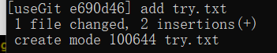
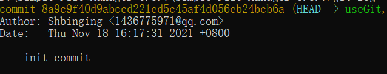
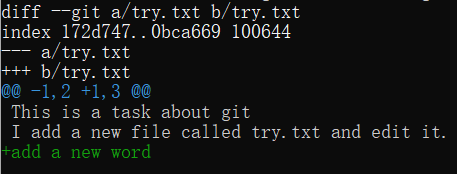

# **实验内容**

## git基础操作

##### 1.将本实验开源仓库初始化为git仓库

```
git init
```

与远程仓库绑定

```
git remote add origin https://github.com/Shbinging/Simple-File-Manager-6.8.7
git push -u origin main
```

##### 2.创建分支开发实验功能

```
git checkout -b useGit
```

##### 3.添加try.txt，并通过 git status查看


##### 4.通过 git add try.txt，再次使用 git status


##### 5.执行git commit -m "add try.txt" 提交try.txt的修改



##### 6.执行git log,发现当前分支的指针头已经指向了最近一次提交


##### 7.使用git reset 可以退回之前的版本



##### 8.修改try.txt,增加一行"add a new word"

运行 git diff try.txt



##### 9.通过git chckout 切换到master分支，然后使用 git merge useGit, 将刚刚分支的结果合并到master 分支


##### 10.使用git tag -a "" -m ""可以给某个版本打上标签，用git show 可以查看标签信息

##### 11.使用 git log --graph --oneline 可以可视化看出各个分支的关系并且缩略显示


上图为实验三的分支关系图

在原来的基础上我首先checkout并新建了一个modify1分支，开发了第一个功能，接着在modify1分支的基础上checkout了modify2分支，开发了第二个功能，一个两个功能联合成一个组合大功能。

我在原来的基础上新建了modify3分支，这个分支的功能和modify1，2 是独立的，所以可以并行开发。开发完后modify1,2,3合并到master分支

master分支测试由发现了两个bug，于是我在新的fixbug分支上修复了bug，最后合并到master分支

并给该版本打上“stable”的标签


##### 12.使用git push推送到远程


用git push --tag 将标签推送到远程

如果有新的分支想要推送到远程，要执行第一步将新分支与远程绑定


# 问题回答：

##### 1.使用git的好处

a.可以方便的进行版本控制，随时进行版本后退

b.与传统的SVN相比，git可以非常简单的建立分支，回退速度更快

c.方便多人协作和开发

d.方便远程开发，是分布式版本控制系统

##### 2.使用远程仓库的好处

a.随时备份，保证数据安全

b.便于单人或多人在不同设备上协作开发

c.方便代码分享和复用，促进开源繁荣

##### 3.开发中使用分支的好处？

a.版本迭代更加清晰

b.便于多人同时开发，互相之间不影响，最后合并时候只要解决冲突就可以

c.利于代码review的实现，从而使整个团队开发更加规范

##### 4.你在实际开发中有哪些体会和经验？

多人开发必须在开发前商量好完整的逻辑、架构，制定统一的接口和规范，再进行开发。

同时要划分好各自的开发范围，防止误修改他人代码。

开发中要加强联系，保证进度。开发中要遵守统一的规划和使用科学的方法，提升代码质量。

在合并之前要进行review，减少bug和错误率。

要进行大量且科学的测试，保证软件质量。

##### 5.其他进阶操作

##### a.merge和rebase的区别

rebase不会保留被merge分支上的所有commit，只讲被merge分支上的最后一次修改作为新的修改merge到当前分支

##### b.reset和revert的区别

reset是回退，将HEAD指针沿着链表指向要回退到的版本，取消该版本后的修改；revert是反做，在HEAD基础新建一个版本，这个版本通过修改当前HEAD版本的信息（逆向），使新的版本与要回退的版本一致，同时commit的这个新的版本，这样原来的版本的链表是不会改变的

##### c.stash

通过stash暂存当前未提交的修改，同时回退到最后一次commit后的版本

##### d.cherry-pick 

将指定的commit应用到其他分支上