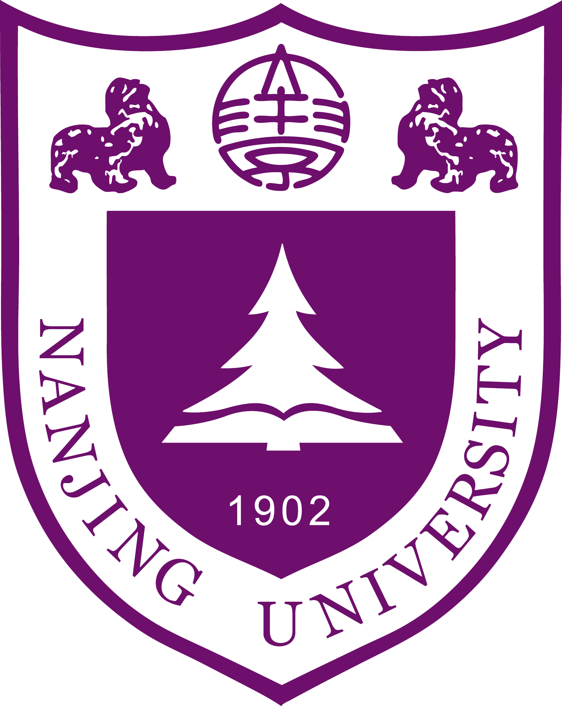
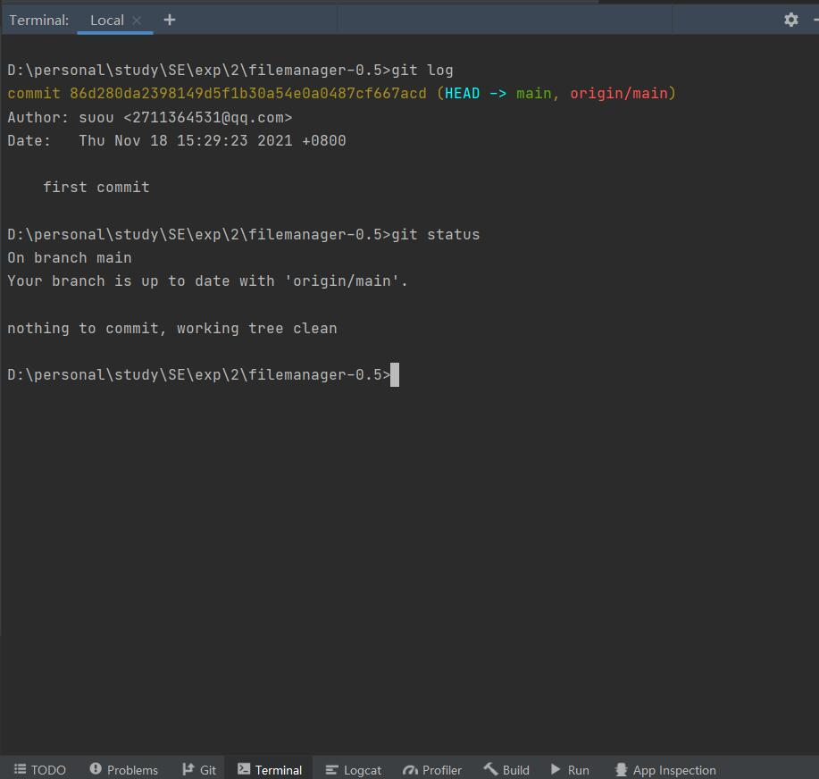
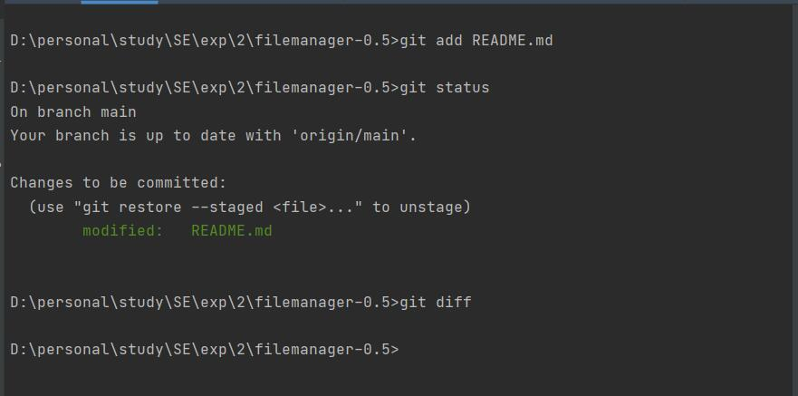
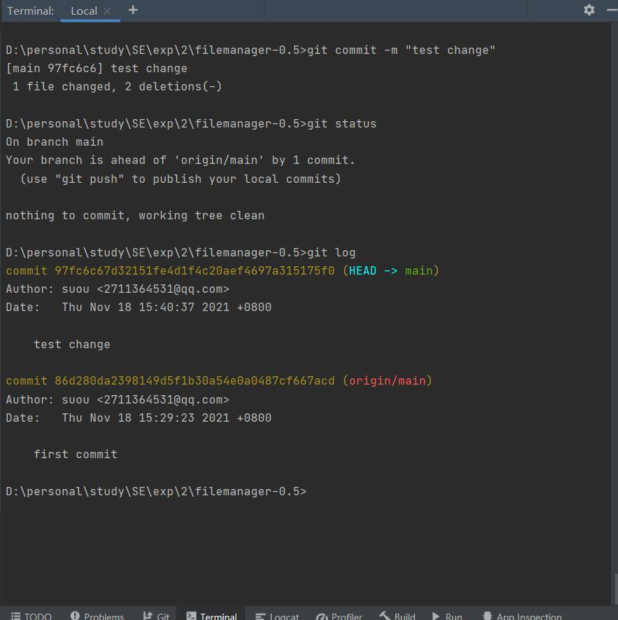
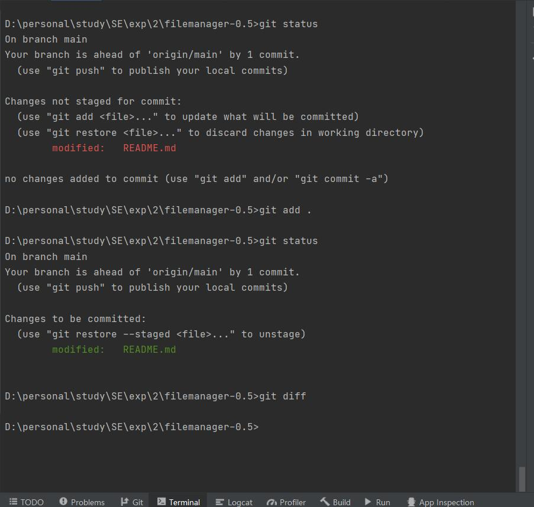
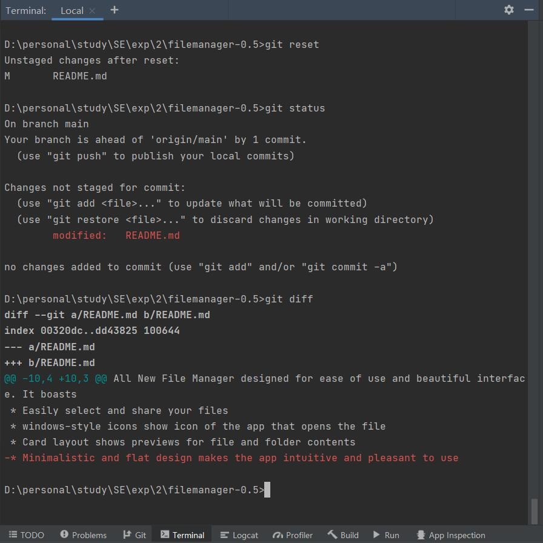
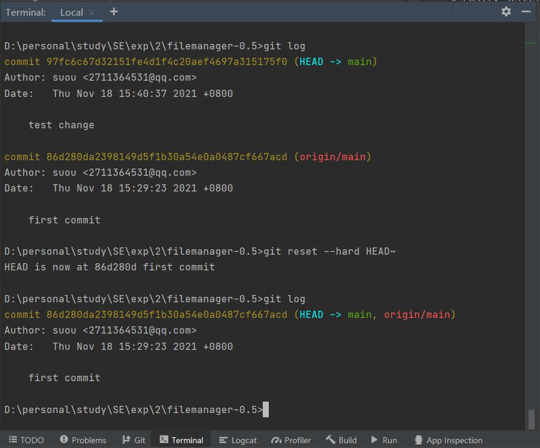
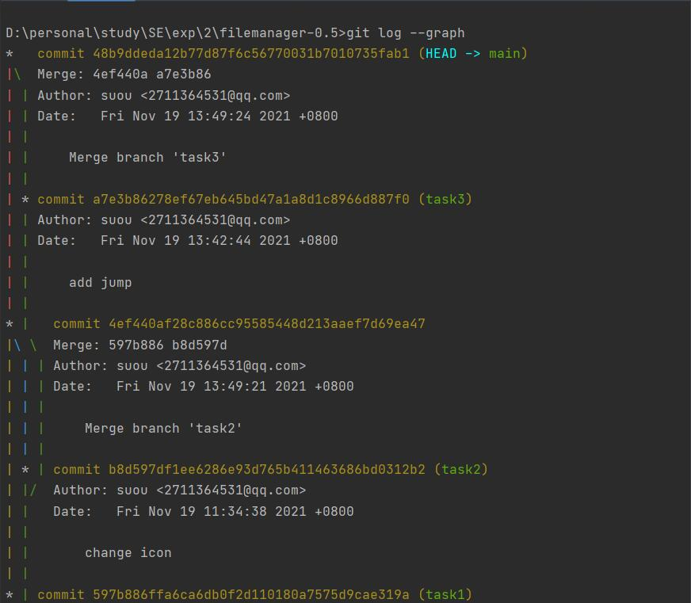
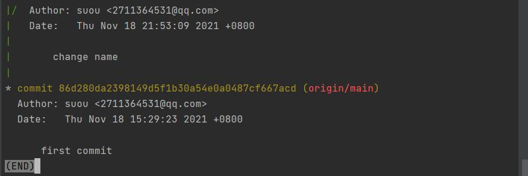

# Lab6 项目协同开发管理与工具集成环境实验

## 191180133 王一鸣

#### 一，实验名称

项目协同开发管理与工具集成环境实验

#### 二，实验内容

##### 1，在本地尝试修改、提交、回退等过程，在报告中展示你的操作，并使用git diff, gitlog, git status 等命令展示操作前后的区别

下图是修改前的git信息

下图是修改README后的git信息

下图是add操作以及对修改后的README进行add后的git信息

下图是在本地进行提交的操作以及提交后的git信息

下图是在进行修改且add后尚未commit进行reset操作即可将add重置，并且包含各阶段的状态

下图的reset操作可以将已提交的版本回退

##### 2，根据实验三针对几个页面进行微调的任务，在本地为每个子任务创建一个分支并在各分支上进行开发，终将所有修改合并到master 分支上；如有冲突请尝试解决。在报告中展示你的操作，并使用git log --graph 命令展示分支合并图

本次实验我进行了3次修改，创建了3个branch，分别为task1，task2，task3，我在创建后在各自的分支对文件进行了修改，最后merge的过程中并未产生冲突，因此不需要进行解决，merge后的信息如下

##### 3，给你的某个稳定版本的代码打上标签

最后我给main贴上了v1.0的标签并且push到了GitHub，task1-3分支也push了上去。

#### 三，实验收获

##### 1，使用git的好处

（1）分布式开发时，可以git clone克隆一个本地版本，然后在本地进行操作提交，本地可以完成一个完整的版本控制，在发布的时候，使用git push来推送到远程即可；

（2）git分支的本质是一个指向提交快照的指针，速度快、灵活，分支之间可以任意切换，本地拥有版本库，随时进行版本后退；

（3）冲突解决，多人开发很容易就会出现冲突，可以先pull远程到本地，然后在本地合并一下分支，解决好冲突，在push到远程即可；

（4）离线工作，如果git服务器出现问题，也可以在本地进行切换分支的操作，等联网后再提交、合并等操作。

##### 2，使用远程仓库的好处

（1）项目储存在远程仓库，在不同的使用不同的设备都可以方便地同步；

（2）使用远程仓库可以实现项目的开源和分享，他人可以参与到项目的完善中；

（3）在远程仓库，例如GitHub可以接触到最新的最前沿的 IT 技术，并且可以学习到很多知识。

##### 3，在开发中使用分支的好处，在实际开发中的体会和经验

（1）可以让项目的版本迭代更加清晰；

（2）开发效率提升；

（3）在不同的分支实现不同的需求，可以让编程目的更明确，可以让开发思路更明了；

（4）不同的分支包含不同的版本，当在开发过程中出现bug或者问题可以随时参考其它的版本；

（5）有助于对开发过程中的bug进行处理；

（6）对于开发团队而言，利用分支处理不同的任务，可以减少代码相互间的影响。
