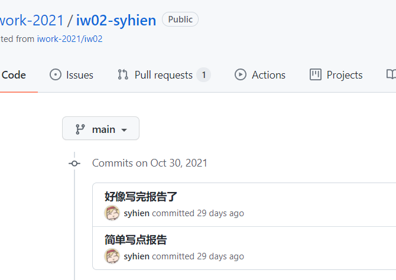
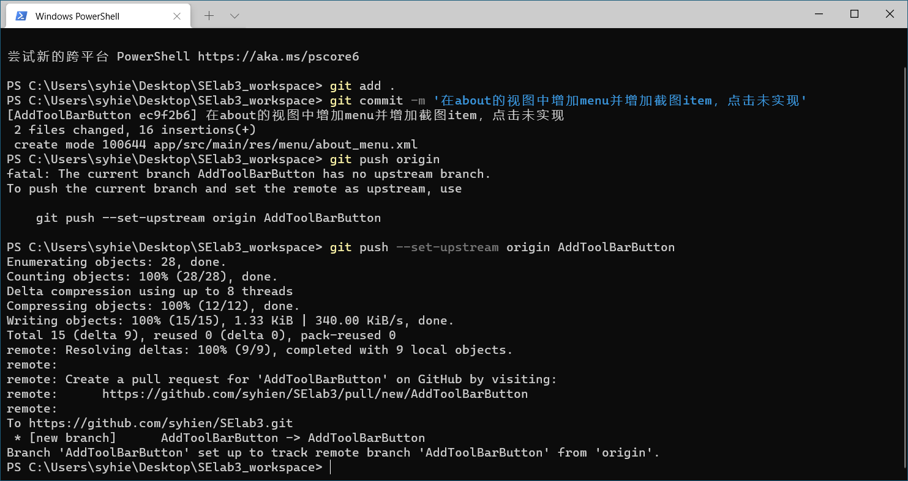

# Git

## 添加

`add`在Git中意味着，我想要将某个文件加入到VCS中，我希望Git为该文件服务

具体来说用法是`git add <filename>`

但是这样太麻烦了。大多数时候，大多数文件我们都想要加入到VCS中，只有少量内容我们不想加入（敏感的密钥信息、与项目无关的信息等）。我们多采用的方法是，先写一个`.gitignore`文件，告诉git它应该忽视哪些文件，再直接使用`git add .`将所有文件及子文件夹中文件递归加入到git中

一个`.gitignore`的例子：

```
# Windows image file caches
Thumbs.db
ehthumbs.db

# Folder config file
Desktop.ini

# Recycle Bin used on file shares
$RECYCLE.BIN/

# Windows Installer files
*.cab
*.msi
*.msm
*.msp

# =========================
# Operating System Files
# =========================

# OSX
# =========================

.DS_Store
.AppleDouble
.LSOverride

# Icon must ends with two \r.
Icon


# Thumbnails
._*

# Files that might appear on external disk
.Spotlight-V100
.Trashes

# Android Studio
.idea/*
#.idea/workspace.xml - remove # and delete .idea if it better suit your needs.
.gradle/
build/
.settings
bin/
gen/
.classpath
local.properties
.project
.idea/
projectFilesBackup
captures
*.iml

/app/src/main/res/values-in/strings.xml
/app/src/main/res/values-iw/strings.xml
```

## 提交

`commit`会被使用，当我们想要创建一次提交


一个例子如图，我用`git commit -m ' '`产生了一次提交

`-m`参数的含义是本次提交的信息，应该简要又精确地描述本次提交的所有改动（如果发现太多需要写的改动那说明应该分几次来提交）

## 回退

`reset`用于回退，具体一点，是把HEAD指针指向某次提交

`reset`只是修改HEAD指针的指向，实际上还保留了提交记录（在一些场景有用）

`git reset`有3个参数，默认的`mixed`，以退为进的`soft`，全部推倒重来的`hard`

- soft 保留工作目录，因reset而产生的变动放入暂存区
- mixed 保留工作目录，清空暂存区
- hard 不保留工作目录，不保留暂存区

**下面介绍一个很实用的场景，也是我实际开发中的经验**：

### 删除Github上的commit记录

试问谁没在公开的仓库出现过以下情况：

- 公用电脑git config混乱，用错账号commit push
- 没写好.gitignore，误提交敏感信息、隐私信息
- ……

首先，直接把仓库改动了再提交一次是没用的！别人一点`commits`就看光了。我们需要回退git

1. 重新clone仓库，保证HEAD准确无误

这里用一个我的仓库做例子：


2. git reset --hard

我想要回退的是：


使用命令`git reset --hard`回退到指定提交：


**注意，其实这里"好像写完报告了"和”完成报告“两个commit还存在**，我们可以`git reset --hard 311a5a`回去：


3. 强行当前的仓库push --force到远端

使用`git push origin --force`来强制推送：


Github刷新一下，可以发现真的看不到commit了：



最后还原一下我的commit，因为本地没落后于远端所以无需`force`


## 推送

推送就是将本地的提交送到一个中心化的远端

在设定好`origin`的远端地址后`git remote add origin <URL>`，每次只需要`git push origin`即可将改动推送


## 分支

`branch`即分支，通过分支，我们可以把开发流程划分成若干个小任务，完成小任务后再进行拼接（即合并分支）

**注意，本地分支和远端分支无关**

这里用Android Studio的图形化界面创建分支并切换：


这里我是先添加的分支才截图，所以显示`AddTextView`分支已经存在

现在，我们增加了新分支`AddTextView`，并且已经切换到该分支，表示我们正在该分支上工作


完成一些工作后，我们`commit`并`git push origin`：


git告诉我们本地的`AddTextView`在远端没有对应分支（至少我们没为其设置git）

根据提示，我们用`--set-upstream`参数顺便在`origin`创建一个同名分支

我们到Github确认一下效果：


成功啦

接下来我们**从main分支**创建另一条分支`AddToolBarButton`，意思是我们是在`main`的基础上开展`AddToolBarButton`的工作：


可以看到，此时刚刚`AddTextView`分支的改动（添加一个新view）消失了，意味着我们确实走上了一条和`AddTextView`不同的开发路径

在该分支上产生一些提交并推送：




确实有两条分支啦。并且`main`上仍然没提交，看看`AddToolBarButton`分支：


正确看到了提交


当在各自分支开发完成并各自测试后，终于决定将其改动汇入`main`分支：


我们首先把分支用`git checkout main`切换回main分支，然后用`git branch`查看分支因为我不记得两个分支叫什么了，直接`git merge AddTextView`即可将其合并到当前的分支（即main），显示`Fast-forward`（无冲突情况下，快速合并），最后推到远程


main分支下有了提交

试着把另一条分支也合并过来：


最后以图形方式看看：


绿色为`AddTextView`分支，黄色为`AddToolBarButton`分支，合并后变为红色`main`分支

## 标签

`tag`顾名思义，为索引服务。打标签有利于后期监视、审计代码

`git tag <tag_name>`给HEAD指向的commit打上标签

`git tag <commit_hash> <tag_name>`给指定的commit打上标签


如图，此处给0b3e0b打上了`v1.0`标签

## 回答问题

### 使用 git 的好处？

git带来的好处基本都是VCS带来的好处。版本控制系统使得开发者能够明确地控制代码的版本。

git用提交的方式来记录代码的变迁过程，通过每次commit的信息可以让开发者轻松回顾代码生命历程

git关心变动而不太关心整体。最大的好处就是版本控制的成本变低了，不需要为每次改动保存副本，而且记录每次改动”到底改了什么“

git的分支更是让开发有效地模块化、系统化，为多人多端提供了可能性和规范

### 使用远程仓库 (如 github/gitee 等) 的好处？

思考一个事物的好处，其实就是在思考如果少了这个事物会有哪些坏事情发生：

- 多人多端协作中，需要频繁反复交换整个工作仓库以保持一致性
- 浪费时间
- 人数增加时很难保证一致性

远程仓库行使一个中央机构的角色。开发者们约定，它手上的内容才是真正有意义的内容。这样一来，每个终端只需要和这一个中心节点沟通、交换内容即可。

### 在开发中使用分支的好处？你在实际开发中有哪些体会和经验？

- 使得多人协作有了可能
- 隔离开发
- 并行开发
- 促进模块化、增强系统化

实际开发中，分支几乎是唯一的多人协会的可行解。如果没用git的分支，大家同时工作，会出现非常多的冲突和不一致；最后往往需要花大量时间去解决因此产生的问题大大拖慢开发进度。很多时候，可能一些多人开发的小项目会懒得用分支管理，根据我的经验这样最后一定会崩盘无法控制，还不如一开始就划分好分支减轻工作负担。

## submodule & subtree

只有这部分的二级标题我没有使用中文，因为我实在想不到如何才能表述出这两个之间的微妙差别

简单来说，submodule是子模块的引用，subtree是子模块的拷贝

引用仓库意味着，我可能实际上没有子模块的实体

这样的差别，给两者带来了不同的应用场景

- 对于一个**需要网络分发**、**需要同步子模块更新**的项目，它应该用`submodule`。需要网络分发以为着带上所有的子模块纯粹是拖累自己；需要同步子模块更新说明它自身就需要控制子模块的版本
- 对于一个**封闭环境内**或**不关心子模块变动**的项目，应该优先使用`subtree`。可能是一个政府机关、一个金融机构等要求高安全性、高保密性的环境无法提供互联网环境，或者对于子模块只要求”能动就行“不需要更新

本次lab6用的是submodule，其实也没法用subtree，基于以下原因：

- subtree大量的拷贝会占用太多空间，远程仓库可能不够大
- subtree需要对每个子模块单独更新，对于一个大班级来说这个是令人恐惧的工作量