# 软件工程第六次实验报告

*191220001 毕一帆*

## 实验名称

项目协同开发管理与工具集成环境实验

## 实验目的

- 了解协同开发与持续集成过程
- 学会使用项目协同开发管理工具 git/github
- 了解持续集成并使用 jenkins 自动构建项目

## 实验内容

- 安装 git，在本地将你的开源项目目录初始化为 git 仓库 (如已有.git 文件夹请先删)
- 在本地尝试修改、提交、回退等过程，在报告中展示你的操作，并使用 git diff, git log, git status 等命令展示操作前后的区别
- 根据实验三针对几个页面进行微调的任务，在本地为每个子任务创建一个分支并在各分支上进行开发，最终将所有修改合并到 master 分支上；如有冲突请尝试解决。在报告中展示你的操作，并使用 git log --graph 命令展示分支合并图
- 给你的某个稳定版本的代码打上标签
- 注册 github 账号，在账号中创建远程仓库 (权限请设置为 public)；把本地的所有分支和标签推送到远端
- 使用 pull request 提交自己的代码和报告

<!-- - 在报告中回答以下问题：
- 使用 git 的好处？
- 使用远程仓库 (如 github/gitee 等) 的好处？
- 在开发中使用分支的好处？你在实际开发中有哪些体会和经验？
- 如果你额外学习并实践了关于 git/github 的其他进阶操作 (如 merge 和 rebase 的区
别、reset 和 revert 的区别、stash, cherry-pick 的使用等)，可在报告中展示 -->

## 实验结果与说明

修改代码后使用git diff, git log, git status：

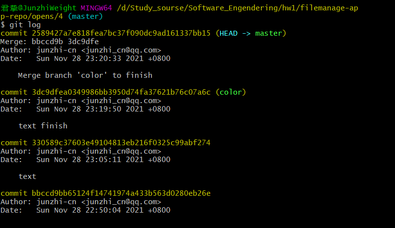
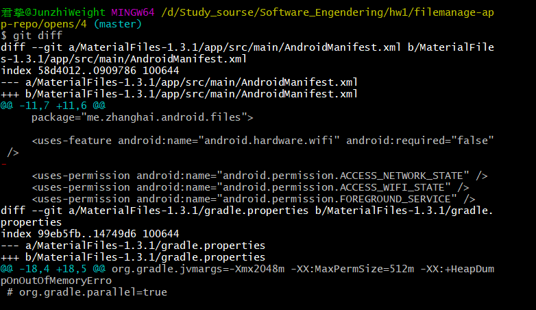
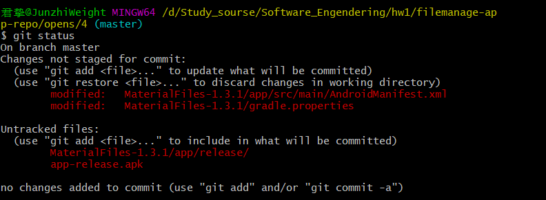

进行提交：

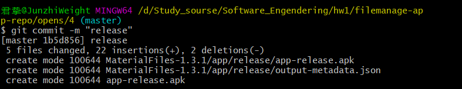

查看状态：

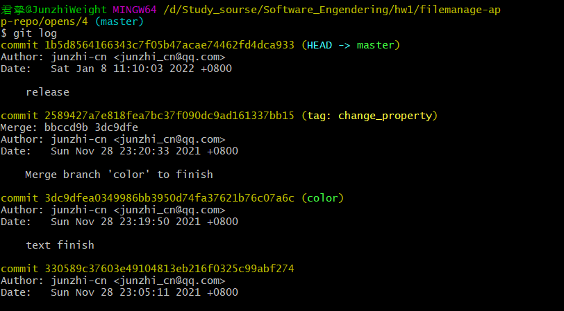
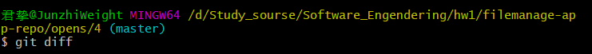
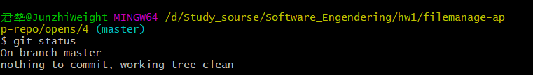

回退：

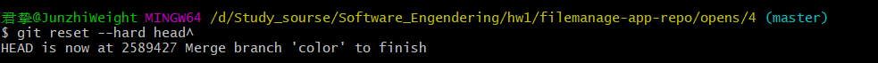

查看状态：

回退前：

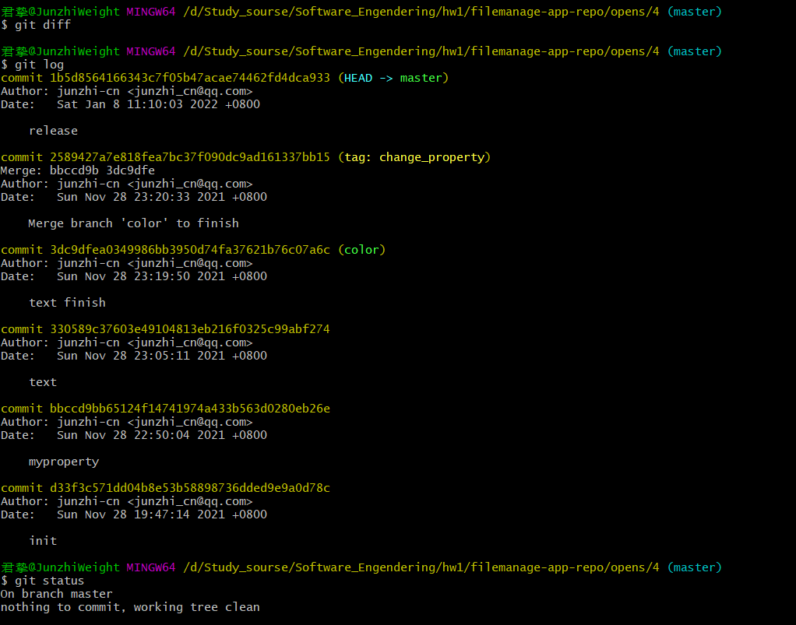

回退后：

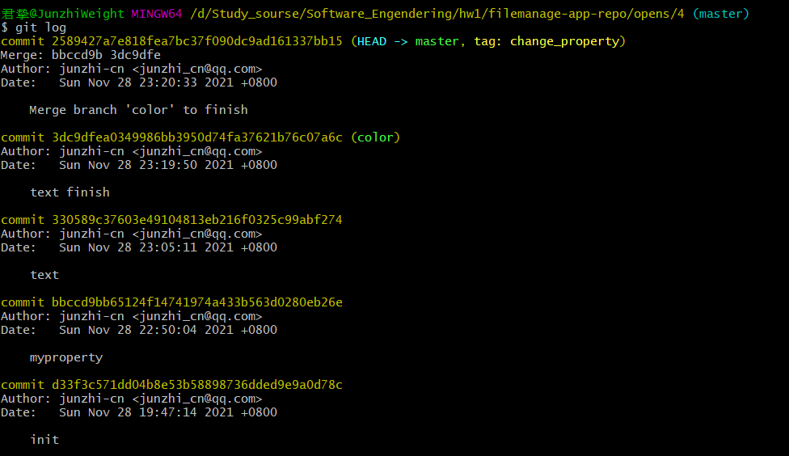

恢复：

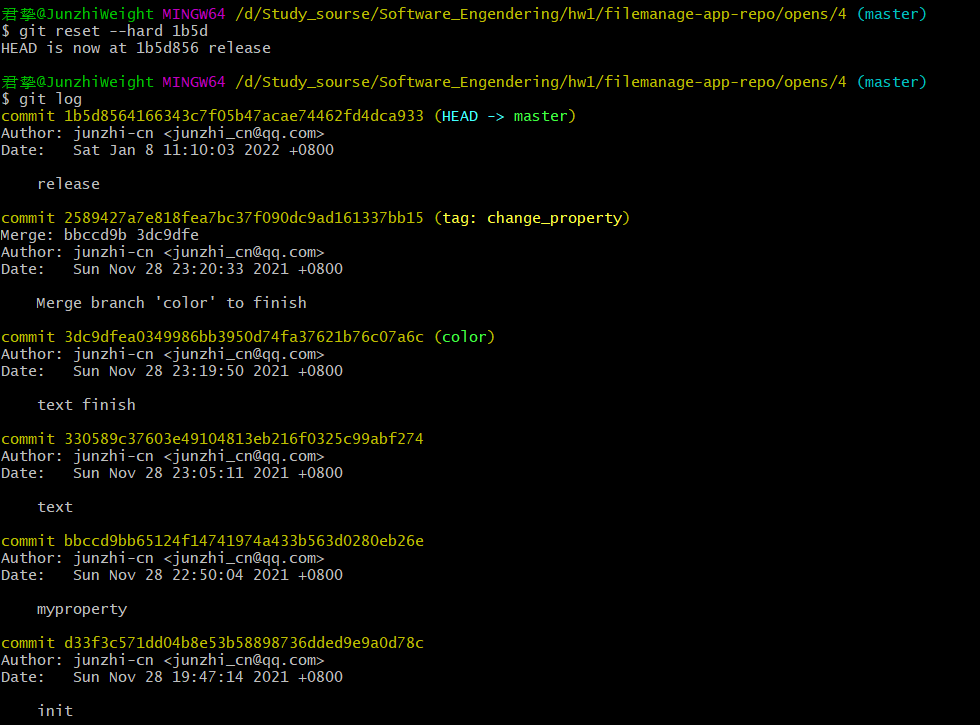

我将实验三中文字修改部分创建了一个分支，我的属性部分创建了另一个分支，最后将它们合并。展示如下：

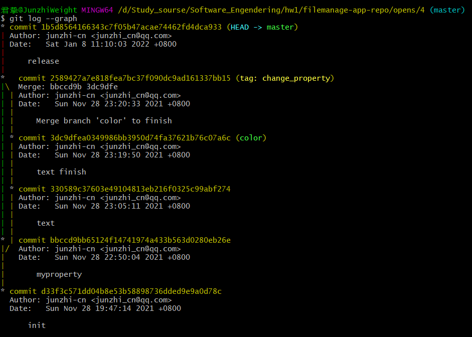

git reset是将指针指向先前的提交，而git revert是创建一个先前提交的复制再将指针移上去。
初始：
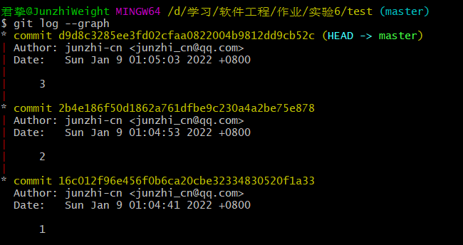
reset：
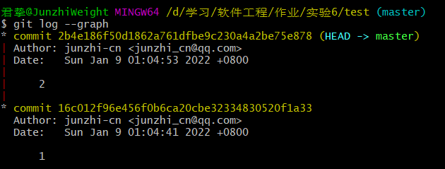
revert：
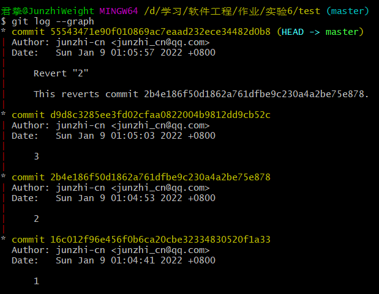

## 结果分析与结论

- 使用git能够很好地帮助我们进行代码管理，便于开展协同开发，无论是多个版本，多人协同工作，多设备进行工作，git都能很好地帮助我们便利地完成这些目标。同时它也像存档一样，给了我们后悔和多支线工作的能力。
- 使用远程仓库可以让我们不用将代码保存在本地，帮助我们可以在多个设备上同步进度，也便于团队开发时多人共同进行开发。便捷的多人开发有利于吸引更多人对代码做出贡献，也能帮助我们很好地开展团队合作。
- 分支能帮助我们在不受干扰的情况下单一的开发某个模块，在帮助多人共同开发的同时，也能帮助我们排清其他干扰，集中于寻找单一改动引发的问题。在实际开发中，使用分支可以在一个稳定的版本上进行不同改动，这样能更好的进行debug。而在代码低耦合的情况下，合并也十分简单。因此良好的代码也能让开发变得更简单。
- 