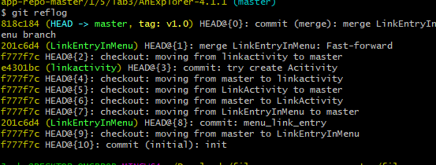

# README
191220002 蔡鸿彬
## 初始化Git仓库
### 创建仓库

### 将项目文件添加到仓库

### 提交

---
## 创建分支
### 创建跳转新页面按钮的任务的分支

### 展示

### 提交改动

### 返回主分支

### 创建新页面的任务的分支

### 提交改动

### 回到主界面并合并分支

### 提交

### 再合并第二条分支并提交

### 展示合并图

---
## 创建标签
### 创建v1.0标签在主分支上

---
## 版本回退和复原
### 先展示所有版本

### 回到初始版本

### 回到tagv1.0版本

---
## 提交仓库
### 克隆仓库

### 增加子模块

### 提交修改

### push到远程仓库

---
## 回答问题
### 1. 使用 git 的好处？
方便撤销更改，管理版本等。
可以轻松记录代码更新时间等信息

### 2. 使用远程仓库 (如 github/gitee 等) 的好处？
可作为本地代码的保存备份，避免本地故障而丢失代码。
易于分享和多人协同开发。

### 3. 在开发中使用分支的好处？你在实际开发中有哪些体会和经验？
写比较独立的不同需求时，也可将代码独立编写并测试，避免大脑混乱
多人协同时，可以开发不同分支，提升效率。