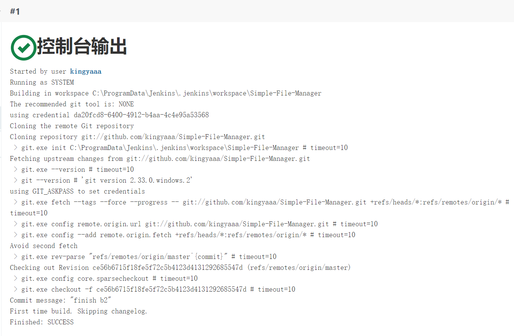

## Git操作

### 本地修改、提交过程

**以branch b1的修改和提交为例**

`git add`：将文件修改添加到暂存区

`git commit`：将暂存区的所有内容提交到当前分支

`git log`：显示当前分支的版本历史

`git status`：显示有变更的文件（在某次`git add`之后，`git commit`之前）

`git diff --cached` ：查看暂存库与当前版本的差异

不加`--cached`参数则`git diff`指令没有显示任何内容

### 本地创建和合并分支

**以创建和合并branch b1为例**

`git checkout -b b1 `：创建并跳转到分支b1

`git branch `：查看所有分支

`git merge b1`：合并分支b1和master

`git log --graph`：查看合并后的分支

**将所有修改合并到master分支上**

`git log --graph`：展示分支合并图

`git merge b2`：合并分支b2

`git branch -d b1`：删除分支b1

`git branch -d b2`：删除分支b2

`git log --graph`：展示最后的分支合并图

### 创建标签

`git tag v1.0 ce56b67`：为最后一个版本创建标签

### 思考题

- 使用 git 的好处？

  - 本地拥有代码的版本库，可以随时进行版本后退，相当于后悔药，在进行复杂的项目开发时能够给自己留下容错的机会。
  - 建立分支非常简单，且速度快，在不同的分支上进行开发能够让项目的开发过程更加有层次性，也可以满足协同操作。
  - Git免费开源

- 使用远程仓库 (如 github/gitee 等) 的好处？ 

  - 参与感兴趣的开源项目，增强协作开发能力
  - 创建自己的开源项目，优秀的编程项目能够打造个人名片
  - 支持Git的版本库托管
  - 获取最新最流行的技术相关源代码，通过社交途径与他人交流，参考借鉴学习。

- 在开发中使用分支的好处？你在实际开发中有哪些体会和经验？

  - 使用分支可以使每个开发者在各自的分支上进行开发工作而不互相干扰，提升了开发效率
  - 使用分支使开发更加具有层次化，版本迭代更加清晰。
  - 在本次实验的实际开发中，通过对每一个子任务创建分支再进行开发，能够使不同的子任务都在原框架上进行而不互相影响，最终将所有修改在合并到总分支上。
  - Git的创建、切换、合并、删除分支都非常快速，节约时间提升效率。

## Jenkins

1. 安装Jenkins

   

2. 配置JDK地址，Gradle地址和JAVA_HOME地址

   **JDK**

   [本地系统设置中已配置]

   在全局工具中配置：

   

   **Gradle**

   在本地系统中配置：

   添加系统变量

   

   添加PATH

   

   验证环境变量是否配置成功：

   

   在全局工具中配置：

   

3. 填写github地址，对项目进行一次构建

   **配置**

   

   **Bulid now**

   

4. 修改代码再次推送到github仓库中，再次对项目进行构建

   `git push -u origin master`
   
   
   
   **Build now**
   
   
   
   实验结果：修改代码前后，构建项目均成功