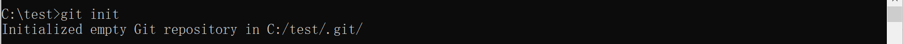
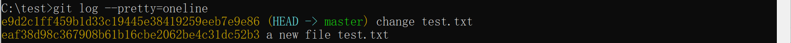
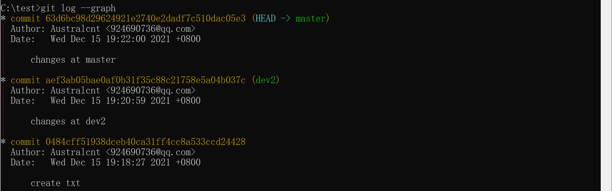
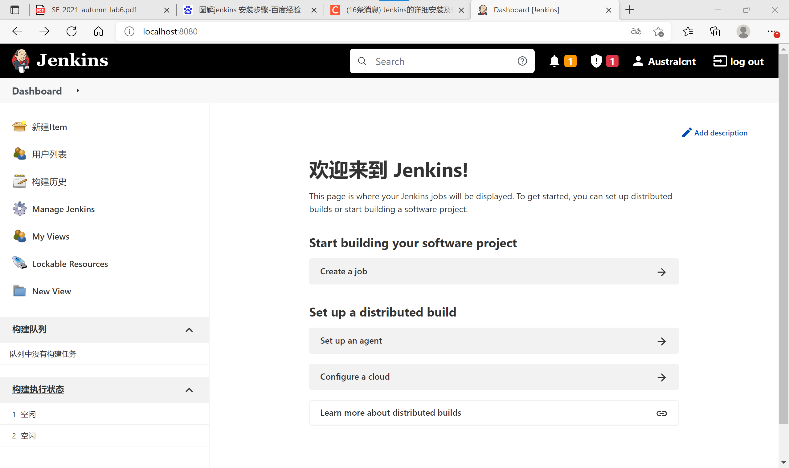

# 南京大学	计算机科学与技术系

# 软件工程实验报告

##### 实验名称：项目协同开发管理与工具集成环境实验

##### 学号：191220008

##### 姓名：陈南曈

##### 指导老师：张天

##### 实验地点：基础实验楼乙211

##### 实验时间：2021.11.18 ~ 2021.12.16

#### **一、实验名称**

##### 项目协同开发管理与工具集成环境实验

 

#### **二、实验要求**

1、了解协同开发与持续集成过程

2、学会使用项目协同开发管理工具 git/github

3、了解持续集成并使用 jenkins 自动构建项目

 

#### **三、实验环境**

##### 1、软件：

Git：2.28.0.windows.1

Jenkins：2.325

##### 2、硬件：

##### 3、项目名称：

SimpleExplorer-2.3.1

 

#### **四、实验内容**

##### 1、协同开发

① 安装 git，在本地将你的开源项目目录初始化为 git 仓库 (如已有.git 文件夹请先删除)。

② 在本地尝试修改、提交、回退等过程，在报告中展示你的操作，并使用 git diff, git log, git status 等命令展示操作前后的区别。

③ 根据实验三针对几个页面进行微调的任务，在本地为每个子任务创建一个分支并在各分支上进行开发，最终将所有修改合并到 master 分支上；如有冲突请尝试解决。在报告中展示你的操作，并使用 git log --graph 命令展示分支合并图。

④ 给你的某个稳定版本的代码打上标签。

⑤ 注册 github 账号，在账号中创建远程仓库 (权限请设置为 public)；把本地的所有分支和标签推送到远端。

⑥ 使用 pull request 提交自己的代码和报告 (作业提交说明里细🔒)。

⑦ 在报告中回答以下问题：

- 使用 git 的好处？
- 使用远程仓库 (如 github/gitee 等) 的好处？
- 在开发中使用分支的好处？你在实际开发中有哪些体会和经验？

⑧ 如果你额外学习并实践了关于 git/github 的其他进阶操作 (如 merge 和 rebase 的区别、reset 和 revert 的区别、stash, cherry-pick 的使用等)，可在报告中展示。

##### 2、持续集成

①  在本机安装 jenkins，并在全局工具配置和系统设置中配置好 JDK 地址、Gradle 地址、ANDROID_HOME 地址和 JAVA_HOME 地址。

② 新建任务，在源码管理中填写自己项目的 github 地址，对项目进行一次构建。

③ 修改代码再次推送到 github 仓库中，再次对项目进行构建。

#### **五、实验结果与说明**

#### （一）协同开发

##### 1、Git 基本操作

（1）用 `git init` 创建版本库

（2）新建 test.txt 并写入内容后，用 `git add` 将修改添加到暂存区

（3）用 `git commit` 将 test.txt 提交到当前分支，用 `-m` 添加提交说明

（4）对 test.txt 进行修改后，用 `git status` 查看当前状态，发现 test.txt 被修改

（5）用 `git diff` 查看具体修改的内容

（6）用 `git add` 将修改后的 test.txt 添加到暂存区，并用 `git status` 查看状态，可见将要被提交的修改包括 test.txt

（7）用 `git commit` 将修改后的 test.txt 提交到当前分支，再用 `git status` 查看状态，发现已经没有需要被提交的修改了，工作目录是干净的

（8）继续修改 test.txt，并提交至当前分支

（9）发现该版本编写有误，用 `git reset --hard HEAD^` 回退至上一版本（windows中^须加上引号）

（10）回退后，发现之前编写并没有出错，用 `git log` 查询当前存在的版本号

（11）看起来有些繁琐，改用 `git log --pretty=oneline` 进行查看

（12）发现版本 “wrong version” 的版本号已经看不见了，通过 `git reflog` 查看每一次命令

（13）得到版本 “wrong version” 的版本号后，用 `git reset --hard f835673` 重新回到该版本

##### 2、实验三开发记录

（1）查看当前已有分支

（2）将分支合并至 master

（3）查看日志分支合并图

（稳定版本的标签为初始版本 `v0.0` 和最终版本 `v1.0`）

##### 3、Pull Request

##### 4、思考题

**（1）使用 git 的好处？**

① **版本库本地化，支持离线提交，相对独立不影响协同开发。**每个开发者都拥有自己的版本控制库，在自己的版本库上可以任意的执行提交代码、创建分支等行为。例如，开发者认为自己提交的代码有问题？没关系，因为版本库是自己的，回滚历史、反复提交、归并分支并不会影响到其他开发者。

② **更少的“仓库污染”。**git 对于每个工程只会产生一个 .git 目录，这个工程所有的版本控制信息都在这个目录中，不会像 SVN 那样在每个目录下都产生 .svn 目录。

③ **把内容按元数据方式存储，完整克隆版本库。**所有版本信息位于 .git 目录中，它是处于你的机器上的一个克隆版的版本库，它拥有中心版本库上所有的东西，例如标签、分支、版本记录等。

④ **支持快速切换分支方便合并，比较合并性能好。**在同一目录下即可切换不同的分支，方便合并，且合并文件速度比 SVN 快。

⑤ **分布式版本库，无单点故障，内容完整性好。**内容存储使用的是 SHA-1 哈希算法。这能确保代码内容的完整性，确保在遇到磁盘故障和网络问题时降低对版本库的破坏。

**（2）使用远程仓库 (如 github/gitee 等) 的好处？**

① 我们可以随时随地的与仓库建立连接，以实时存放我们开发的内容，作为本地仓库的一个备份，这样项目会更有保险。

② 与他人实现协同开发，而不是再需要来回的发送修改过的代码由他人整合在一起，git 会自动的帮我们完成了更新。

③ 如果你不把提交到本地仓库中的代码提交到远程库，那么别人也无法看到你的代码。

**（3）在开发中使用分支的好处？你在实际开发中有哪些体会和经验？**

① 版本迭代更加清晰。

② 开发效率提升。

③ 利于代码 review 的实现，从而使整个团队开发更加规范，提高容错率。

④ 分支间相互独立。即便其中某些分支出现了bug也可以删除重来或者采用其他分支的代码，不会影响主分支；各个分支同时开发，不会出现等待情况；新建了一个指针指向当前版本；分支可以再合并到主分支，方便又高效。

##### 5、Git 进阶操作

在新建的 git 仓库中，存在 master，dev1 和 dev2 三个分支，dev1 和 dev2 均是从 master 初始版本中创建的分支， 此后三个分支均进行了一次 commit。

##### （1）`git merge` 和 `git rebase`

现尝试分别对 dev1 分支进行 merge，对 dev2 分支进行 rebase。

① 查看当前 master 分支的日志图

② 通过 `git merge dev1` 将 dev1 分支合并至 master 分支

③ 查看当前 master 分支的日志图，可见 master 分支的最后产生了一个额外的 merge commit

④ 通过 `git rebase dev2` 将 dev2 分支合并至 master 分支，

⑤ 查看当前 master 分支的日志图，可见 master 分支在创建 dev2 分支后的 commit 记录移动到了 dev2 分支的顶端，最后形成了一条直线，十分简洁清晰

**git merge 和 git rebase 的区别：**

① git merge 会产生额外的提交记录并进行两条分支的合并；git rebase 无须新增提交记录到目标分支，rebase 后可以将对象分支的提交历史续上目标分支上，形成线性提交历史记录，进行review的时候更加直观。

② 不能在一个共享的分支上进行git rebase操作，但可以 git merge。

##### （2）`git reset` 和 `git revert`

① 此时，我们想要回到 “changes at master” 版本，可以通过 `git reset --hard 63d6bc9` 回退到指定版本

② 查看当前 master 分支的日志图，发现 ”changes at dev1“ 版本已经不见了

③ 现在，我们又想要撤销 ”changes at dev2“ 版本的修改，可以通过 `git revert -n aef3ab0` 撤销指定版本，然后用 commit 提交

④ 查看当前 master 分支的日志图，当前的版本下 dev2 分支的修改已经被撤销

**git reset 和 git revert 的区别：**

① git reset 的作用是修改HEAD的位置，即将HEAD指向的位置改变为之前存在的某个版本。如果想恢复到之前某个提交的版本，且那个版本之后提交的版本我们都不要了，就可以用这种方法。

② git revert 是用于“反做”某一个版本，以达到撤销该版本的修改的目的。如果我们想撤销之前的某一版本，但是又想保留该目标版本后面的版本，记录下这整个版本变动流程，就可以用这种方法。

##### （3）`git stash` 

① 现在我们在 master 分支上继续做修改，但突然发现有一个 bug 需要被修复，需要单独创建一个 bug 分支，然而当前的修改只完成了一半，不想提交，此时可以通过 `git stash` 暂时将工作现场保存起来

② 然后我们就切换到新的 bug 分支上修改 bug，修改结束后回到 master 分支，并删去 bug 分支

③ 我们现在想要恢复之前的工作现场，可以用 `git stash list` 查看当前已有的 stash 内容，可以看到我们刚刚保存的工作现场

④ 利用 `git stash pop` 或者 `git stash apply` 加上 `git stash pop`，恢复工作现场并删去 stash 的内容

⑤ 此时用 `git stash list` 查看 stash，已经没有工作现场了

**git stash 作用：**

当你正在进行项目中某一部分的工作，里面的东西处于一个比较杂乱的状态，而你想转到其他分支上进行一些工作。问题是，你不想提交进行了一半的工作，否则以后你无法回到这个工作点。解决这个问题的办法就是`git stash`命令。储藏(stash)可以获取你工作目录的中间状态——也就是你修改过的被追踪的文件和暂存的变更——并将它保存到一个未完结变更的堆栈中，随时可以重新应用。

##### （4）`git cherry-pick`

① 在修复完上面的 bug 后，我们意识到，这个 bug 不仅存在于master 分支，还存在于之前就创建的 dev1 分支中（dev2 分支的修改已被撤销，故无需考虑），因此我们还需要到 dev1 分支中再次修复该 bug，查看当前 master 分支的日志图，记录修复 bug 的 commit 的版本号

② 切换换到 dev1 分支，查看当前 dev1 分支的日志图

③ 我们通过 `git cherry-pick 4a1e334`，可以将该版本对 bug 的修复直接复制当前分支，省去了重复操作的繁琐

④ 再次查看当前 dev1 分支的日志图，发现多了一个对 bug 修复的提交，但版本号与之前在 master 分支上的 bug 修复版本号不同

**git cherry-pick 作用：**

复制一个特定的提交到当前分支，避免重复操作。

#### （二）持续集成

（1）安装好 jenkins，并在全局工具配置和系统设置中配置好 JDK 地址、Gradle 地址、ANDROID_HOME 地址和 JAVA_HOME 地址。

（2）新建任务，在源码管理中填写自己项目的 github 地址

（3）把本地的所有分支和标签 push 到远端。

（4）对项目进行第一次构建

（5）对项目进行简单修改后，再次 push 到 github 仓库中

（6）再次对项目进行构建

#### **六、结论**

通过本次实验，我了解了协同开发与持续集成的概念，学会使用项目协同开发工具 Git 和 Github，并实践了一些常用操作，然后简单使用了持续集成开发工具 Jenkins，并尝试构建项目。总的来说，在实验的过程中学习到了很多新知识，有很多收获。
