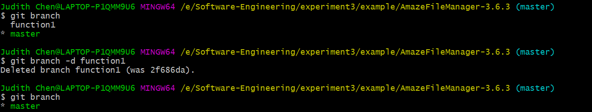
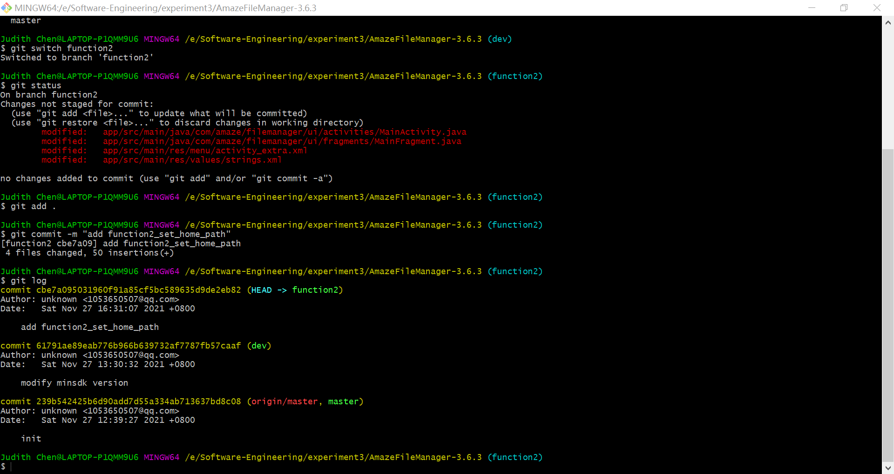

# LAB6-Report

### 1.实验名称：

软件工程实验六: 项目协同开发管理与工具集成环境实验

### 2.实验目的：

• 了解协同开发与持续集成过程 

• 学会使用项目协同开发管理工具 git/github 

• 了解持续集成并使用 jenkins 自动构建项目

### 3.实验内容：

##### 1.安装 git，在本地将你的开源项目目录初始化为 git 仓库 (如已有.git 文件夹请先删除)。

已经预先安装好了git，现在进入开源项目目录，输入命令行：`git init`  将该目录初始化为git仓库

##### 2.在本地尝试修改、提交、回退等过程，在报告中展示你的操作，并使用 git diff, git log, git status 等命令展示操作前后的区别。

###### 初始化提交

依据要求，我们首先查看现在仓库的状态，输入命令行`git status` 查看状态

可以看到有很多文件未被追踪，于是我们输入命令行`git add .` 将所有文件都加入其中

这里的`warning`是由于不同操作系统上的换行符不同导致的，这里可以忽略。

查看状态变成了待提交状态：

接下来我们将我们的初始版本进行提交，将提交命名为`init`方便查询：

输入命令行 `git commit -m "init" `

查看状态：

现在我们可以查看一下目前的`commit`状态，发现只有一个`init` 的`commit`。

###### 修改、提交、回退等过程的尝试

我们随意的修改一个文件的内容, 比如在`CODE_OF_CONDUCT.md`文件的末尾加上这样一行文字

`modify test: hello world`

我们现在查看状态可以看到：`CODE_OF_CONDUCT.md`被修改了但没有提交

我们可以提交这一修改： 

可以在日志中看到：前后两次的`commit` 其中我们可以看到标了HEAD的是当前的版本，可以用HEAD^表示上一版本，或者用版本号表示

我们可以通过 ` git reset`来实现版本回退，参数可直接用版本号，或者用HEAD^表示上一版本，用HEAD^^表示上上版本，如下所示：

此时查看文件发现恢复到了修改前的状态，且版本库中只剩下了`init`：

###### 分支相关基础操作：

构建一个分支 `git branch <BranchName>`并切换到该分支`git switch <BranchName>`或者`git checkout <BranchName>`：

现在我们同样修改一下`CODE_OF_CONDUCT.md`并提交给function1:在结尾加了一行`Branch Test Add Function1.`

现在切换到master分支，发现文档中的修改消失了，这是由于function1分支的修改没有合并到master上，我们现在合并，合并后查看文档，可以看到末尾添加了修改的内容：

现在我们可以删除function1这一分支。

这是比较顺利的合并，有时我们会出现冲突：

发现冲突在都修改了`CODE_OF_CONDUCT.md`，我们打开文档可以看到：

我们依据冲突提示和要求，进行修改手动解决冲突，并提交即可。

可以看到合并的关系图如下：

接下来我们来进行一些标签的操作：

截止到目前，我们已经学会了git管理的基本操作和一些管理技巧，下面我们将这些技巧运用到实验三的具体代码管理中。

##### 3.根据实验三针对几个页面进行微调的任务，在本地为每个子任务创建一个分支并在各分支上进行开发，最终将所有修改合并到 master 分支上；如有冲突请尝试解决。在报告中展示你的操作，并使用 git log --graph 命令展示分支合并图。

首先我们先将原代码上传到`github`上，新建的仓库为`JudithChen-19122/AmazeFileManager-Extention`

为了方便管理，我们用一个dev分支来为后续的合并做准备。首先在dev进行一些配置，比如修改`build.gradle` 文件,并提交，为功能修改做好前期环境准备：

接下来为每个子任务创建一个分支：

第一个分支： `function1` 

在menu中添加查看home路径的控件`check_home_path`，并用dialog显示结果。

在`function1`上进行相关代码的编写，并使用git管理。

切换回dev分支，创建function2：

在`function2`上进行相关代码的编写，并使用git管理。

完成其他功能分支。

我们先把function1/2/3 合并到dev分支中，后续合并操作与之类似，就不再说明：

先切换到dev分支，依次合并funcition1/2, 在合并function2时出现冲突：

我们手动到文件里面进行整合：

此时可以看到出现冲突的文件以及标红，并且指出了冲突的位置，我们手动整合一下：

对其他冲突文件做类似的操作。

完成后重新添加提交，实现合并：

类似的我们完成后续分支的合并，可以得到合并关系图：

添加合适的标签得到最终的合并关系图：

##### 4.git/github 的其他进阶操作

###### • merge 和rebase 的区别

合并前：

rebase：

merge:

我们可以很清楚的看到，在合并时，merge 会将分支合并到当前分支的版本，并生成一个新的当前分支的版本，而rebase则不是，rebase 是基于两个分支的共同祖先，先合并分支，在进行分支在共同祖先之后的操作，也就是最后一步操作变成了"modify basic" 而不是merge。

###### • reset 和revert 的区别

回退前：

revert:

reset:

reset是在正常的commit历史中，删除了指定的commit，这时HEAD指向旧版的commit。

revert是在正常的commit历史中再commit一次，只不过是反向提交，它的HEAD是一直向前的，指向新的commit。revert可用于push后的版本回退。

###### • stash, cherry-pick 的使用

`git stash`： 把已经`git add` 的改动搁置，后续通过`git stash apply`可以找回搁置的改动.

git stash list 用来查看所有的搁置版本；如果想找回栈中的第2个，可以用 git stash apply stash@{1} ;如果想找回第1个，可以用 git stash pop;如果想删除一个stash，git stash drop <id> ;删除所有stash，git stash clear.

cherry-pick:

将代码从一个分支转移到另一个分支时，如果只需要部分代码变动（某几个提交），这时可以采用 Cherry pick。

### 4.思考题

##### • 使用git 的好处？

使用git可以方便的进行版本管理，查看前后版本的差别，方便进行版本选择，和在进行不适合的修改后进行版本回退，可以有效解决程序修改过程中崩溃而无法恢复的问题，相当于给代码上了一层保险。

##### • 使用远程仓库(如github/gitee 等) 的好处？

使用远程仓库，有利于开源代码的共享，远程仓库提供代码保管，可以避免由于本地硬件等问题而导致的代码丢失问题。有利于团队合作的开展，进行协同开发，随时随地可以了解到代码的更新状态，并进行跟进开发。

##### • 在开发中使用分支的好处？你在实际开发中有哪些体会和经验？

在开发中使用分支，可以有效避免代码在开发阶段对主分支的影响，对于个人而言，代码分支可以帮助我们更好地进行代码管理，保存源代码的同时，可以进行代码改动后的相应测试，在后期通过分支进行合并的过程中也可以减少不必要的修改和冲突，且代码的版本脉络会更加清晰。对于团队而言，一般主分支的修改只在版本迭代时进行，使得软件的版本迭代更加清晰，采用分支管理，团队成员可以在自己的分支上进行独立开发，不会受到其他成员的影响，个人代码的合并，冲突解决更加便利，在合并完个人代码后再与其他人的分支代码合并，可以有效的减少合并的次数，避免频繁的出现冲突，提升开发效率，也便于代码的管理。

实际开发过程中，分支管理，可以使得代码的脉络更加清晰，比如本次实验将每个功能的实现作为一个分支，在进行合并，使得代码的划分和组成更加的清晰。同时，将merge操作交给dev来进行，可以将冲突解决的过程在dev上完成，从而减少对master的不当操作，更加安全。

### 5.实验拓展

##### 1.在本机安装 jenkins，并在全局工具配置和系统设置中配置好 JDK 地址、Gradle 地址、 ANDROID_HOME 地址和 JAVA_HOME 地址

##### 2.新建任务，在源码管理中填写自己项目的 github 地址，对项目进行一次构建

##### 3.修改代码再次推送到 github 仓库中，再次对项目进行构建

### 6.结论

 了解了协同开发与持续集成过程 ，基本学会使用项目协同开发管理工具 git/github，对于git的不同命令操作有了一些尝试 ，了解持续集成并尝试了使用 jenkins 自动构建项目。通过实验体会到了git管理代码的重要性和便捷性。

