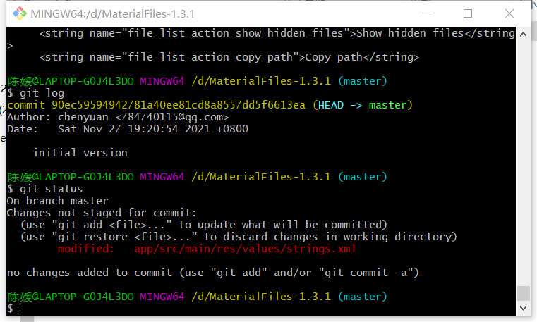

# 实验六实验报告

## 一、修改、提交、回退操作的展示

### 1. 修改

将app/src/main/res/values/strings.xml中的New window改为New Window

完成修改后，在git中输入git diff，git log以及git status，结果如图：

git diff：显示strings.xml被修改，且标出修改前后的语句

git log：由于此时只修改了文件，并未有进一步操作，因此日志中只有最开始的一次提交initial version

git status：显示仓库当前的状态——strings.xml被修改但未提交

### 2. 提交

首先使用命令git add将修改过的strings.xml文件添加到仓库，再使用git commit命令将文件提交到仓库（本次提交的说明为“modifed”）：

此时输入git diff，git log，git status结果如图：

git diff：因为git diff语句是比较工作区与暂存区的区别，此时暂存区已更新为修改过的版本，与现在工作区内容相同，所以git diff语句没有输出结果

git log：进行了git commit操作，所以结果为最开始的一次提交initial version和修改后的提交modified

git status：仓库当前没有需要提交的内容

### 3. 回退

使用git reset进行版本回退，使用的是--hard参数

- --hard：当前head指针、工作区、暂存区内容全部改变
- --soft：仅移动head指针，不改变工作区、暂存区内容
- --mixed：reset默认参数，移动head指针，改变暂存区，但不改变工作区

此时输入git diff，git log，git status结果如图：

git diff：因为使用的是--hard参数，工作区、暂存区的内容全部改变，所以git diff语句没有输出结果

git log：回退到HEAD^，即HEAD指针向前回退一次，所以结果为最开始的一次提交initial version（修改后的提交modified被回退）

git status：仓库当前没有需要提交的内容

## 二、根据实验三创建分支并合并

### 1. 创建分支

实验三共做了三个修改，创建了三个分支

- color_appBar

- filelist_Newwindow
- color_properties

#### （1） 修改appBar的颜色

首先在master分支下创建color_appBar分支（使用git checkout -b <name>创建并自动切换到对应分支）：

修改app/src/main/res/layout/file_list_fragment_app_bar_include.xml文件，新增一行代码`android:background_="2196F3"`从而修改appbar的颜色

输入git diff显示修改的位置与内容，再在color_appBar分支上将修改过的文件添加到仓库并提交（此次提交的说明为“color_appBar”）

#### （2） 修改filelist的New window的名称

首先切换回master分支，创建并切换到filelist_Newwindow分支

修改app/src/main/res/values/strings.xml文件，修改New window为New Window，从而改变了控件名称的大小写

输入git diff显示修改的位置与内容，再在filelist_Newwindow分支上将修改过的文件添加到仓库并提交（此次提交的说明为“filelist_Newwindow”）

#### （3）修改文件属性界面的颜色

首先切换回master分支，创建并切换到color_properties分支

修改app/src/main/res/layout/file_properties_dialog.xml文件,新增一行代码`android:background_="@color/material_blue_grey_200"`从而修改properties界面的背景的颜色

输入git diff显示修改的位置与内容，再在color_properties分支上将修改过的文件添加到仓库并提交（此次提交的说明为“color_properties”）

### 2. 合并分支

在master分支中，使用git merge分三次合并三个分支

### 3. 分支合并图的展示

## 三、问题

• 使用 git 的好处？

(1)可以方便实现版本控制，查看前后版本的区别,以及需要时进行版本的回退等

(2)git是分布式的,方便多人协作开发

 • 使用远程仓库 (如 github/gitee 等) 的好处？

(1)可以支持多人多设备,便于团队协同开发

(2)建立了远程的代码仓库,避免由于本地的问题造成代码损坏丢失等问题

(3)有利于开源项目的共享,促进学习与交流

 • 在开发中使用分支的好处？你在实际开发中有哪些体会和经验？

(1)在开发中使用分支,使得整个开发过程的版本迭代过程清晰明确(比如查看分支合并图可以清楚看到整个建立分支,合并分支的流程)

(2)每个人可以在各自分支上进行开发而互不干扰,最后需要合并时解决冲突即可,提高了开发的效率

(3)在分支上进行的开发操作不会影响master,提高了开发的安全性

## 四、额外操作

• merge和rebase区别

git merge合并两个分支会产生一个新的提交

git rebase合并两个分支会把它们的最新的commit作为master最新提交,不会产生新的提交

• reset和revert区别

git reset直接删除指定的commit,将一个分支的末端指向了另一个提交

git revert撤销一个提交时会创建一个新的提交,用一次新的commit来回滚之前的commit,执行操作后之前的commit都被保留

• stash

将当前未提交的修改保存至堆栈中,保存当前工作进度,并将工作区和暂存区恢复到修改之前

• cherry-pick

可以选择某个分支中的一个或几个分支提交应用到其他分支

