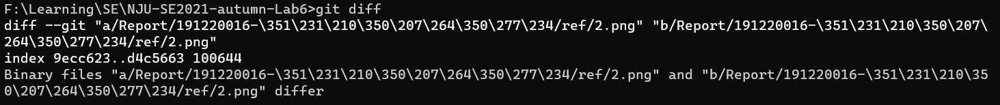

# 实验报告

## 191220016     陈致远

## 一、修改、提交、回退操作

在修改前使用git pull同步远程仓库  

此时修改了实验报告部分，尝试提交

使用git status查看状态

使用git diff查看修改

使用git log查看日志

使用git reset撤销操作

## 二、分支

创建新分支并查看

在分支上进行修改并提交

回到主分支，并合并刚刚在testBranch分支上的修改

查看合并记录

## 三、问题回答
1、git 可以给我们提供方便的项目管理，可以清晰地查看修改记录。对于大项目而言，合作、版本控制方面都离不开git。  
2、使用远程仓库可以方便的进行远程合作，对于线上合作项目而言，这样的管理工具可以提供方便的合作更新框架。另外，对于开源项目而言，版本更新、合作贡献也依赖于git远程仓库。  
3、在开发中使用分支，可以在合作过程中分别随时随地commit并且push到远程仓库，无需担心合作者直接频繁pull或遇到冲突的问题。利用分支，可以有效地将合并以及冲突问题集中解决。

