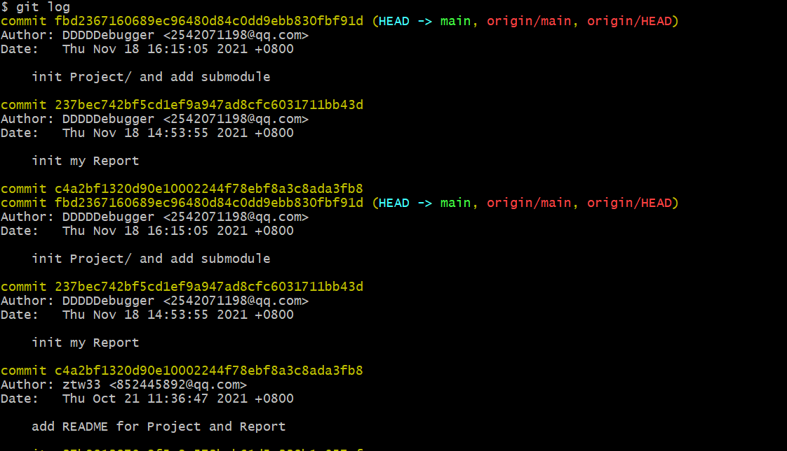
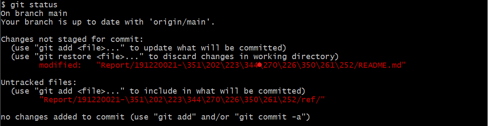
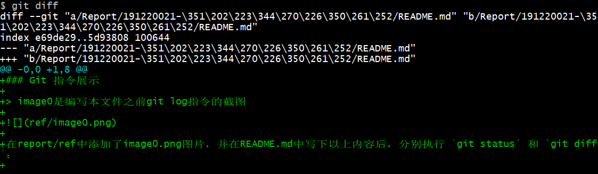
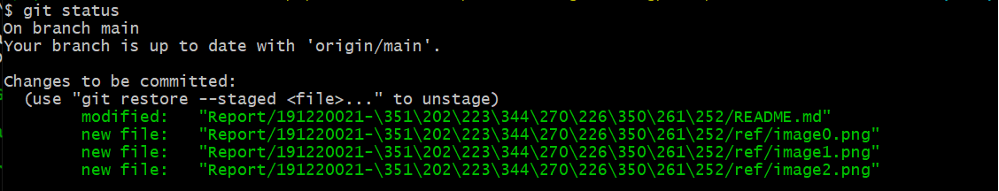
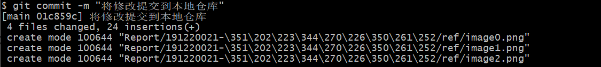
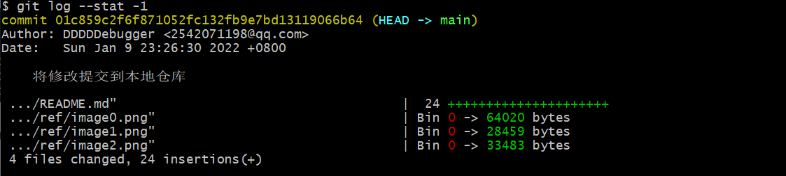
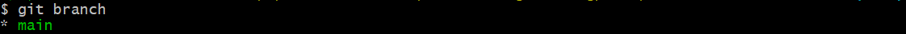
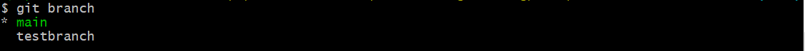

### Git 指令展示

> image0是编写本文件之前`git log`指令的截图

​		在report/ref中添加了image0.png图片，并在README.md中写下以上内容后，分别执行 ``git status`` 和 ``git diff``：

#### git status		

`git status` 命令查看**工作区**的状态：

​		可以看到显示修改了README.md文件(也即当前编辑的文件)，并且没有将这个修改**staged**，[之后](#git%20add)将使用 `git add` 指令将它从**工作区**添加到**暂存区**；另外还显示添加的image0.png是**untracked**状态，同样可用 `git add` 将其添加到**暂存区**。

#### git diff

`git diff` 命令查看文件在**工作区**与**暂存区**的差别。如果还没 add 进暂存区，则查看文件自身**修改前后的差别**：

​		可以看到 `git diff` 指令显示了工作区文件的修改情况，image0.png由于**untracked**所以没有显示。

#### git add

`git add`命令将文件从**工作区**添加到**暂存区**：

​		这里我们使用 `git add -A` 可以将所有更新的文件添加到**暂存区**(包括ref文件夹下所有文件和README.md文件)，再使用`git status`查看**工作区**的状态

​		可以看到README.md文件的修改以及ref文件夹下新添加的png图片都已经加入到了**暂存区**，现在，只需要将这些更改提交到**本地仓库**的到当前分支就可以随时回退到此刻的状态。

#### git commit

`git commit`命令将**暂存区**内容添加到**本地仓库**中

​		这里我们使用`git commit -m "将修改提交到本地仓库"`，其中-m参数可以对当前提交添加一个描述，方便以后回退版本时可以大致了解这个版本的主要修改：

#### git log

`git log`命令用于显示**提交**日志信息

​		这里我们使用`git log --stat -1`命令可以显示最近一次**提交**的简要增改行数，其中`--stat`选项显示简要的增改信息，`-1`选项指定最近一次提交：

​		可以看到最近一次的**提交**显示了简要的信息，包括README.md增加了24行，ref添加的图片占了多少bytes，总共有4个文件的更改，24行数据的增加。下面我们新建一个分支来展示其他git命令。

#### git branch

`git branch`命令执行分支的查看、创建、删除等操作

​		我们使用`git branch`来查看当前**本地仓库**的分支情况：

可以看到本地仓库只有一个main主分支，下面我们来创建新的分支，可以通过`git branch testbrach` `git checkout -b testbranch` `git switch -c testbrach` 这三个命令来创建一个叫做testbranch的分支，其中后两个命令在创建分支后会直接切换到新的分支下，这里我们使用第一个命令，然后再次通过`git branch`(也可以使用`git branch --list`)查看当前分支：

可以看到现在有两个分支分别是主分支main和刚刚创建的分支testbranch，现在我们来切换到testbranch。

#### git switch

`git switch`命令进行分支的切换

​		直接使用`git switch testbranch`可以切换到testbranch分支：

