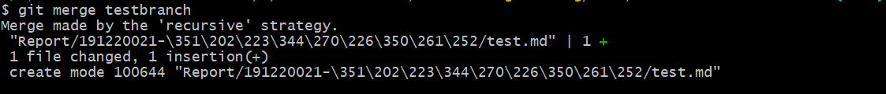
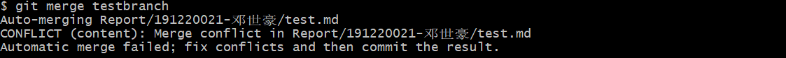
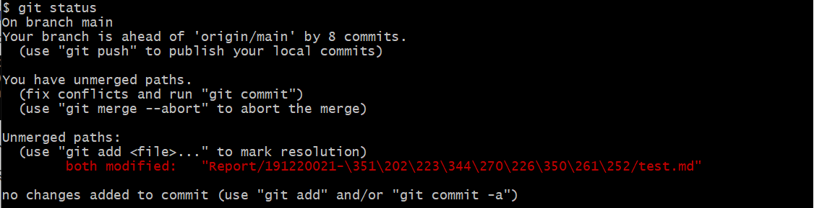
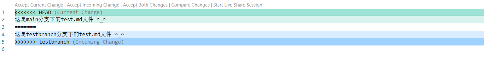
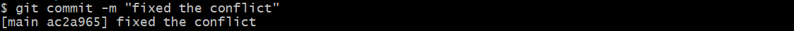
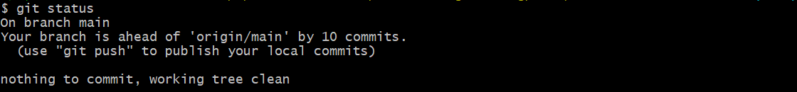
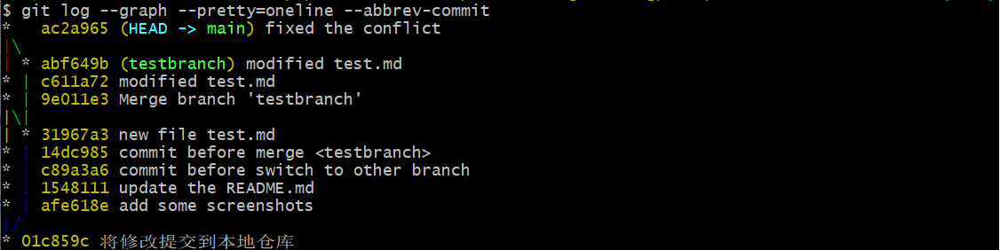
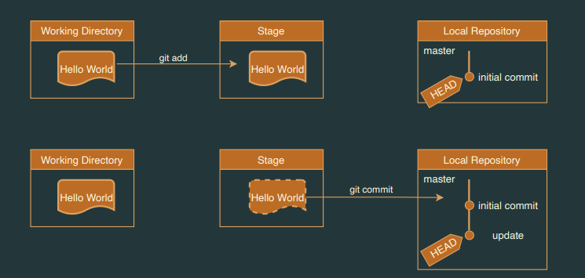
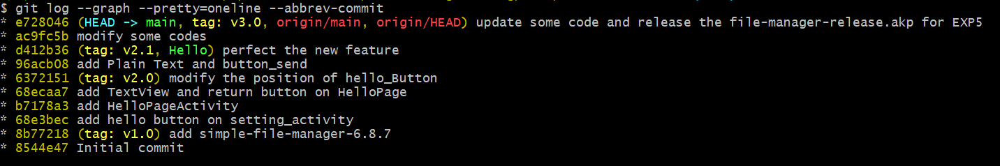
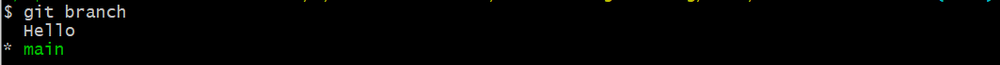

# 实验六

| 姓名   | 学号     | 助教   | 日期      |
| ------ | -------- | ------ | --------- |
| 邓世豪 | 19122021 | 朱庭纬 | 2022.1.10 |

## 实验名称

 项目协同开发管理与工具集成环境实验

## 实验目的

- 了解协同开发与持续集成过程
- 学会使用项目协同开发管理工具 git/github
- 了解持续集成并使用 jenkins 自动构建项目

## 实验内容

### Git 指令展示

> image0是编写本文件之前`git log`指令的截图

​		在report/ref中添加了image0.png图片，并在README.md中写下以上内容后，分别执行 ``git status`` 和 ``git diff``：

#### git status		

`git status` 命令查看**工作区**的状态：

​		可以看到显示修改了README.md文件(也即当前编辑的文件)，并且没有将这个修改**staged**，[之后](#git%20add)将使用 `git add` 指令将它从**工作区**添加到**暂存区**；另外还显示添加的image0.png是**untracked**状态，同样可用 `git add` 将其添加到**暂存区**。

#### git diff

`git diff` 命令查看文件在**工作区**与**暂存区**的差别。如果还没 add 进暂存区，则查看文件自身**修改前后的差别**：

​		可以看到 `git diff` 指令显示了工作区文件的修改情况，image0.png由于**untracked**所以没有显示。

#### git add

`git add`命令将文件从**工作区**添加到**暂存区**：

​		这里我们使用 `git add -A` 可以将所有更新的文件添加到**暂存区**(包括ref文件夹下所有文件和README.md文件)，再使用`git status`查看**工作区**的状态

​		可以看到README.md文件的修改以及ref文件夹下新添加的png图片都已经加入到了**暂存区**，现在，只需要将这些更改提交到**本地仓库**的到当前分支就可以随时回退到此刻的状态。

#### git commit

`git commit`命令将**暂存区**内容添加到**本地仓库**中

​		这里我们使用`git commit -m "将修改提交到本地仓库"`，其中-m参数可以对当前提交添加一个描述，方便以后回退版本时可以大致了解这个版本的主要修改：

#### git log

`git log`命令用于显示**提交**日志信息

​		这里我们使用`git log --stat -1`命令可以显示最近一次**提交**的简要增改行数，其中`--stat`选项显示简要的增改信息，`-1`选项指定最近一次提交：

​		可以看到最近一次的**提交**显示了简要的信息，包括README.md增加了24行，ref添加的图片占了多少bytes，总共有4个文件的更改，24行数据的增加。下面我们新建一个分支来展示其他git命令。

#### git branch

`git branch`命令执行分支的查看、创建、删除等操作

​		我们使用`git branch`来查看当前**本地仓库**的分支情况：

可以看到本地仓库只有一个main主分支，下面我们来创建新的分支，可以通过`git branch testbrach` `git checkout -b testbranch` `git switch -c testbrach` 这三个命令来创建一个叫做testbranch的分支，其中后两个命令在创建分支后会直接切换到新的分支下，这里我们使用第一个命令，然后再次通过`git branch`(也可以使用`git branch --list`)查看当前分支：

可以看到现在有两个分支分别是主分支main和刚刚创建的分支testbranch，现在我们来切换到testbranch。

#### git switch

`git switch`命令进行分支的切换

​		直接使用`git switch testbranch`可以切换到testbranch分支：

接下来我们在这个分支上来创建一个test.md文件来模拟使用分支来开发的情形。

#### git merge

`git merge`命令将两个或两个以上的开发历史加入(合并)一起

​		此前我们创建了testbranch分支，在testbranch分支下创建新的文件test.md，并在其中加上一行内容：

然后依次`git add`、`git commit` 将修改**提交**到**本地仓库**的testbranch分支下，然后我们切换到main主分支来进行分支的合并，使用命令`git merge testbranch`：

可以看到顺利的完成了分支合并，接下来我们修改main分支下的test.md文件为：

然后`git add`、`git commit`将修改提交到**本地仓库**的main分支。再切换到testbranch分支下，修改test.md文件为：

再次`git add`、`git commit`将修改提交到**本地仓库**的testbranch分支。然后我们切换到main主分支再来尝试一次进行分支的合并，使用命令`git merge testbranch`：

​		这次我们发现两个分支没法自动合并了，出现了冲突，需要解决冲突后再commit结果，此时用`git status`指令查看**工作区**的状态：

打开Unmerged paths告诉我们的文件可以发现test.md有了变化：

当产生合并冲突时，该部分会以`<<<<<<<`，`=======`和 `>>>>>>>`表示。在`=======`之前的部分是当前分支这边的情况，在`=======`之后的部分是对方分支(待合并)的情况。这里直接`git add`、`git commit -m "fixed the conflict"`将最终test.md的修改提交到**本地仓库**：

检查一下**工作区**状态：

然后利用[` git log `](#git%20log)命令的功能查看提交日志：

至此，testbranch的工作就顺利完成了，可以用`git branch -d testbranch`命令来删掉该分支：

#### git reset

`git reset` ——reset current HEAD to the specified state

​		`git reset` 总共有三个模式，hard、soft、mixed，在了解这三个模式之前，先要理解之前**工作区**、**暂存区**、**本地仓库**的概念和相互关系：

- --hard参数：重置HEAD位置的同时，直接将**工作区**、**暂存区**以及**本地仓库**都重置成reset目标节点的內容，效果等同于清空暂存区和工作区。
- --soft参数：重置HEAD位置的同时，保留**工作区**和**暂存区**的内容，只让**本地仓库**中的内容和 reset 目标节点保持一致，因此原节点和reset节点之间的差异会放入**暂存区**中。结果为工作区、暂存区的内容不变，只是原节点和reset节点之间的所有差异会被放到暂存区中。
- --mixed参数（默认）：重置HEAD位置的同时，只保留**工作区**的內容，但会将**暂存区**和**本地仓库**中的內容更改和reset目标节点一致，因此原节点和reset节点之间的差异会放入**工作区**中。结果就是原节点和reset节点之间的所有差异都会放到工作区中。

### 实验三中Git的使用

`git log`查看本地仓库的提交记录：

###### v1.0: 

第一个稳定版本，是开源软件本来的源码未经修改的版本，之后创建了新的分支Hello来对开源软件做修改

###### v2.0:

第二个稳定版本，基于原来的软件实现了特定场景上组件的添加和修改

###### v2.1:

第二个版本的改进版，在Hello分支完善了修改，合并了分支

###### v3.0:

最终版本，完成EXP5后对开源软件又进行了一定程度的修改，并打包了release版本的安装包

##### 总结

​		在完成实验三的过程中，根据实验三针对几个页面进行微调的任务，我创建了Hello分支在该分支上进行开发，最终将修改合并到 main 分支上。但是实际体验下来发现，单人开发的情形下，分支开发的作用并不大，反而容易忘记切换分支(比如实验五修改app时就直接在main分支上进行开发了🙄)；单纯使用Git回退版本的能力就足以解决单人开发中遇到的版本问题了。

### 问题回答

> merge 和 rebase

- merge被翻译为合并，在合并过程中Git会自动根据两个分支的共同祖先的 commit 和两个分支的最新提交进行一个三方合并，然后将合并中修改的内容生成一个新的 commit，操作完成后版本历史有分叉有合并。

- rebase被翻译成“变基”，在“变基”过程中Git会从rebase两个分支的共同祖先开始提取**当前分支**上的修改，再将**当前分支**指向**目标分支**的最新提交，然后将刚刚提取的修改依次应用到这个最新提交后面。操作会舍弃**当前分支**上已经提交的commit，不会像 merge 一样生成一个合并修改内容的 commit，相当于把**当前分支**上的修改在**目标分支**上复制了一遍，操作完成后的版本历史会被整理成直线。

> 使用 git 的好处

​		使用Git来管理本地代码进行开发可以非常方便的记录不同时间各个版本的内容，并且在需要时能够方便快捷地回到那个版本。另外，Git作为分布式本版控制系统，更强大的地方在于协同开发，无论是在不同设备上持续开发同一个项目，还是多人合作开发同一个项目，Git都有其强大的功能来支持。

> 使用远程仓库 (如 github/gitee 等) 的好处

​		Git作为分布式本版控制系统，其能分布到不同设备、不同账号上的原因就在于使用了**远程仓库**。利用GitHub的仓库托管服务来托管你的代码，这样就有了一个独立于**本地仓库**的**远程仓库**。分布式版本系统的最大好处之一是在本地工作完全不需要考虑远程仓库的存在，也就是有没有联网都可以正常工作，这就使得本地的工作和远程仓库是分离的，你不必担心本地发生的问题，例如硬盘突然遭受不可抗力而受损，你可以任何时候将远程仓库的版本拉取到本地来进行开发。另外，远程仓库也给多人协同开发带来了便携，任何一个共同开发的伙伴可以从你的**远程仓库**拉取代码到他的**本地仓库**来进行开发，最后再利用PR操作来提交他的修改，共同完成开发。

> 在开发中使用分支的好处？你在实际开发中有哪些体会和经验

​		开发中分支的使用能清晰地展示各个功能的开发经过和记录，同时也能保持开发的稳定性，特别是在多人协同开发的情形下。在实际的开发中，我感觉在独立开发的情形下使用分支并不能展现出它的威力，而在多人协同开发中，分支显得格外重要，一般的流程是这样的：

1. 首先，`git clone`远程仓库到本地进行开发
2. 本地创建新的分支进行开发，可以用`git push origin <branch name>`推送自己的修改
3. 如果推送失败，则因为远程分支比本地更新，需要先用`git pull`试图合并

4. 如果合并有冲突，则解决冲突，并在本地提交

5. 没有冲突或者解决掉冲突后，再用`git push origin <branch name>`推送就能成功

## 参考链接

[SE_2021_autumn_lab6.pdf (nju.edu.cn)](https://seg.nju.edu.cn/curriculums/Software_Engineering_(Fall_2021)/Experiment/Experiment6/SE_2021_autumn_lab6.pdf)

[廖雪峰的Git教程](https://www.liaoxuefeng.com/wiki/896043488029600)

[Git reset 教程](https://www.jianshu.com/p/c2ec5f06cf1a)

[Git merge完全解析-简书](https://www.jianshu.com/p/58a166f24c81)

[Git rebase & Git merge](https://www.jianshu.com/p/c17472d704a0)