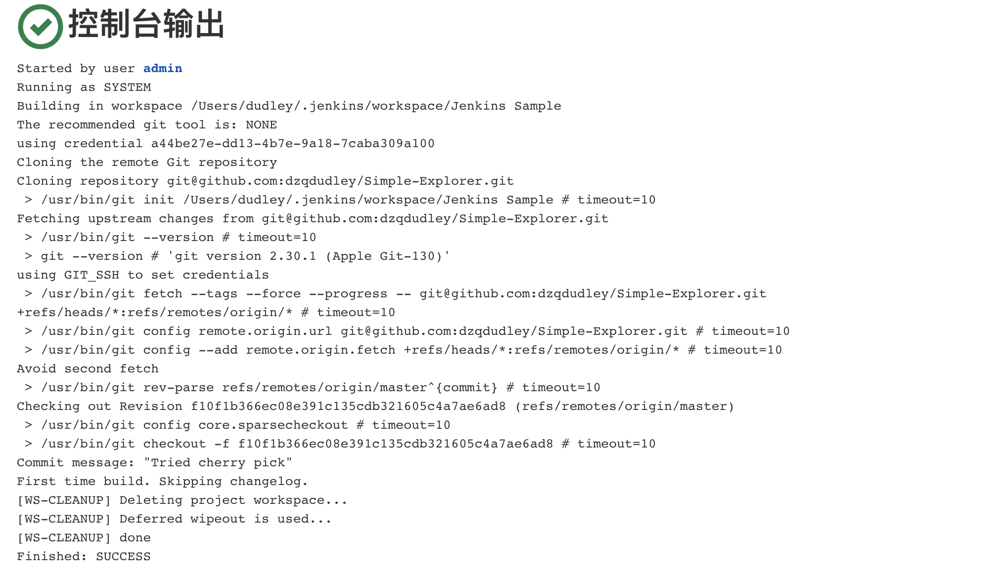

# 南京大学计算机科学与技术系软件工程实验报告 

#### 实验名称：项目协同开发管理与工具集成环境实验

#### 学    号：191220023                               

#### 姓    名： 丁子千                               

#### 指导教师：张天                                 

#### 实验地点：基础实验楼乙208                                

#### 实验时间：2021.11.18-2021.11.28     

### 一、实验名称

项目协同开发管理与工具集成环境实验

### 二、实验要求

1. 了解协同开发与持续集成过程 
2. 学会使用项目协同开发管理工具 git/github 
3. 了解持续集成并使用 jenkins 自动构建项目

### 三、实验环境

1.软件（JDK，Android SDK，Gradle）：
JDK: 1.8.0_231
Android SDK: Android 11.0
Gradle: 3.1.4
2.硬件（安卓模拟器版本）：
Pixel 2 API 30
3.项目名称：
Simple Explorer

### 四、实验内容

1. 安装 git，在本地将你的开源项目目录初始化为 git 仓库 (如已有.git 文件夹请先删除) 

2. 在本地尝试修改、提交、回退等过程，在报告中展示你的操作，并使用 git diff, git log, git status 等命令展示操作前后的区别

3. 根据实验三针对几个页面进行微调的任务，在本地为每个子任务创建一个分支并在各分支上进行开发，最终将所有修改合并到 master 分支上；如有冲突请尝试解决。在报告中展示你的操作，并使用 git log --graph 命令展示分支合并图

4. 给你的某个稳定版本的代码打上标签

5. 注册 github 账号，在账号中创建远程仓库 (权限请设置为 public)；

6. 把本地的所有分支和标签推送到远端

7. 使用 pull request 提交自己的代码和报告 (作业提交说明里细 )

8. 在报告中回答以下问题：

​		 • 使用 git 的好处？

​		 • 使用远程仓库 (如 github/gitee 等) 的好处？

​		 • 在开发中使用分支的好处？你在实际开发中有哪些体会和经验？

9. 如果你额外学习并实践了关于 git/github 的其他进阶操作 (如 merge 和 rebase 的区别、reset 和 revert 的区别、stash, cherry-pick 的使用等)，可在报告中展示

### 五、实验结果与说明

#### 1. 在本地尝试修改、提交、回退等过程，在报告中展示你的操作，并使用 git diff, git log, git status 等命令展示操作前后的区别

##### 修改

在README中添加一行`After Modify`后，`git diff`：

##### 提交

commit后，再次`git diff`：

commit后使用`git log`，可以看到之前的cmmit已被记录：

可以使用`git status`查看状态：

##### 回退

reset返回到修改之前的commit，修改会变成Unstaged changes。使用`git diff`可以查看区别。

使用`git log`，可以看到当前最新的commit是修改前的那一个。

使用`git status`，可以看到当前存在未保存的修改。

#### 2. 根据实验三针对几个页面进行微调的任务，在本地为每个子任务创建一个分支并在各分支上进行开发，最终将所有修改合并到 master 分支上；如有冲突请尝试解决。在报告中展示你的操作，并使用 git log --graph 命令展示分支合并图

在本次实验中，一共创建了五个分支，分别命名为： `modify_1`、`modify_2`、`modify_3`、`modify_4`和`modify_5`。

##### 分支的创建

在master分支上，`git checkout -b modify_1`切换到modify_1分支。使用`git branch`查看，当前已经在modify_1分支上了。

修改完后，将修改commit。`git checkout modify_2`切换到分支二，重复上述操作。

##### 分支的合并

五个分支都修改完并commit后，现在将它们合并到master分支上。

在master分支上，使用`git merge modify_1`合并。使用`git log --graph`，可以看到分支合并过程。

重复上述操作，最终合并结果如下：

#### 3. 给你的某个稳定版本的代码打上标签

使用`git tag`，为合并所有分支后的commit打上v1.0的标签。

然后把tag push到远程仓库。

#### 4.回答如下三个问题

##### 使用 git 的好处？

1. 使用git可以很方便地进行版本控制，可以创建分支进行修改，也可以回退版本，便于项目的版本管理。

2. 可以通过使用分支，便于同时开发不同功能，提高开发效率，同时也有助于独立测试。

3. 便于比较代码修改前后的区别，同时可以可视化各个版本之间的关系，便于梳理复杂的项目开发流程。

##### 使用远程仓库 (如 github/gitee 等) 的好处？

1. 远程仓库提供了稳定的网络仓库环境，可以在本地出现问题时充当备份，及时进行恢复。

2. 使用远程仓库可以将代码保存在服务器，同时别的开发者也可以进行pull，fork等操作，不同团队成员可以更高效便捷地实现代码分享与融合操作，便于代码的保存、共享和协同开发。

3. 远程仓库可以促进不同开发者间内容的共享，有助于促进技术交流。

##### 在开发中使用分支的好处？你在实际开发中有哪些体会和经验？

1. 开发中使用分支可以同时并行推进多个功能开发，提高开发效率。

2. 各个分支在开发过程中，如果某一个分支开发失败，不会对其他分支有任何影响。失败的分支删除并重新开始即可，容错性高。

3. 便于实现代码的模块化，在不同的功能模块上可以进行独立测试，便于定位bug的位置。

4. 在本次开发过程中，对每个feature都创建了一个分支，在这一个分支上只用考虑当前所做的修改。同时，在出现问题时也可以很方便地进行版本回退。如果有不想要的分支，直接删掉即可。在创建分支时，尽量确保不同分支上的修改是差异比较大的功能，降低耦合度，这样可以减少在合并时发生冲突的频率。

### 六、额外Git操作的学习

#### merge & rebase (& stash)

##### merge

在上一部分，已经进行了merge操作。merge操作会将两个分支合并后，形成一个新的commit。

##### rebase

在master分支上创建分支test_1，在README中增加一行`Merge or Rebase?`

将修改提交后，切换到master分支，尝试rebase。由于在之前reset过，所以现在存在unstaged changes，导致rebase 不了，需要先**stash**：

###### stash

stash操作就是把未保存的更改先保存然后隐藏起来。

然后`git rebase`，使用`git log`查看，发现`test_1`分支的commit直接被放到了master分支的最新commit。

##### 二者差异

rebase 会直接把合并分支的 commit 作为master分支的最新commit。而 merge 会把两个分支合并在一起，形成一个新的 commit 提交。

#### reset & revert

在master分支上，在README中增加一行`Rebase or Revert?`，然后commit修改。

使用`git log`查看，结果如下：

##### reset

reset后，结果如下：

git reset的参数有：

hard：重置repository中branch pointer的指向，使用commit的内容填充working directory ，以及重置staging area(暂存区域)。

soft：仅重置repository中branch pointer的指向。

mixed：（默认值）重置repository中branch pointer的指向。重置staging area(暂存区域)。

可见，reset采用默认值mixed，会将HEAD指针修改，并且新的HEAD之后的修改放到暂存区域。

##### revert

rebase or revert分支上`git revert`：

出现了冲突，手动解决。这里accept incoming change。

解决冲突后，保存，继续revert：

revert后结果如下，可见新增了一个commit：

##### 二者差异

reset的做法是移动分支指针到commit链其他位置，进而实现撤销更改；而revert命令会在链的末尾添加新的提交以“取消”更改。 

#### cherry-pick

merge和rebase都进行的是分支的合并，但cherry-pick可以挑选部分commit来合并。

在`test_1`分支上，加上语句`Cherry pick!`，保存修改并commit：

切换到master分支，选择`test_1`的最后一个commit进行`cherry-pick`：

手动处理冲突，，在这里accpet incoming change。

解决冲突后，保存，继续cherry-pick：

可以看到，cherry-pick后，master分支上最新的commit为所选择cherry-pick的commit，这一点和rebase类似。

##### 查看修改的代码行数

给最初的commit打上标签“start”，给最终的commit打上标签“end”，可以得到总的修改的代码行数：

### 七、Jenkins实践

使用home brew安装好Jenkins后，首先在在全局工具配置和系统设置中配置好 JDK 地址、Gradle 地址、 ANDROID_HOME 地址和 JAVA_HOME 地址。

然后新建任务，在源码管理中填写了自己项目的 github 地址。然而，在对项目进行一次构建时，出现了问题：

报错如下，大概意思是无法连接到GitHub：

在网上查了很多资料，99%都是说应该安装Git。但我早已安装git，其他方法也试过了，问题久久得不到解决。后来自己摸索，试着把访问方式从https换到ssh后，问题得到解决。

问题解决后，项目初始时候构建成功结果如下：

将项目修改后，备注为“final modify”，提交到远程仓库。

再次构建，结果如下：

### 八、实验感想

在这次之前的课程中，只是简单地使用过git clone，commit、push等操作，通过这次试验，极大地增强了对分支、合并、冲突处理等操作的理解，同时也了解到了merge和rebase、reset和revert的区别，也使用了stash、cherry-pick等操作。最后，也尝试了Jenkins这一工具。总体来说，这次实验极大地加深了对git相关操作的了解，收获很大。
