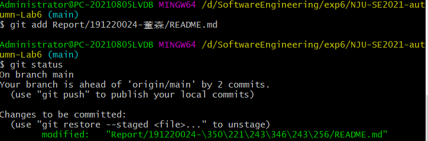
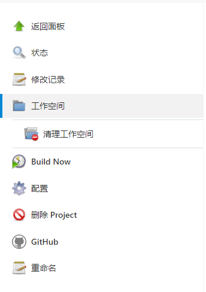

# NJU-SE2021-exp6-Report

**实验名称：项目协同开发管理与工具集成环境实验**

**学 号：191220024**

**姓 名： 董森**

**指导教师：张天**

**实验地点：基础实验楼乙**

**实验时间：2021.11.18-2022.1.5**


## 一、实验名称

项目协同开发管理与工具集成环境实验


## 二、实验要求

- 了解协同开发与持续集成过程 
- 学会使用项目协同开发管理工具 git/github 
- 了解持续集成并使用 jenkins 自动构建项目


## 三、实验环境

软件：

- Android 11.0 (Google APIs)x86_64
- Appium 1.18.3
- Android Studio Arctic Fox


## 四、实验内容

### 1、协同开发：

1. 安装 git，在本地将你的开源项目目录初始化为 git 仓库 
2. 在本地尝试修改、提交、回退等过程，在报告中展示你的操作，并使用 git diff, git log, git status 等命令展示操作前后的区别
3. 根据实验三针对几个页面进行微调的任务，在本地为每个子任务创建一个分支并在各分支上进行开发，最终将所有修改合并到 master 分支上；如有冲突请尝试解决。在报告中展示你的操作，并使用 git log --graph 命令展示分支合并图
4. 给你的某个稳定版本的代码打上标签
5. 注册 github 账号，在账号中创建远程仓库 (权限请设置为 public)；
6. 把本地的所有分支和标签推送到远端
7. 使用 pull request 提交自己的代码和报告 (作业提交说明里细 )
8. 在报告中回答以下问题：
   - 使用 git 的好处？
   - 使用远程仓库 (如 github/gitee 等) 的好处？
   - 在开发中使用分支的好处？你在实际开发中有哪些体会和经验？
9. 如果你额外学习并实践了关于 git/github 的其他进阶操作 (如 merge 和 rebase 的区别、reset 和 revert 的区别、stash, cherry-pick 的使用等)，可在报告中展示

### 2、持续集成：

1. 在本机安装 jenkins，并在全局工具配置和系统设置中配置好 JDK 地址、Gradle 地址、 ANDROID_HOME 地址和 JAVA_HOME 地址
2. 新建任务，在源码管理中填写自己项目的 github 地址，对项目进行一次构建
3. 修改代码再次推送到 github 仓库中，再次对项目进行构建


## 五、实验结果

### 协同开发：

#### 1、在本地尝试修改、提交、回退

- 首先修改README.md文件，在其中添加一行 “五、实验结果”，使用`git diff`命令查看修改：


- 使用`git add`命令将修改加入到暂存区中，并使用`git status`查看状态，可见有修改未被commit：



- 使用`git commit`命令提交暂存区内容，然后使用`git log`查看版本状态，可见已经有了一个新的版本，并且HEAD指针也已经指向改版本：


- 使用`git reset`命令进行版本回退，并使用`git log`查看版本信息，可见HEAD指针已经回退到上一版本了：

  

- 查看README.md文件，可见修改已被撤销(原来的那一行变成了"##"):

  

#### 2、创建分支，分别修改然后合并

- 首先在main分支下使用`git switch -c UpdateActivity`创建UpdateActivity分支并切换到该分支，然后在该分支下修改并提交：

  > git switch -c 命令与git checkout -b 命令效果一样，都相当于两行命令(先创建再切换)：
  >
  > ```
  > $ git branch dev
  > $ git checkout(switch) dev
  > ```

  

- 使用`git switch main`命令切换回main分支，并使用`git status`和`git log`查看当前分支的状态，可见在UpdateActivity分支下的修改对main分支无影响：

  

- 在main分支上完成修改并提交：

  

- 直接将UpdateActivity分支merge到main分支上，由于都修改了同一文件的同一行，所以产生了冲突，不可自动合并：

  

- 手动解决冲突后，再次提交冲突文件，然后合并：

  

- 使用`git log --graph`命令验证：


- 最后查看项目文件发现与预期修改一致🥳


#### 3、给某个稳定版本的代码打上标签

- 使用`git tag`命令给某个版本打上标签并使用`git log`命令验证：

  

  

#### 4、在GitHub账号中创建远程仓库 (权限请设置为 public)，并本地的所有分支和标签推送到远端

- 按照网上的教程创建远程仓库并关联本地文件夹

- 将本地文件和代码push到远程仓库：

  

- 使用`git push origin [tag name]`命令将本地tag推送到远程仓库（直接push不会push标签😭）：

  

- 再次查看github上的远程仓库，发现有了tag🤗：

  


#### 5、使用 pull request 提交自己的代码和报告


#### 6、Q&A

1. 使用 git 的好处？

   - 本地拥有版本库，随时进行版本控制，便于进行修改

   - 很容易建立分支，同时进行多个功能的开发，提高效率

   - 可以进行多个版本之间的区别对比，可视化修改，更加利于项目开发过程的管理

     

2. 使用远程仓库 (如 github/gitee 等) 的好处？

   - 远程仓库提供了稳定的网络仓库环境，可以在本地出现问题时充当备份，及时进行恢复。

   - 方便各个开发者共同合作开发同一项目，提高开发效率

   - 作为资源交换的工具，促进技术进步

     

3. 在开发中使用分支的好处？你在实际开发中有哪些体会和经验？

   - 各个分支开发不同的功能，主分支只负责release，降低耦合性，版本迭代更加清晰
   - 多个功能同时推进，开发效率提升
   - 提高项目的模块化程度，在不同的功能模块上可以进行独立测试，便于定位bug的位置
   - 利于代码review的实现，从而使整个团队开发更加规范，减少bug率


#### 7、额外学习git操作

1.  `merge`和`rebase`的区别

   - 从根本上讲，合并和rebase提供了相同的目的，以将来自一个分支（有时倍数分支）的变化集成到另一个分支中。

   - merge是将几个分支的修改合并（如果有冲突需要手动处理），然后创建一个新的commit提交，结果上面的实验已经做过，不再赘述

   - rebase则是将被合并的分支的从分出去开始的每一次提交都移到当前分支的最新提交之后，相当于所有的修改都是从当前分支最新的commit开始的，为了验证，我首先在master分支进行了一次commit，然后创建新分支feature1，并在该分支进行两次commit，切换回master分支后执行`git rebase`命令，然后使用`git log --graph`命令查看，结果如下：

     

     可见是从master分支的最新commit处开始合并的

   

2. `reset`和`revert`的区别

   - reset的英文原意就是重置，这里重置的是指针，就是重置head指针到指定的commit。

     revert的英文原意是使恢复原状，这里就是把文件内容恢复成指定commit的样子。

   - 也就是说，reset只会把head指针指向目标的commit

     revert则是需要有一个复原的过程，所以会创建一个（或几个）新的commit

   - 例如，有`A->B->C`的提交，指向`git revert` 回滚到B，提交记录会变成A->B->C->D，也就是将B作为一次新的提交:

     

   

3. stash的使用

   > git stash命令的作用就是将目前还不想提交的但是已经修改的内容(工作区和暂存区)进行保存至堆栈中，后续可以在某个分支上恢复出堆栈中的内容。这也就是说，stash中的内容不仅仅可以恢复到原先开发的分支，也可以恢复到其他任意指定的分支上。git stash作用的范围包括工作区和暂存区中的内容，也就是说没有提交的内容都会保存至堆栈中。

   - git stash：将所有未提交的修改（工作区和暂存区）保存至堆栈中，用于后续恢复当前工作目录

   - git stash list：查看当前stash中的内容

   - git stash pop：将当前stash中的内容弹出，并应用到当前分支对应的工作目录上。

     ​							注：该命令将堆栈中最近保存的内容删除（栈是先进后出）

   - git stash apply：将堆栈中的内容应用到当前目录，不同于git stash pop，该命令不会将内容从堆栈中删除

   

4. cherry-pick的使用

   > git cherry-pick命令的作用，就是将指定的提交（commit）应用于其他分支

   - 也就是说，`git cherry-pick`可以指定对应分支的某一次（或者几次）提交作为合并对象


### 持续集成

#### 1、在本机安装 jenkins

> ​	参考教程：[Jenkins简单安装及配置（Windows环境） - 小小尧 - 博客园 (cnblogs.com)](https://www.cnblogs.com/zhengyao9236/p/11584081.html)

​	由于Jenkins的默认更新镜像用的国外的镜像，所以我在安装时进入Jenkins官网时加载很慢，不过换源之后就解决了问题。


#### 2、配置环境变量


#### 3、创建新项目

直接创建一个空项目即可，在项目配置中填好项目信息（GitHub上的项目地址）


#### 	4、构建项目

​		在构建项目时发生了不少错误：

- 错误一：Couldn't find any revision to build. Verify the repository and branch configuration for this job.

  ​	

  找不到远程仓库，原因是我的URL填的是自己的SSH key，应该修改成web URL.

- 错误二：Couldn't find any revision to build. Verify the repository and branch configuration for this job.


​	但是修改过URL之后仍然报错，上网搜才知道是因为github在2020.10.1之后，所有的master分支都改成了main分支，所以需要将配置中的`/*master`改成`/*main`即可

- 错误三：Error fetching remote repo 'origin'

  

上网搜索发现是因为Jenkins有个工作空间（ workspace）的概念，Jenkins构建时产生的缓存会存储到工作空间，清理掉缓存就好：



最后**构建成功**：


#### 5、修改代码再次推送到 github 仓库中，再次对项目进行构建

构建成功后，可以通过控制台输出对比两次的构建的差别：

- 第一次：


- 第二次：

  


## 六、实验感悟

本次试验主要是学习了协同开发（git/github）和持续集成（Jenkins）的一些简单使用，之前的课程中也陆陆续续使用过git，但都是很简单的add、commit和oush，经过这次试验，我加深了对于git和github的理解以及使用，还有就是对于Jenkins的了解，虽然只是简单地安装、创建一两个项目，但是也算是对于持续集成有了一个初步的了解，总的来说这次的实验工作量也不算小，而且由于我自己的拖延症，导致一直拖到考完试才完成😩，不过总的来说，还是学到了很多东西，对于软件工程的一些开发方法有了初步了解😀。

这是本学期的最后一次实验了，从实验一到实验六，总的来说我觉得软工课程的实验工作量并不是很大，只不过由于大多都是之前未曾接触过的东西，所以上手会有些难度，但是这也培养了我们自我学习、解决问题的能力，另外，非常感谢张天老师以及各位助教在课程、实验中给我的帮助，帮助我解决了许多问题🥳。

完结撒花🌻🌻🌻

