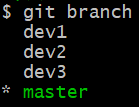
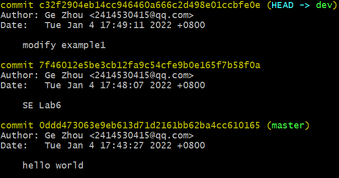

# 软件工程实验六报告

&emsp;&emsp;实验名称：项目协同开发管理与工具集成环境实验

&emsp;&emsp;学&emsp;&emsp;号：191220030

&emsp;&emsp;姓&emsp;&emsp;名：葛 洲

&emsp;&emsp;指导教师：张 天

## 一、实验名称

&emsp;&emsp;&emsp;项目协同开发管理与工具集成环境实验

## 二、实验目的

- 了解协同开发与持续集成过程
- 学会使用项目协同开发管理工具 git/github
- 了解持续集成并使用 jenkins 自动构建项目

## 三、实验内容

1. 协同开发 
2. 持续集成

## 四、实验过程与结果说明

1. 安装 git，在本地将开源项目目录初始化为 git 仓库，并将目录下初始的所有文件提交到git仓库中

2. 在本地尝试修改、提交、回退等过程，在报告中展示相关操作，并使用 git diff, git log, git status 等命令展示操作前后的区别

    - 修改：
    
        - 在README.md文件中添加信息如下所示:
            
            

        - 使用`git status`查看当前仓库状态：

            

            README.md文件被修改过，且尚未添加到暂存区及提交到仓库；

        - 使用`git diff`查看修改情况：

            

            README.md增加了4行内容，与实际修改一致；

    - 提交：

        - `git add README.md`将修改添加到仓库暂存区，使用`git status`查看仓库状态：

            

            README.md的修改尚未提交到仓库；

        - `git commit`将文件提交到仓库，使用`git log`查看提交日志：

            

            有两次提交记录，HEAD指向最新的一次提交；

        - 之后查看仓库状态：

            

            仓库中没有需要提交的修改，并且工作目录是干净的；

    - 回退：

        - 使用`git reset`回退到init版本并查看提交日志：

            

            

            显示HEAD指向了init版本库，即回退到了最初版本。

3. 根据实验三针对几个页面进行微调的任务，在本地为每个子任务创建一个分支并在各分支上进行开发，最终将所有修改合并到 master 分支上；如有冲突请尝试解决。在报告中展示你的操作，并使用 git log --graph 命令展示分支合并图

    - 使用`git branch <name>`创建分支，查看所有分支如下：

        

        显示共有四个分支，目前处于master分支，其中：

        dev1分支代表的子任务是在app项目中"about"栏目增加信息；
        
        dev2分支代表的子任务是增加控件及修改控件id；

        dev3分支代表的子任务是修改build.gradle以便项目通过编译；

    - 使用`git switch <name>`分别切换到每一个分支，在每个分支上完成相应的子任务并commit；

    - 切换到master分支，用`git merge <name>`将其余三个分支合并到master分支上，使用`git log --graph`查看分支合并图：

        

4. 给某个稳定版本的代码打上标签

    - 在合并了三个分支的master分支下，使用`git tag v1.0`打上标签v1.0

5. 注册 github 账号，在账号中创建远程仓库 (权限设置为 public)；把本地的所有分支和标签推送到远端

    - 首先创建SSH Key，并将公钥添加到自己的github账号中；

    - 之后在github上创建一个新的Git仓库，并用下面的指令将本地仓库与之关联：
        ```
        git remote add origin github.com/0030gz/MaterialFiles-1.3.1
        ```

    - 最后，依次把本地仓库的所有分支和标签推送到GitHub仓库中，采用如下指令：
        ```
        git push -u origin master
        git push origin dev1
        git push origin dev2
        git push origin dev3
        git push origin v1.0
        ```

6. git/github的其他进阶操作(如 merge 和 rebase 的区别、reset 和 revert 的区别、stash, cherry-pick 的使用等)的学习、实践与展示

    - `cherry-pick`

        作用：

        是将指定的提交(commit)应用到其他分支；即在当前分支下使用`git cherry-pick <commitHash>`命令，会将指定的提交commitHash应用到当前分支，在当前分支产生一个新的提交

        实践：
        
        本地仓库中有master和dev两个分支，master有一次提交，dev分支有两次提交，如下所示：

        

        使用`git cherry-pick 7f46012`将dev分支的第一次提交应用到master分支上，master分支会产生一个新的提交，如下所示：

        

    - `stash`

        作用：

        将当前工作现场“保存”起来，等以后恢复现场后继续工作

        实践：

        当前仓库中有master和dev两个分支，dev分支的工作状态如下：

        

        欲先完成master分支的相关任务，使用`git stash`保存工作现场：

        

        此时查看状态可以发现工作区是干净的:

        

        完成master分支的任务后，回到dev分支，恢复工作现场：

        

        之后可以继续dev分支的工作

        （可以使用`git stash`多次保存现场，使用`git stash list`查看保存现场的列表，使用`git stash apply`恢复、`git stash drop`删除保存的现场）

    - merge 和 rebase 的区别

        merge的合并效果看起来就像一个新的“合并的提交”，rebase的合并效果是使得分支历史看起来像是没有经历过合并一样；

        merge的结果能够体现出时间线，而rebase的结果会打乱时间线；

        使用merge只需要解决一遍冲突，而使用rebase可能会需要多次解决冲突

    - reset 和 revert 的区别
    
        reset是修改HEAD指针的指向，将HEAD的指向回退到之前存在的某个版本(commit)从而达到版本回退、恢复的效果；而revert则会使用一个新的commit来恢复到指定的版本(commit)，而不是通过HEAD指针的回退

7. 依据作业提交说明，使用 pull request 提交自己的代码和报告。

## 五、实验总结

1. 使用git的好处？

    Git是一种分布式版本控制系统，使用git的好处：

    - 便于项目的开发与管理，方便对项目版本进行存储与切换，以避免各种误操作带来的难以修复的问题
    - 可以建立分支，分支之间互不干扰、相互独立
    - 便于多人合作、协同开发
    - git采用分布式管理，每个成员都有完整的版本库，安全性更高

2. 使用远程仓库 (如 github/gitee 等) 的好处？

    - 可以进行代码托管，以免因本地仓库遭破坏而造成项目文件丢失
    - 远程仓库充当“服务器”的作用，便于团队合作、协同开发，团队成员可以从远程仓库中获取初始的项目、将自己的修改提交到远程仓库以及从远程仓库中获取经过他人修改后的最新的项目代码

3. 在开发中使用分支的好处？你在实际开发中有哪些体会和经验？

    - 好处：对不同的子任务建立不同的分支进行开发实现，分支之间相互独立，在一个分支上只需要关注一个任务的实现；在项目的开发过程中，需要增加、修改或取消某个子任务时，只需要对应地建立、修改或删除一个分支，操作较为方便；最终将所有分支合并到主分支中，在此之前主分支不会被修改
    - 体会和经验：使用分支的确使得各个子任务的实现更为容易，有利于项目的整体进展；但如果有些子任务之间存在一定的关联，在合并分支时容易产生冲突，需要手动解决冲突