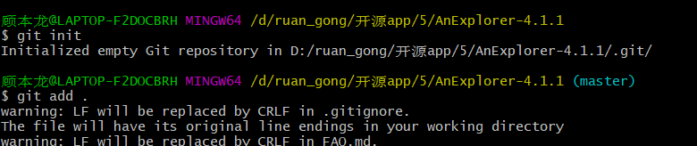
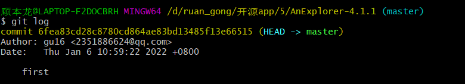
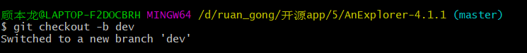
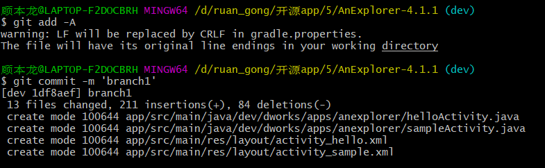
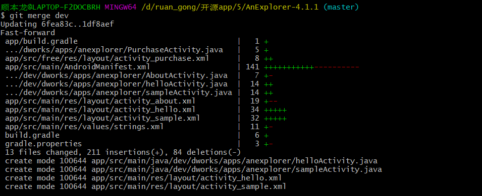
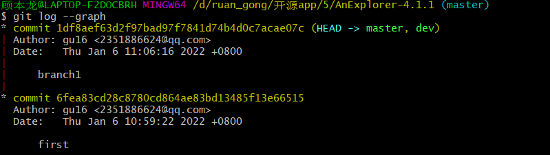
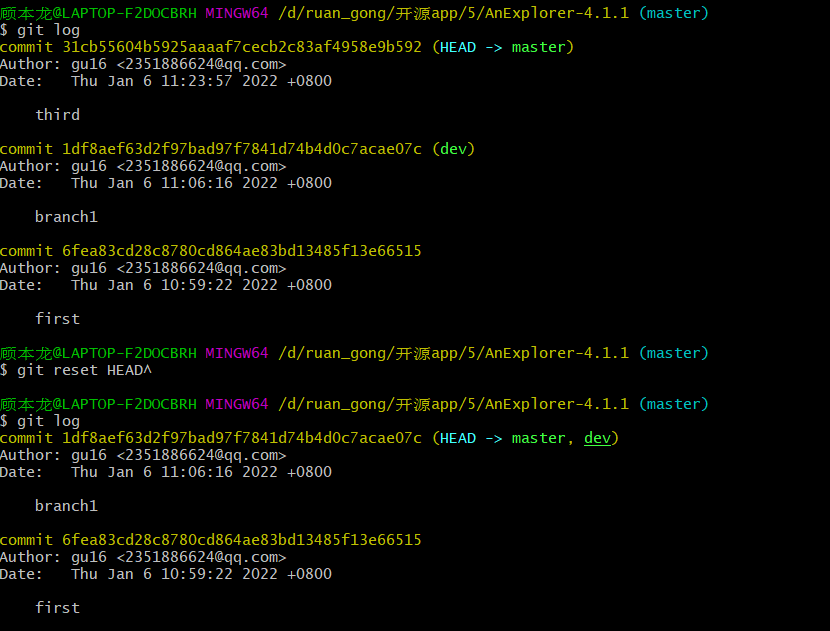
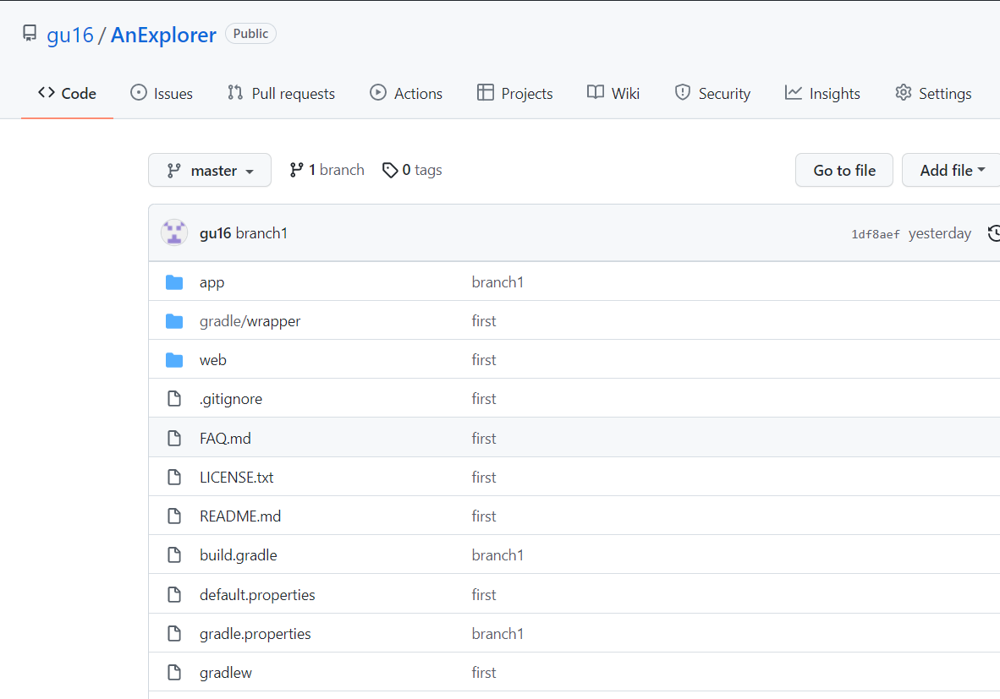

# 实验报告：lab6项目协同开发管理与工具集成实验环境

## 实验过程
1. 在原始目录使用`git init`并使用`git add .`和`git commit -m 'first'`，先对当前初始版本进行第一次提交。

2. 之后不对原始文件进行修改，使用`git log`和`git status`指令查看操作之后的区别
   

可以看出日志中已经有了我们第一次提交的记录，而status会提醒我们文件现在未进行任何修改。

3. 接着创建分支dev   

在dev的分支上我们对support的界面进行调整，调整完成之后将该分支提交为branch1

4. 切换会master分支，通过`merge`操作合并dev分支

这个时候我们通过`git log -- graph`查看，master和dev的分支都指向了branch1的提交。

5. 我们对master进行细微修改之后将它提交为third，提交之后，我们通过`git reset HEAD^`使之回退到上一个版本，再查看`git log`

6. 最终在我的GitHub账号上创建远程仓库AnExplorer，将回退之后的稳定版本打上标记v1，将它推到远程仓库上（这里忘记截图了）。完成之后远程仓库的结果为：

## 问题回答
### 1. 使用git的好处
使用git可以做到对自己的代码进行备份保存；当对代码进行较大改动但却想回到之前的样子时使用git就可以轻松回到之前的版本；git可以使用分支管理，在不影响主支的情况下进行。

### 2. 使用远程仓库的好处
将自己的代码提交到远程仓库，可以方便团队之间的协作交流；对代码进行了备份和保存；使自己不受限与当前的电脑，在任意电脑均可通过远程仓库获得代码并修改等。

### 3.使用分支的好处
使用分支可以让开发者放心进行开发，最终出现错误在不合并的情况下也不会对主支带来影响；分支的使用也方便了团队对同一个项目不同功能的开发，最终合并即可。