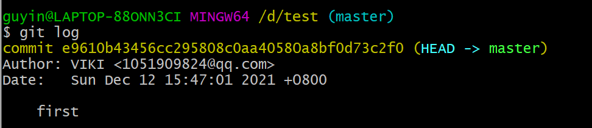

# 实验六 实验报告

191220033 顾吟

## 一、git 基本操作演示

下面演示git的基本操作：

首先，新建一个test文件夹，使用`git init`命令初始化本地仓库。

在test文件夹中创建一个`mytest.txt`文件，其中内容如下：

下面执行`git add .`操作，将修改的文件添加到暂存区。

再执行`git status`指令，可以看到：目前还没有任何提交，在待提交区的有mytest.txt这个新文件：

执行`git commit -m`操作，将当前暂存区里的文件（mytest.txt)提交到仓库中。

执行`git log`操作，可以看到新的提交被记录到了提交日志中。

再次执行`git status`操作，可看到，没有待被提交的文件。

接下来，修改test.txt文件中的内容，将“This is my git test”改成“my git test”，保存文件。执行`git diff`指令：

执行`git add .`和`git commit -m "second"`操作,即将修改后的文件再次提交，用`git log`操作查看提交日志：

接下来执行`git reset --hard HEAD^`指令，将当前仓库中内容回退到上一个版本。

使用`cat`命令查看mytest.txt中的内容，可以看到其中的内容回到了第一次的时候。

再次查看提交日志，可看到第二次的提交记录已经没有了。

## 二、实验三中的git操作

由于实验三中，共做了三处修改，为每一个修改创建一个分支，共创建了三个分支。

具体操作如下：

用`git checkout -b <分支名>`创建并切换到该分支上。

每完成一个分支就commit一次，用`git checkout master`切换到主支，再使用`git merge`操作将该分支合并到master分支上。

最后的分支合并图如下：

最后，用`git tag`指令为最终版本打上标签"v1":

## 三、思考题

### 1、使用git的好处

1. 能够对操作进行存储，出现问题可以随时进行版本回退等操作，便于对修改过程进行管理
2. 能够进行分支管理，每个分支之间独立存在互不阻碍，有助于多人协同开发，提高团队合作效率

### 2、使用远程仓库 (如 github/gitee 等)的好处？

1. 可以完成远程的代码备份
2. 可以实现多人之间的代码共享，方便进行多人协同开发
3. 有助于个人的多设备开发

### 3、在开发中使用分支的好处？你在实际开发中有哪些体会和经验？

1. 每个分支之间独立存在互不阻碍，有助于多人协同开发，提高团队合作效率

2. 一个分支开发失败不会对其他分支造成影响，避免了某个功能的开发失败对程序的影响

3. 在程序开发中，可以为每个功能开一个分支，当该功能完成后再merge到主支，这样就更方便和稳定。

   

## 四、git/github 的其他进阶操作

### 1、merge和rebase区别：

merge一般发生在主分支上，会保留所有commit的历史时间；rebase不会保留被merge分支上的commit，rebase通常发生在每个人自己的分支上，会始终把最新的修改放到最前。

### 2、reset和revert的区别：

1、reset是彻底回退到指定的commit版本，该commit后的所有commit都将被清除；而revert仅是撤销指定commit的修改，并不影响后续的commit。

2、reset执行后不会产生记录，revert执行后会产生记录。

### 3、stash的使用: 

​	`git stash`用于想要保存当前的修改,但是想回到之前最后一次提交的干净的工作仓库时进行的操作.`git stash`将本地的修改保存起来,并且将当前代码切换到`HEAD`提交上.

### 4、cherry-pick的使用：

​	将指定的提交（commit）应用于其他分支。

