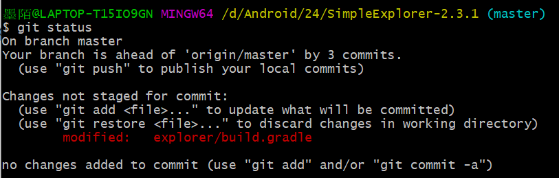

# 实验六：项目协同开发管理与工具集成环境实验

## 1、开始Git

安装 git，在本地将我的开源项目目录初始化为 git 仓库。

## 2、Git的基本操作

在本地尝试修改、提交、回退等过程，在报告中展示操作，并使用 git diff, git log, git status 等命令展示操作前后的区别。

在实验开始之前，使用`git log`、`git status`和`git diff`命令来查看当前状态。


可以看到，`git log`显示出了最近一次commit是初始版本的代码提交，`git diff`空白表示暂未对最新提交过的代码做什么修改，`git status`则显示当前已是最新版本，没有需要commit的地方。

在实验三、四（静态分析过程中对代码进行过一些改进）进行过修改后，再使用`git status`命令查看。



可以看出，branch领先三个版本，这是由于在实验三中对组件进行的三次微调在本地commit过了却未push到远端导致的。同时，系统提示本地有没commit过的修改，这是在实验四中产生的修改，现在我们可使用如下命令进行修改的提交：

```
git add .
git commit -m "experiment 4"
```

提交结束之后进行版本回退，执行命令

```
git reset --hard HEAD^
```

回到上一个版本即可。

## 3、子分支

根据实验三针对几个页面进行微调的任务，在本地为每个子任务创建一个分支并在各 分支上进行开发，最终将所有修改合并到 master 分支上；如有冲突请尝试解决。在报告中展示操作，并使用 git log --graph 命令展示分支合并图。

如图所示，创建子分支color，然后切换到color分支上进行第一个组件的微调，开发结束后进行本地commit。


切换回主分支master，将子分支color合并到master上，然后展示当前的分支合并图。


结束之后删除子分支color。


完毕。对于接下来的两次组件微调，操作同上，子分支分别命名为“upper”和“newbutton”，最终的分支合并图如下。


## 4、标签管理

把实验三结束之后的最新一次commit作为稳定版本打上标签，操作如下图：


可以看到标签已经成功添加：v1.0，然后使用git push把本地的所有分支和标签推送到远端。

## 5、思考题

Q1：使用git的好处？
A1：①在本地建立一个版本库，可以在本地开发过程中随时管理自己的代码版本，一旦开发过程中出现难以恢复的crash可以直接回退版本；②可以建立分支，直接在分支上修改某一部分的代码后再进行提交和合并，避免了在一个分支上开发所有部分的麻烦；③git支持远程协作、可以同步本地和远程仓库，更方便多人协作。

Q2：使用远程仓库 (如 github/gitee 等) 的好处？

A2：①实现了代码、文档托管，当本地发生难以恢复的crash导致代码和文档意外丢失，可以通过远程仓库找回自己的代码和文档；②方便多人协作，通过fork和pr操作，许多人可以参与到同一个开源项目当中，集思广益、互相学习。

Q3：在开发中使用分支的好处？你在实际开发中有哪些体会和经验？

A3：①同时并行推进多个功能开发，提高开发效率；②各个分支在开发过程中，如果某一个分支开发失败，不会对其他分支有任何影响，失败的分支删除重新开始即可。