# 实验六实验报告
## 1. 初始化本地仓库：
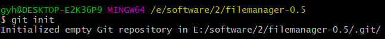
## 2. 修改，提交，回退
### **修改**
#### git status
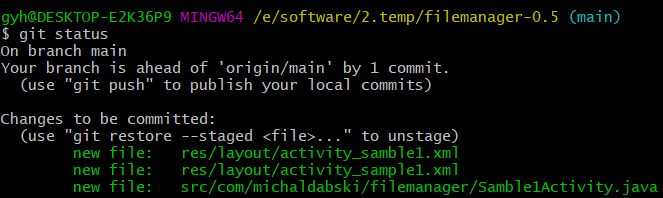
#### git diff
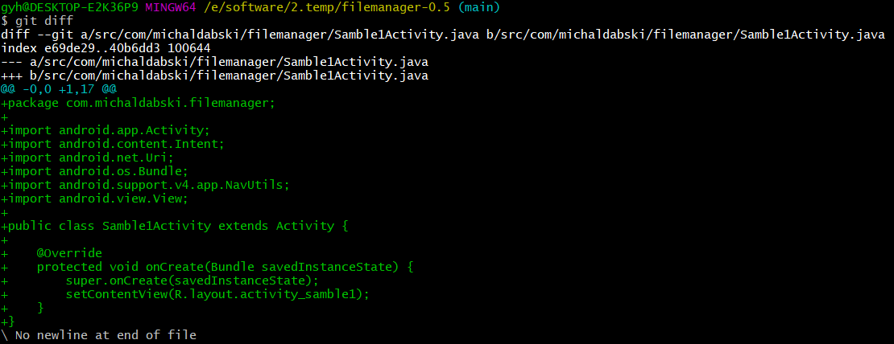
#### git log
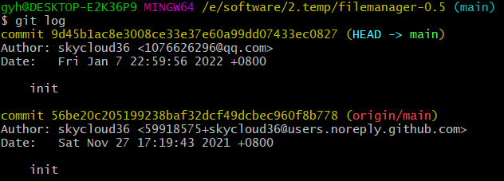
### **提交**
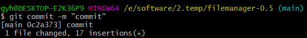
#### git log
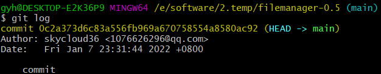
### **回退**
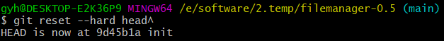
#### git log

## 3. 分支开发
### 创建分支
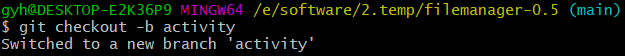
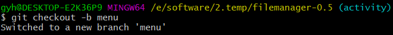
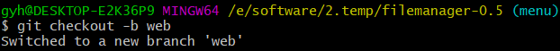
### 合并分支
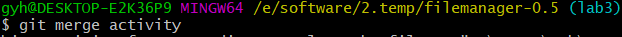
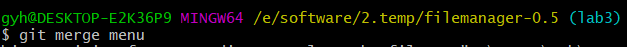
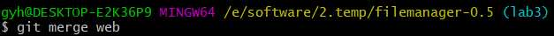
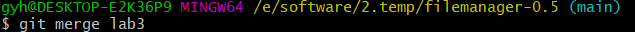
### 分支合并图
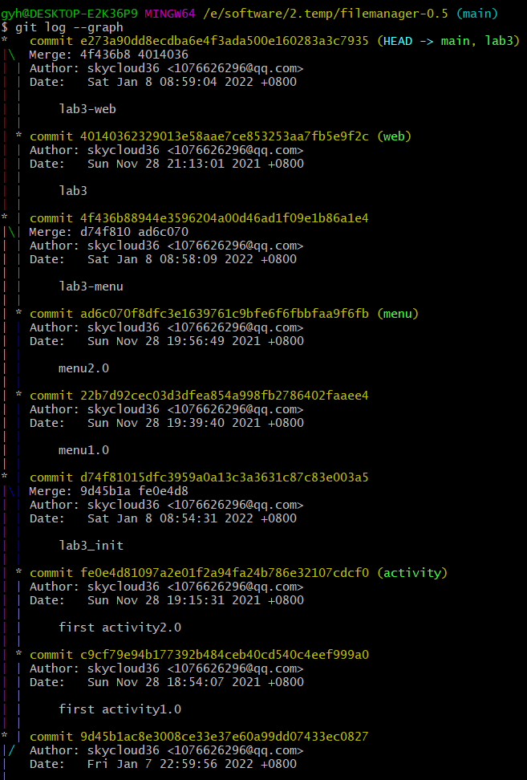
## 4. 回答问题
### 使用git的好处
1. 可以更方便地管理代码，简化了修改和复原代码的复杂步骤。
2. 相比于复制粘贴的备份方式，git可以提供更为轻量级的管理
3. 操作简便，而且给予哈希表的索引方式可以极大速度提高管理代码的速度
4. 便于创建分支，可以有效进行团队开发，而且可以减少冲突带来的影响
### 使用远程仓库的好处
1. 让工程不受限于本地硬盘，可以随时随地对工程进行开发。
2. 让团队合作更加方便，可以方便地对工程进行克隆并且在本地独立开发，不影响团队工程。
3. 让开源项目可以得到更多程序员的支持。使开源更简单。
### 在开发中使用分支的好处
1. 对于一个项目某一个功能的编辑修改，利用分支可以实现简单的分离，这样在修改功能过程中，不会影响其他功能的修改。
2. 当不同功能修改了同一区域的代码时，使用分支可以给出提示，这样可以减少由于共同开发带来的问题。
### 实际开发中的经验与体会
1. git的指令虽然简单，但是种类较多，因此需要一定的学习成本，当然随时上网查找可以极大降低学习成本。
2. 利用git的回退功能，可以很简单地实现删除修改，比如当某一个功能在修改后出现了问题，而且修改的内容多且杂，一句句删除修改是不现实的，而使用git reset可以有效实现删除修改，而且如果不小心删掉了新的版本，git也可以提供一个复活的机会，不至于彻底凉凉。