# NJU-SE2021-autumn-Lab6

## 文件删除

1. 在修改文件删除功能时，首先利用git checkout -b DeleteModule，创建DeleteModule分支并切换；输入git branch可以看到目前的分支情况，随后在此分支下修改场景

2. 修改完成并调试通过后，利用git status可以看到被修改的文件

   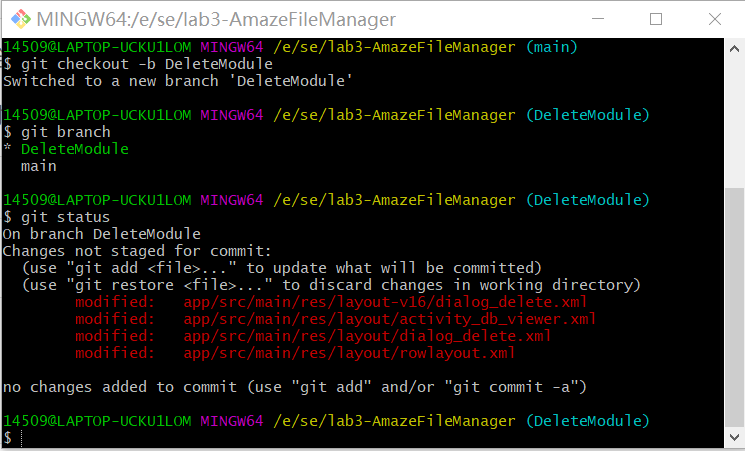

3. 之后git add真正需要被提交的dialog_delete.xml文件，再输入git status可以看到此文件已经不在列表中

   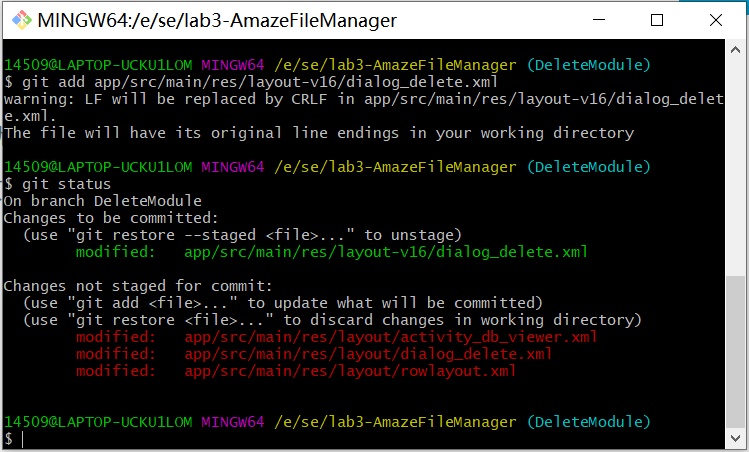

4. 此时利用git log --graph查看分支情况

   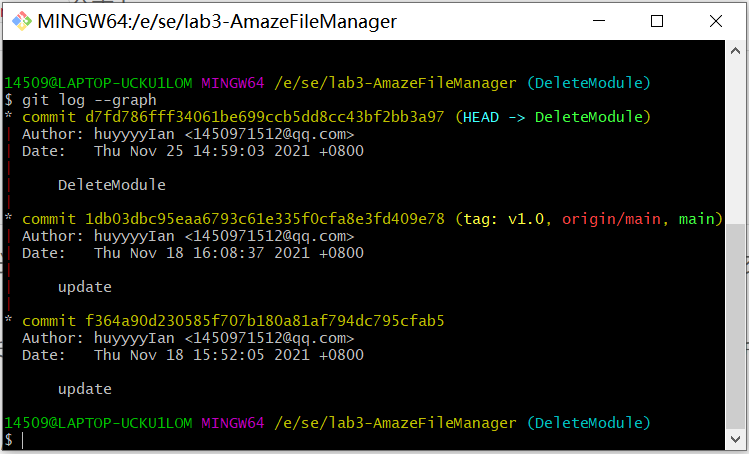

5. 这时如果发现版本内容出现问题，可以使用git reset --hard HEAD^回到上一个版本，其中HEAD^表示头指针的上一个版本，^^即上上个版本，以此类推；查看分支图，发现已经回到了v1.0的最初稳定版本

   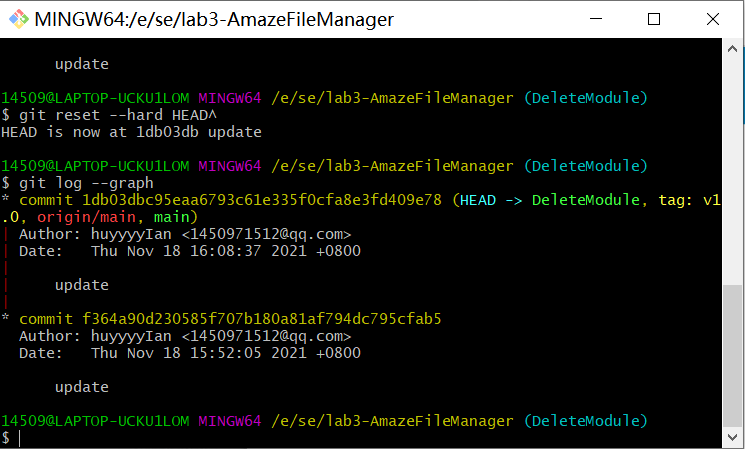

6. 在重新审视代码后，发现原来是虚惊一场，这时候可以用git reset --hard d7fd7回到最新的版本，d7fd7是根据之前的分支图中的commit代码得出的，不用输出完整代码，只需要保证输入的开头独一无二即可；此时查看分支，确实位于之前的最新版本

   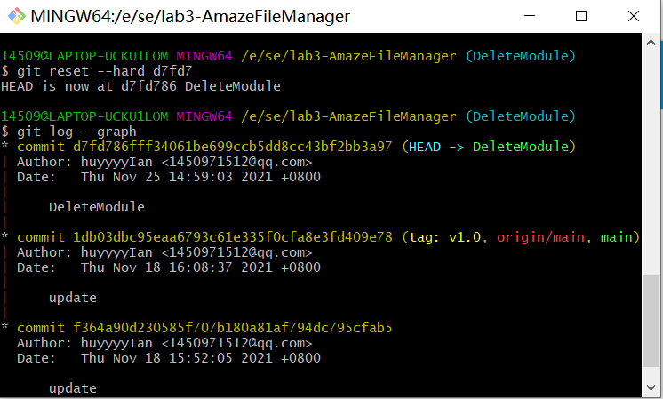

## 查看文件属性

1. 修改文件属性场景时，同理建立并切换PropertiesModule分支；修改并调试场景完毕，利用git status可以看到被修改的文件；此时输入git diff，显示出工作区与暂存区的共同文件

   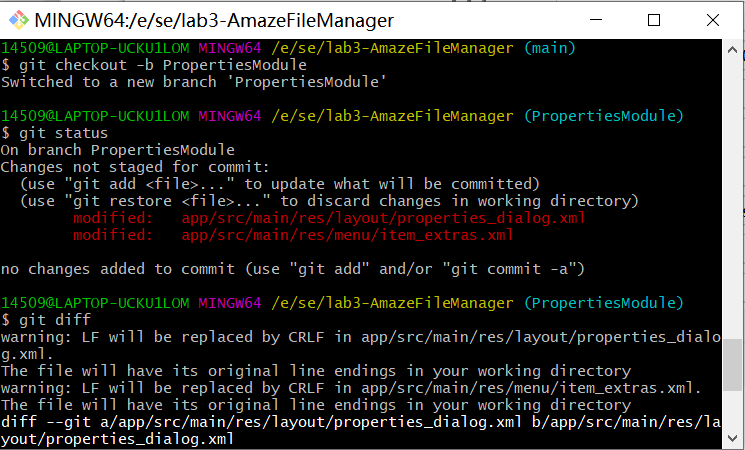

   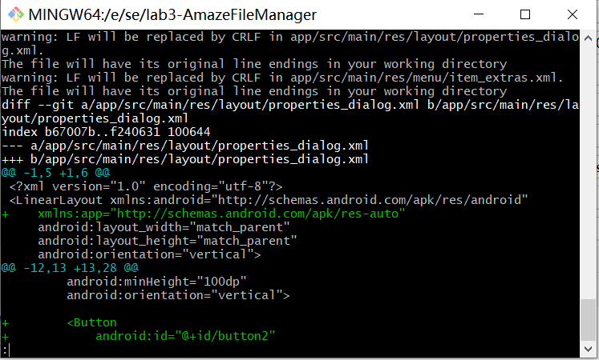

2. 之后利用git add和git commit提交被修改的文件

   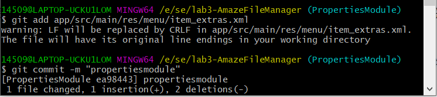

## 合并分支与最终提交

1. 全部修改完成后，查看分支情况，可以看到目前存在的三个分支，利用git merge合并两个支线到main；此时再查看分支图，可以看到分支的合并历史

   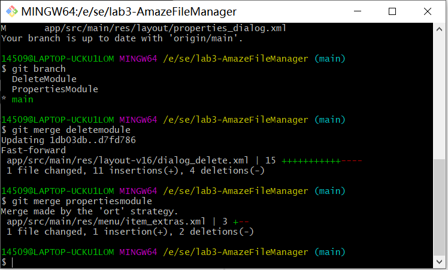

   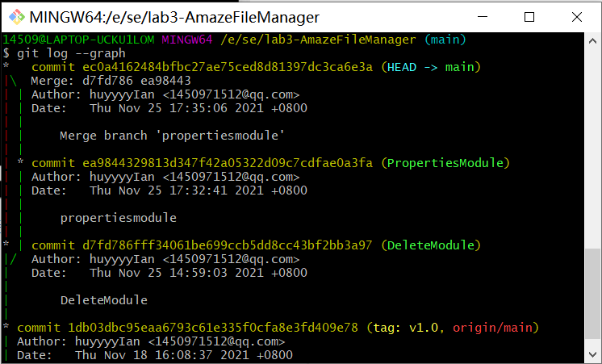

2. 利用git tag打上v2.0的稳定版本标签，并使用git push提交

   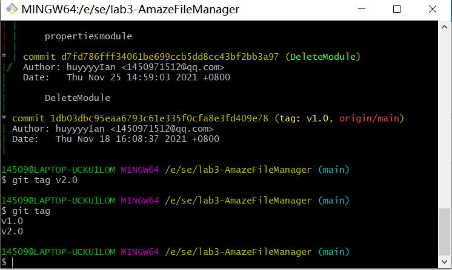
   
   
   
   

## 思考题

1. 使用git的好处？

   git是世界上最先进的分布式版本控制系统，使用git管理代码不需要依赖服务器，而且部署方便，基本上下个命令就可以用，git的分支开发可以让主干代码保持干净；此外github有着良好的社区支持，社区上开发非常活跃，使用人数很多

2. 使用远程仓库(如github/gitee 等) 的好处？

   如果想要多人协同开发，对学生来说购置服务器比较昂贵，使用远程仓库如github就可以免费地和团队其他成员一起协作开发某个项目；管理这些远程仓库，我们可以推送或拉取数据，分享各自的工作进展，包括管理各式远程库分支等等

3. 在开发中使用分支的好处？你在实际开发中有哪些体会和经验？

   分支开发的好处是，真正确保我们每个人有自己的独立分支而不是全部在master分支上开发，全部在master分支上开发弊端太多，比如隔离性太差，而且全部在一个分支上开发的话，经常面临的就是解决冲突

   在自己的分支上开发进行合并与全部在一个主分支上开发进行对比，如果代码提交相对频繁，将会永远都在解决冲突，如果提交缓慢的话，还是在解决冲突，但实际上很多冲突是没有必要的

