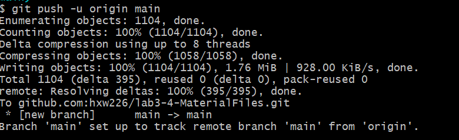
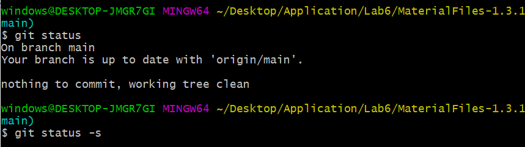
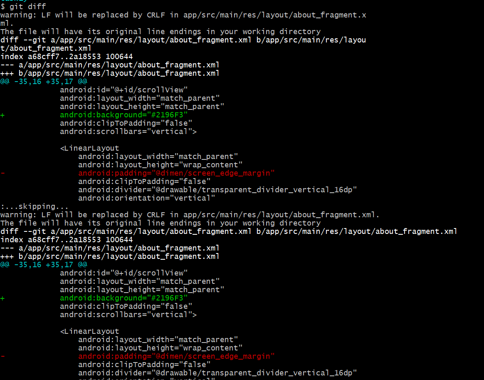
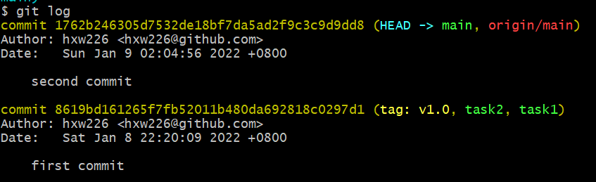
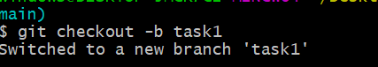
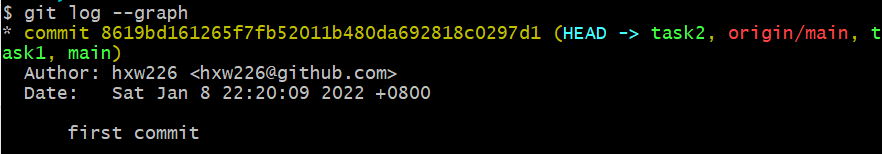
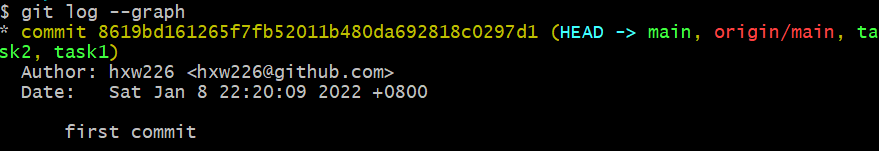

# 软件工程Lab6实验报告

191220038 黄新炜

## Git基本指令

- 创建本地仓库

  `git init` ：用于在当前目录下创建一个新的仓库

  `git add .`：把当前目录下的所有文件添加至暂存区

  `git commit -m`：把暂存区中的所有内容添加到本地仓库中

- 把本地仓库和远程仓库相关联

  `git remote add [shortname] [url]`：添加远程版本库

  `git push `：把本地版本上传至远程版本库中并合并

进过上述操作后，本地版本的内容已经上传至github仓库中：

其他基本指令：

- `git status`：用于查看自上次提交之后对文件是否有修改

  `git status -s`：可以查看修改的文件目录

  具体效果为：

  

- `git diff`：用于查看工作区和暂存区的文件是否有差别

  例如，当我创建了第一个分支task1，并做适当修改之后执行`git diff`：

  

- `git log` ：用于查看历史提交记录

  

## 实验三相关子任务

1. 为每一个子任务创建分支并在分支上开发

   - `git checkout [branchName]` ：切换到名为branchName的工作分支下
   - `git checkout -b [branchName]`：新建名为branchName的工作分支下，并切换到该分支

   

   在实验3中，我实现了三个小任务，所以分别创建2个工作分支：

   - `git log --graph`：用于展示分支结果

     

2. 合并分支

   - `git merge`：用于合并当前分支下的所有分支

   执行完`git merge`之后再执行`git log --graph`来查看分支结构：

   

## 标签和提交

- `git tag [tagName]` ：用于该当前代码打上标签，可以用来对当前版本做特定的标记
- `git push`：用于把本地版本上传至远程仓库，可以上传代码和标签

## 思考题

1. 使用 git 的好处？

   相当于在本地拥有一个版本库，如果在开发过程中出现失误，可以和容易地回退至某个特定的版本，而不用把代码再写一遍。

2. 使用远程仓库 (如 github/gitee 等) 的好处？

   可以便捷地实现团队开发项目，团队成员可以各自修改自己的部分，然后上传至远程进行合并，提高了开发效率。

3. 在开发中使用分支的好处？你在实际开发中有哪些体会和经验？

   使用分支的好处在于，有时候针对一个问题的实现有多种不同的想法，每一种都想尝试一下又怕增加问题时可以用分支很好地解决这种情况。只需要新建分支，在新分支上修改，如果修改的不好就回退，如果修改得合适就合并，非常方便。