# 软件工程实验报告-Lab6

#### 学    号：191220042                               

#### 姓    名： 蒋梓栩                          

#### 指导教师：张天                                 

#### 实验地点：基础实验楼乙208                                

#### 实验时间：2021.12.1-2021.12.7     

## 一、**实验名称**

项目协同开发管理与工具集成环境实验

## 二、**实验目的**

- 了解协同开发与持续集成过程
- 学会使用项目协同开发管理工具 git/github 
- 了解持续集成并使用 jenkins 自动构建项目

## 三、**实验环境**

1. 软件（JDK，Android SDK，Gradle）：
   - JDK：1.8.0_231
   - Android SDK：Android 11 (API 30)
   - Gradle：
     -  Android Gradle Plugin Version：7.0.3
     -  Gradle Version：7.0.2
2. 硬件（安卓模拟器版本）：Pixel 2 API 30

## 四、实验内容

1. Git
   - 安装 git，在本地将你的开源项目目录初始化为 git 仓库 (如已有.git 文件夹请先删除) 
   - 在本地尝试修改、提交、回退等过程，在报告中展示你的操作，并使用 git diff, git log, git status 等命令展示操作前后的区别 
   - 根据实验三针对几个页面进行微调的任务，在本地为每个子任务创建一个分支并在各分支上进行开发，最终将所有修改合并到 master 分支上；如有冲突请尝试解决。在报告中展示你的操作，并使用 git log --graph 命令展示分支合并图
   - 给你的某个稳定版本的代码打上标签
   - 注册 github 账号，在账号中创建远程仓库 (权限请设置为 public)；把本地的所有分支 和标签推送到远端
   - 使用 pull request 提交自己的代码和报告 (作业提交说明里细 )
   - 在报告中回答以下问题：
     - 使用 git 的好处？
     - 使用远程仓库 (如 github/gitee 等) 的好处？ 
     - 在开发中使用分支的好处？你在实际开发中有哪些体会和经验？
   - 如果你额外学习并实践了关于 git/github 的其他进阶操作 (如 merge 和 rebase 的区 别、reset 和 revert 的区别、stash, cherry-pick 的使用等)，可在报告中展示
2. Jenkins
   - 在本机安装 jenkins，并在全局工具配置和系统设置中配置好 JDK 地址、Gradle 地址、 ANDROID_HOME 地址和 JAVA_HOME 地址
   - 新建任务，在源码管理中填写自己项目的 github 地址，对项目进行一次构建
   - 修改代码再次推送到 github 仓库中，再次对项目进行构建

## 五、实验结果

### Git

#### 1

> 安装 git，在本地将你的开源项目目录初始化为 git 仓库 (如已有.git 文件夹请先删除) 

之前已经安装过git，因为已经将开源项目上传至仓库，这里直接git clone

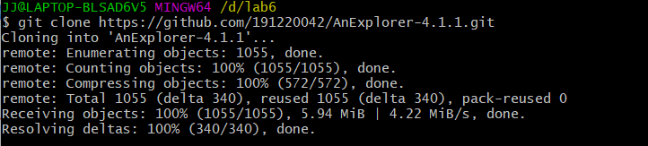

> 在本地尝试修改、提交、回退等过程，在报告中展示你的操作，并使用 git diff, git log, git status 等命令展示操作前后的区别 

这里在项目中新增文件haha.txt，使用命令git status

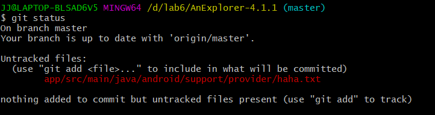

下面将新增文件从工作区添加到暂存区，再次使用git status可见

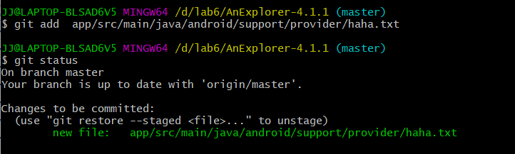

使用git commit将新增文件提交至版本库，git log可见HEAD处于新的commit上

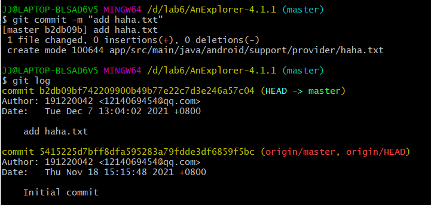

使用git reset回退版本

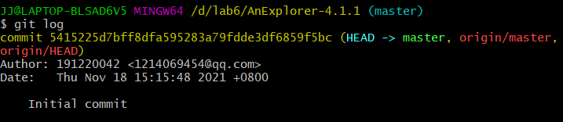

在haha.txt中稍作修改，使用git diff对比工作区与暂存区的共同文件

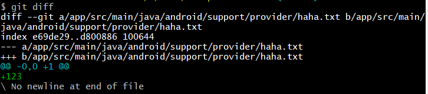

> 根据实验三针对几个页面进行微调的任务，在本地为每个子任务创建一个分支并在各 分支上进行
>
> 开发，最终将所有修改合并到 master 分支上；如有冲突请尝试解决。在报 告中展示你的操作，
>
> 并使用 git log --graph 命令展示分支合并图

git branch查看分支可见目前只有master,现在新建分支并切换

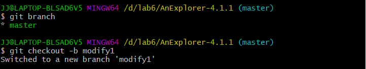

在分支modify1中修改代码

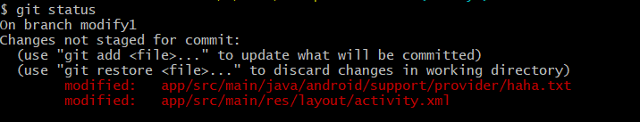

git add . 后通过git commit -m "添加TextView"提交

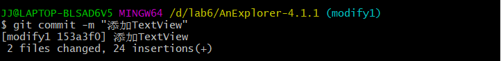

切换回master并新开一个分支modify2

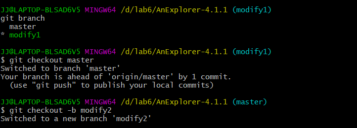

修改代码后git add .再commit

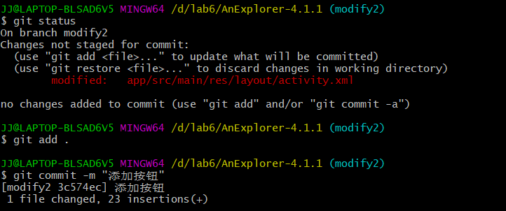

切换到master分支，使用git merge modify1合并第一条分支，结果为

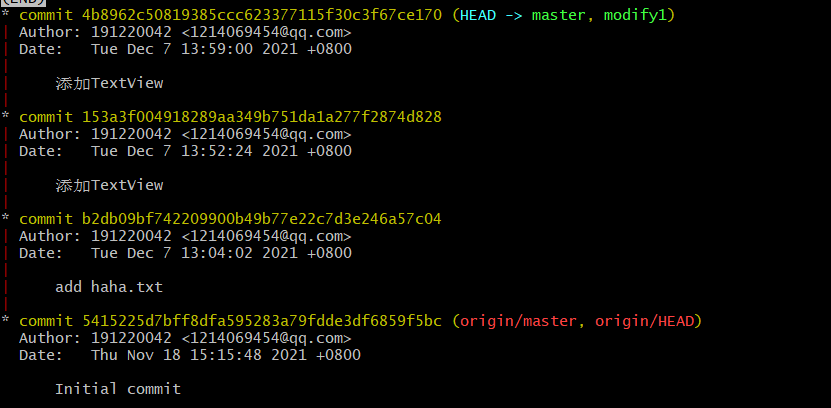

下面合并第二条分支，遇到冲突

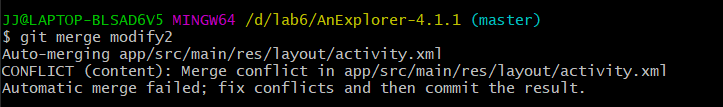

下面手动解决冲突，通过cat指令打开文件可知冲突位置，在Android Studio中做出修改

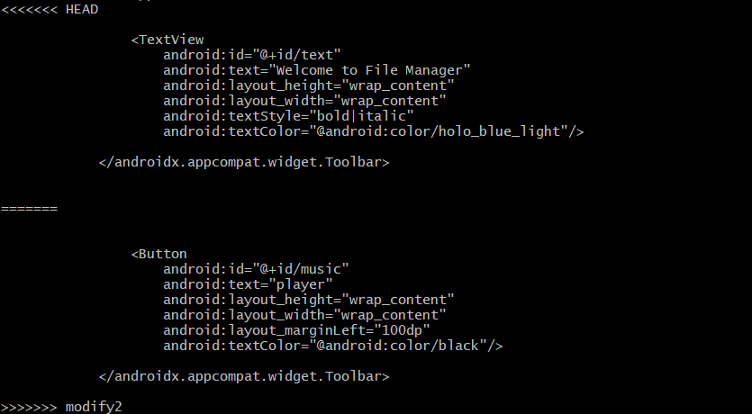

手动解决之后进行add . 之后commit,使用 git log --graph 命令展示分支合并图

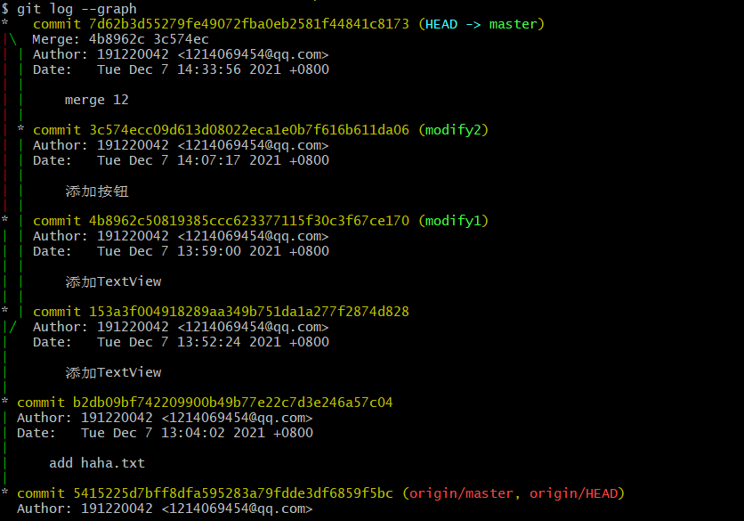

再创建分支modify3,修改代码提交后合并分支。

> 给你的某个稳定版本的代码打上标签

> 注册 github 账号，在账号中创建远程仓库 (权限请设置为 public)；把本地的所有分支 和标签推送
>
> 到远端

推送所有分支和标签

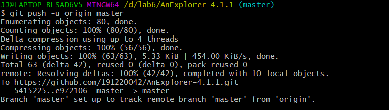

> 在报告中回答以下问题：
>
> 使用 git 的好处？
>
> 使用远程仓库 (如 github/gitee 等) 的好处？
>
> 在开发中使用分支的好处？你在实际开发中有哪些体会和经验？

1. 使用 git 的好处？

git是分布式的版本库，可以在自己的电脑里修改，操作，不需要依赖中心仓库。

git的多分支，版本回退，版本对比可以帮助代码的管理和修改。

2. 使用远程仓库 (如 github/gitee 等) 的好处？

远程仓库可以由很多人fork之后协同开发，极大提高了效率。此外，远程仓库还可以作为代码的一个备份。

3. 在开发中使用分支的好处？你在实际开发中有哪些体会和经验？

使用分支可以进行实验性的修改，成功后可以merge进主分支，失败后删除该分支即可。

每个功能都独立分支便于分工协作，提高了编程效率。

