# 实验六报告

### 实验内容：

#### 1.熟悉git

初始化仓库并首次提交，然后使用git log 查看记录：

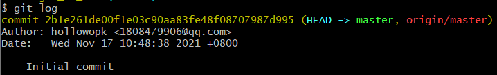

尝试修改文件（修改最上面的注释）：

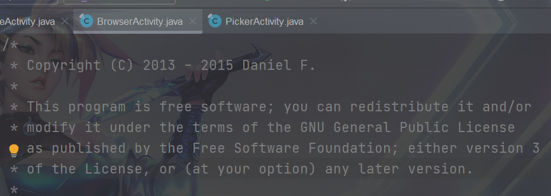

使用git status查看

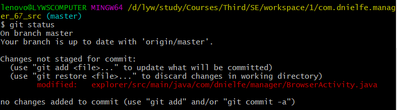

此时工作区已经发生变化，使用git diff查看变化：

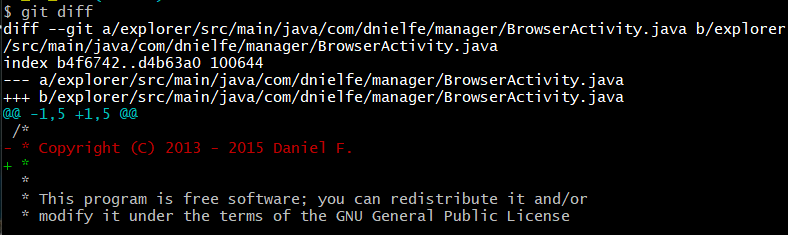

使用git add . 和 git commit 提交，再使用git log查看提交记录：

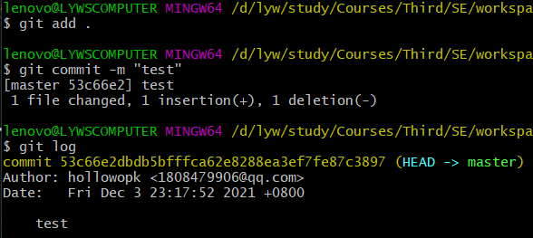

可以看到git历史已经被记录，接下来使用git reset --hard重置代码：

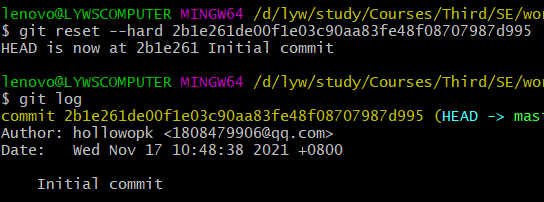

再查看git log时，发现提交记录已经清除。

#### 2.实验3开发

首先创建一个分支并切换到该分支上：

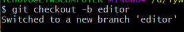

在本次实验中我实现了文本编辑器功能，首先创建文本编辑器界面，新建一个activity和对应的layout文件，然后使用git status查看：

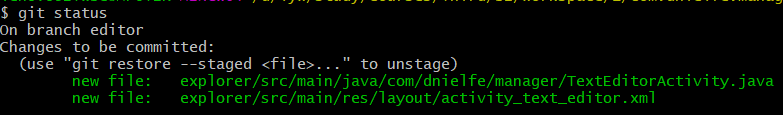

可以看到，有两个新文件已经被创建了。

将修改commit后，切换回master分支，并将创建的editor分支merge进来：

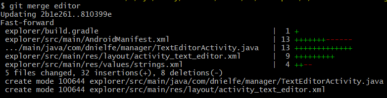

这样分支就merge成功了，本次merge操作没有产生冲突。

使用git log --graph 展示分支合并图：

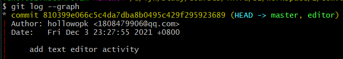

给该版本打上标签：

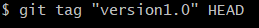

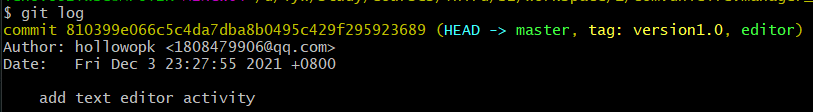

在push的时候加上tag参数即可将tag添加到github：

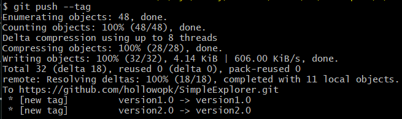

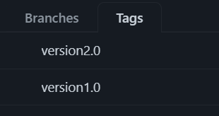

#### 3.探索git其他操作

##### merge和rebase：

如图，此时共存在2个分支，且各有一次commit

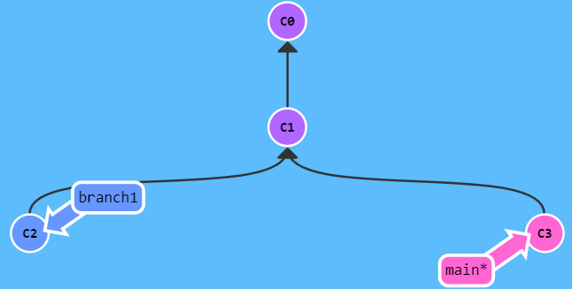

此时，若将branch1分支合并到main上，使用git merge：

则合并后：

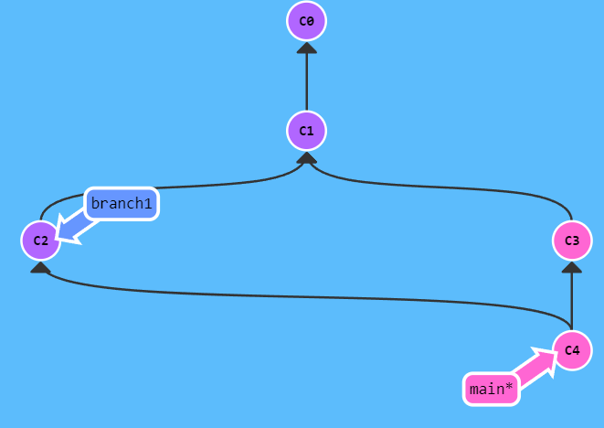

可以看到，merge将两个分支的修改合并到了一起

而若是使用git rebase：

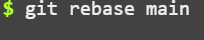

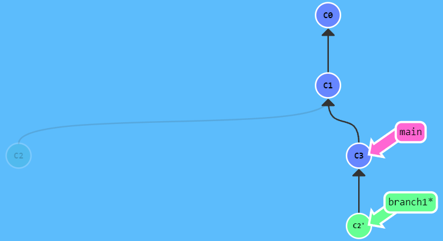

git rebase并不会进行合并分支，而只是提取当前分支的修改，并将其复制到目标分支的最新提交后面。

##### reset和revert：

首先假设在main分支上有多次commit：

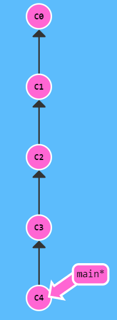

此时假设我们想回退到标号为c2的commit，尝试使用reset：

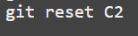

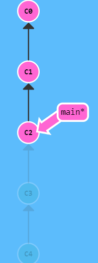

可以看到，git reset将当前分支的HEAD移动到了指定的commit上，以达到撤销的效果。

如果使用git revert，则效果如下：

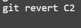

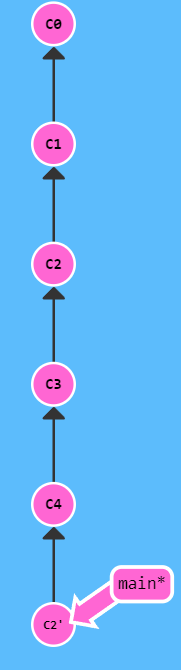

从图中可以看出，git revert时用一次新的commit来回滚到之前的commit，新commit的内容与要revert的内容相反，刚好抵消要被revert的内容。

##### cherry-pick：

git cherry-pick命令复制一个提交节点并在当前分支做一次完全一样的新提交

如图，我们有两个分支，其中branch1分支在main基础上多一次commit：

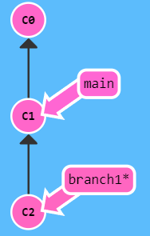

此时我们切换回main，并执行一次cherry-pick，将编号为c2的commit复制到main上：

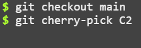

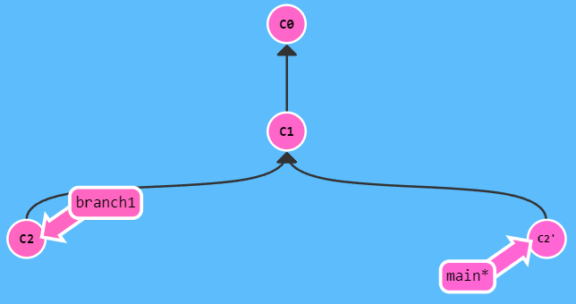

可以看到，在main分支上我们复制了一份C2 commit并将改动应用于分支上。

#### 4.问题

##### 使用git的好处：

建立版本库，方便随时回退与修改

给项目创建分支，方便多人项目开发

##### 使用远程仓库的好处：

可以高效在线协同开发

建立数据云备份，防止数据丢失损坏

##### 在开发中使用分支的好处：

方便同一项目不同功能开发的同步进行

在实际开发中，我们团队可以为每个功能实现创建一个分支，大家只需在小组范围内处理冲突问题，有效加速开发效率