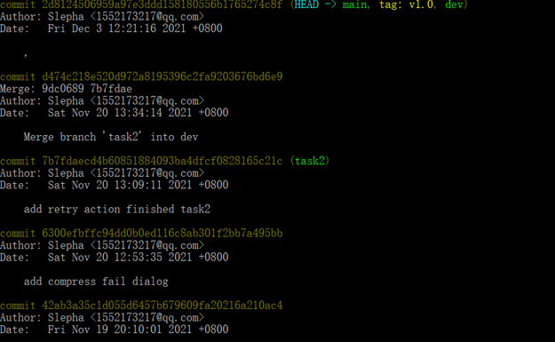

# Lab6 Report

## 一、实验目的

​		项目协同开发管理与工具集成环境实验。

## 二、实验目的

- 了解协同开发与持续集成的过程
- 学会使用项目协同开发管理工具git/github
- 了解持续集成并使用jenkins自动构建项目

## 三、实验环境

1. 软件: Android Studio
2. 项目名称: AmazeFileManager-3.6.3

## 四、实验内容

#### 1.初始化仓库

#### 2.创建分支并查看

#### 3.修改文件

修改文件后用git diff查看

用git log和git status查看信息

commit后再次查看信息

#### 4.分支合并

查看分支信息

合并分支

合并后再查看

合并到main分支

## 五、实验结果

1. 使用git的好处

- 便于版本管理，可以进行创建不同的分支以及回退等操作，可以大胆地去开发。

2. 使用远程仓库 (如 github/gitee 等) 的好处？

- 可以在多个设备上进行开发。
- 可以实现多人协作开发。

3. 在开发中使用分支的好处？你在实际开发中有哪些体会和经验？

- 在开发中使用开发，可以互不影响地并同步实现不同的功能点而互不影响。对我来说，有效地帮助我实现了两个不同的功能点。

