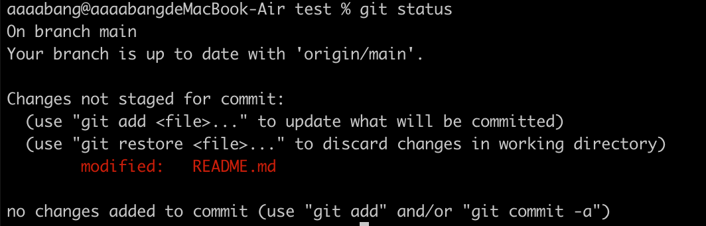
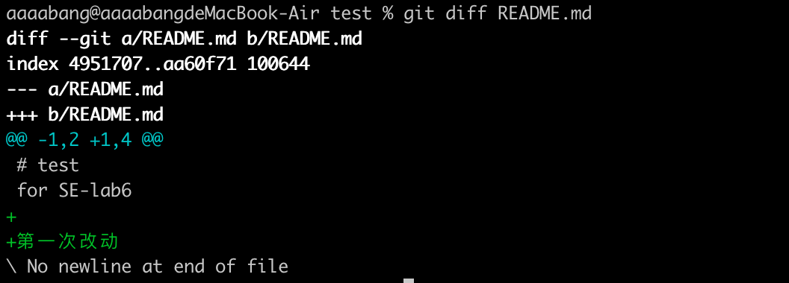
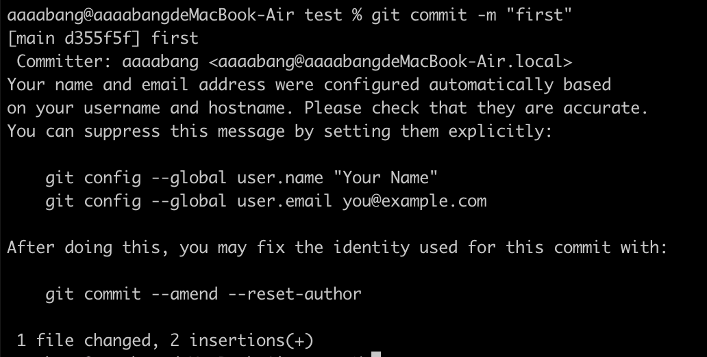
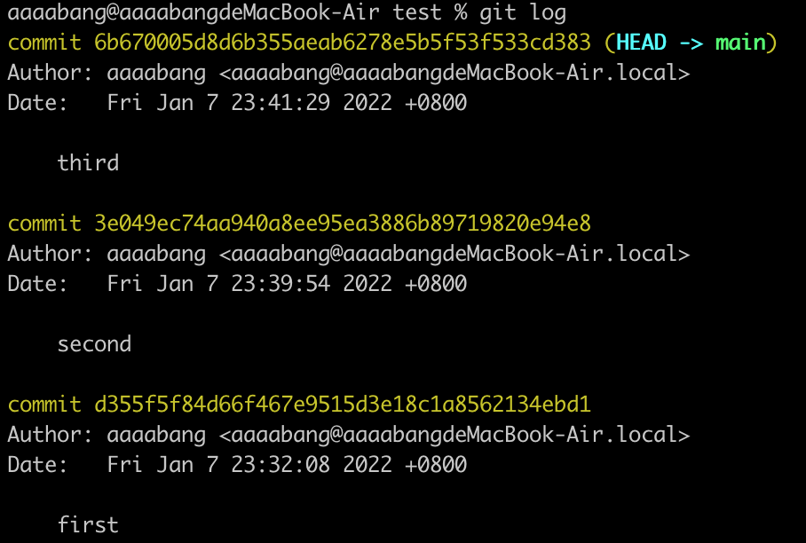
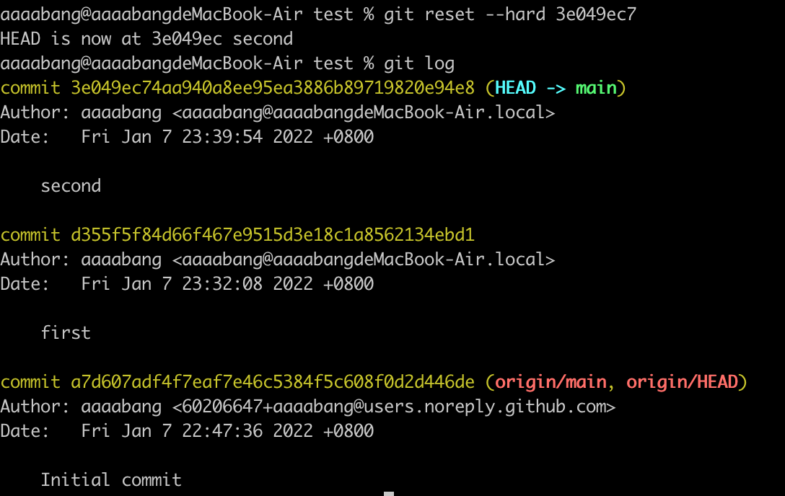
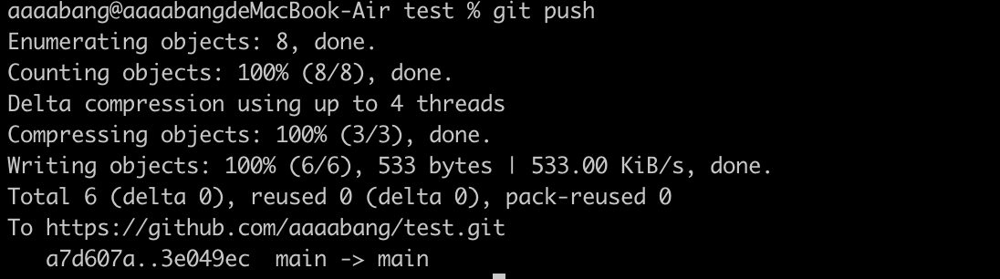
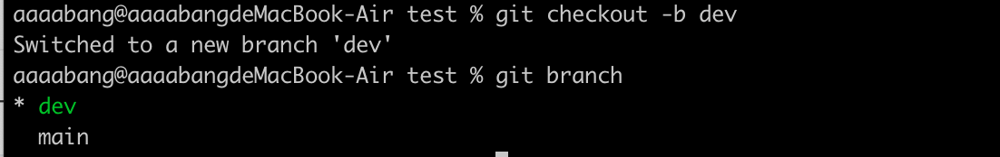
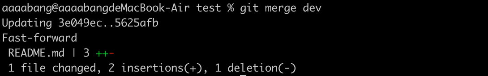
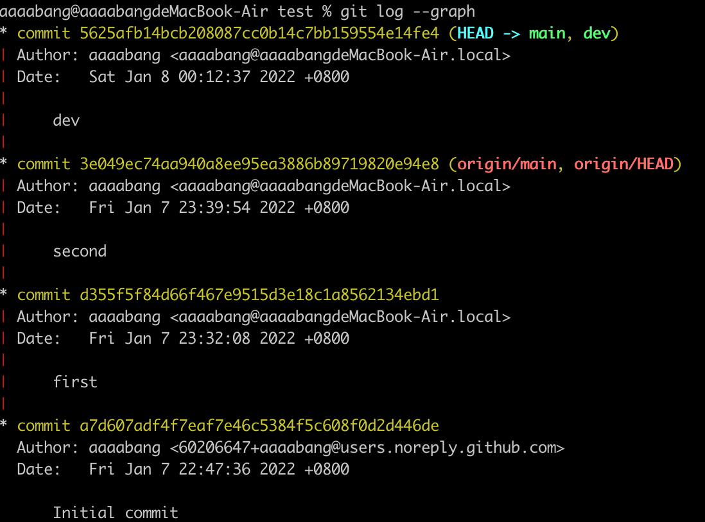
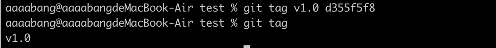

# 软件工程实验六：项目协同开发管理与工具集成环境实验

> 姓名：林芳麒
>
> 学号：191220057


建立一个test仓库演示Git操作

## 一、Git基本操作

#### （一）添加  add

 * 第一次修改test仓库中的README.md，尚未git add前

`git status`命令可以让我们时刻掌握仓库当前的状态，下面的命令输出告诉我们，`README.md`被修改过了，但还没有准备提交的修改。



`git diff`顾名思义就是查看difference，显示的格式正是Unix通用的diff格式，可以从下面的命令输出看到，我们在第四行添加了一句话“第一次改动”。



提交修改和提交新文件是一样的两步，第一步是`git add`：

```
git add <filename>
```

将`<filename>`文件加入到VCS中，但是这样太麻烦了。大多数时候，只有少量内容我们不想加入（敏感的密钥信息、与项目无关的信息等）。多采用的方法是，先写一个`.gitignore`文件，告诉git它应该忽视哪些文件，再直接使用`git add .`将所有文件及子文件夹中文件递归加入到git中。

* `git add` 后再次使用`git status`查看当前仓库的状态：


`git status`告诉我们，`git add` 命令已将要被提交的修改包括`README.md`写入暂存区。下一步，就可以放心地提交了。 


#### （二）提交  commit

git commit 命令将暂存区内容添加到本地仓库中，

```shell
git commit -m [message]
```

[message] 是一些此次修改提交的备注信息。



#### （三）回退 reset

git reset 命令用于回退版本，可以指定退回某一次提交的版本。

git reset 命令语法格式如下：

```shell
git reset [--soft | --mixed | --hard] [HEAD]
```

注意：`git reset`只是修改HEAD指针的指向，实际上还保留了提交记录

- `git log`命令显示提交日志，我们可以看到3次提交



* 想要回退到第二次修改， 使用`git reset HEAD^`表示回退所有内容到上一个版本 ，或者

```shell
git reset --hard [版本号前几位]
```



补充：`reset`和`revert`区别

`git revert` 意思是仅仅撤销本次提交，如果是新建文件，那么该文件被删除，且不存在暂存区，之前或之后的commit不受影响。

`git reset --soft/hard commitID` 撤销的是该次commit之后的所有提交，`--hard`表示工作区的代码完全替换成commitID这次的代码，且被撤销的代码不存在与暂存区;`--soft`表示commitID之后的代码会移入暂存区。

总之git revert产生新的提交，并不会真正删除history。

如果在公共分支上回滚，那么`revert`应该是首选，`reset`用在私有分支。

#### （四）推送 push

在成功将远程仓库中的文件clone到本地环境之后，我们可以在本地对其进行修改，将修改完成之后的文件重新push到远程仓库中。



## 二、Git分支

#### （一）创建分支

`git checkout`命令加上`-b`参数表示创建并切换，用`git branch`命令查看所有分支,当前分支前面会标一个`*`号。




然后，我们就可以在`dev`分支上正常提交，比如对`README.md`做个修改，加上一行：“分支改动”,然后提交

```shell
$ git add .
$ git commit -m "dev"
[dev 5625afb] dev
	.....
 1 file changed, 2 insertions(+), 1 deletion(-)
```

现在，`dev`分支的工作完成，我们就可以切换回`main`分支：

```shell
$ git checkout main
Switched to branch 'main'
Your branch is up to date with 'origin/main'.
```


#### （二）合并分支，解决冲突

```shell
git merge dev
```

`git merge`命令用于合并指定分支到当前分支。合并后，再查看`README.md`的内容，就可以看到，和`dev`分支的最新提交是完全一样的。



#### （三） 展示分支合并图 log --graph




## 三、Git标签

给仓库历史中的某一个提交打上*标签*,以示重要。

```shell
git tag <tag_name>												#给HEAD指向的commit打上标签
git tag <tag_name>	<commit_hash>		#给指定的commit打上标签
```

再用命令`git tag`查看标签：




## 四、问题总结

##### • 使用git的好处?

1. 适合分布式开发，强调个体。

2. 公共服务器压力和数据量都不会太大。

3. 速度快、灵活。

4. 任意两个开发者之间可以很容易的解决冲突。

5. 离线工作。

   

#####  • 使用远程仓库(如github/gitee等)的好处?

在实际使用分布式版本控制系统的时候，其实很少在两人之间的电脑上推送版本库的修改，因为可能双方不在一个局域网内，两台电脑互相访问不了，也可能某方电脑没有开机。因此，分布式版本控制系统通常也有一台充当“中央服务器”的电脑，但这个服务器的作用仅仅是用来方便“交换”大家的修改。


#####  • 在开发中使用分支的好处?你在实际开发中有哪些体会和经验?

  - 版本迭代更加清晰
  - 开发效率提升
  - 利于代码review的实现，从而使整个团队开发更加规范，减少bug率

假设我准备开发一个新功能，但是需要一段时间才能完成，完成某一部分代码后，如果立刻提交，由于代码还没写完，不完整的代码库会导致程序无法运行，他人无法正常工作。但当我创建了一个属于你自己的分支，别人看不到，还继续在原来的分支上正常工作，而我在自己的分支上干活，想提交就提交，直到开发完毕后，再一次性合并到原来的分支上，这样，既安全，又不影响别人工作。