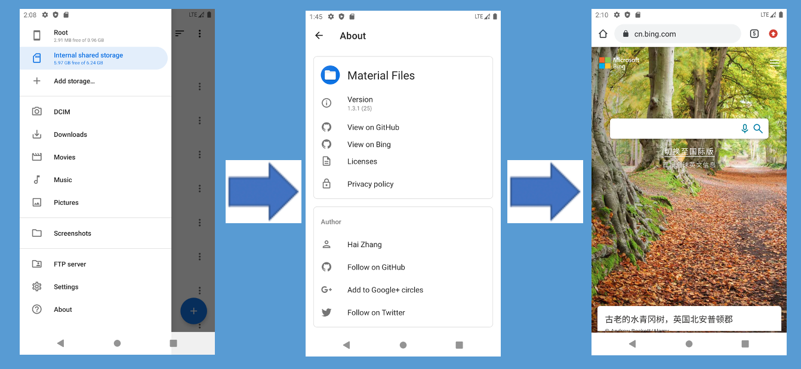
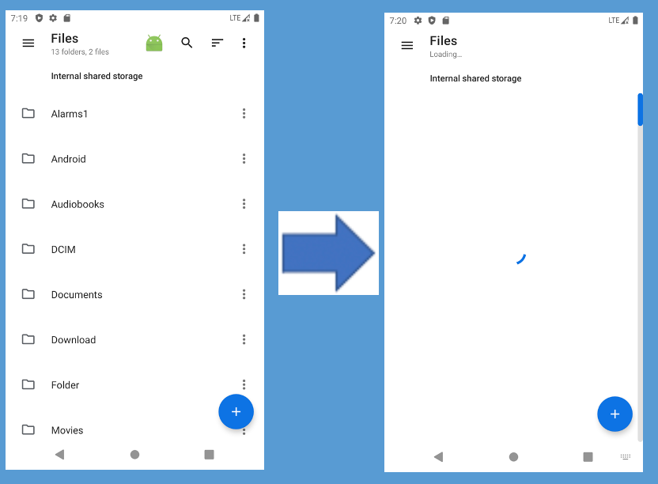
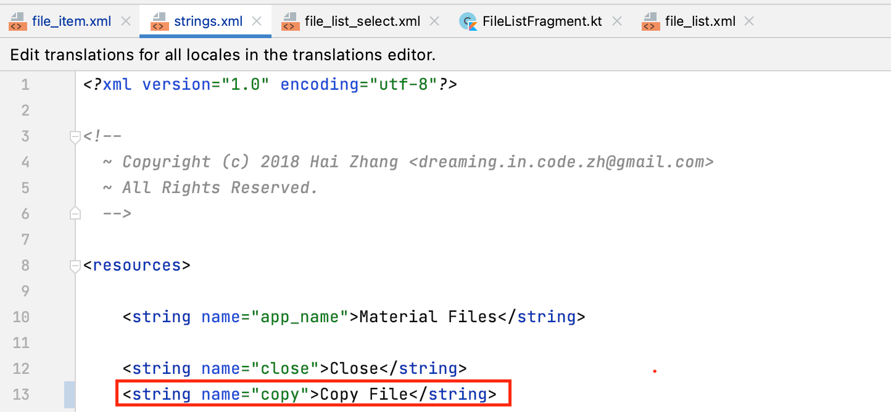
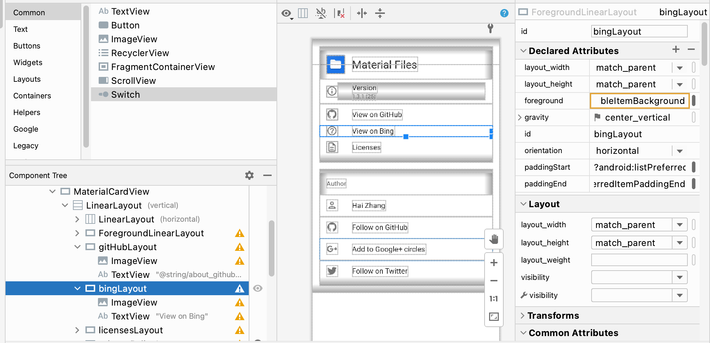
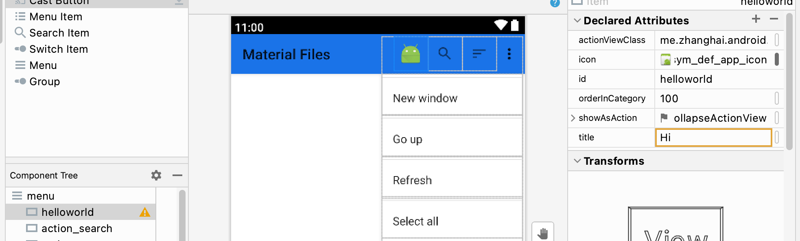
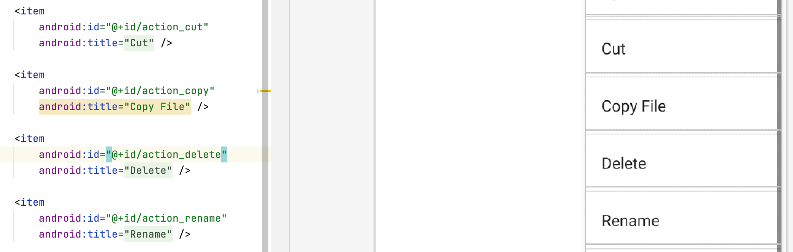

> **姓名：林芳麒**
>
> **学号：191220057**


## 一、实验名称

软件实现与构建实验

## 二、实验要求

1. 了解编码、编译、调试活动。

2. 了解Android Studio在开发和调试过程中的作用

3. 在所分配的移动应用上进行实验，并完成实验报告。

## 三、实验环境

- Android studio
- Android 11.0 Google Api 【1080*1920】/ Pixel 2 x86_64
- jdk-11.0.12.jdk

## 四、实验内容

1.移动应用新功能开发。

2.移动应用新功能调试。

## 五、 实验结果与说明

#### 1.移动应用实现功能描述，根据实验一的要求描述修改的功能场景。

**（1） Copy File文件待粘贴**

​	新旧对比：					

​	点击copy file即可成功粘贴文件

	

**（2）打开Bing链接**

​		新旧对比：					

点击About进入About界面，再点击View on Bing即可打开浏览器跳转到Bing.com

​		

**（3）新增HelloWorld场景**

新旧对比:					

点击导航栏上的绿色安卓图标即可打开新窗口



#### 2.使用git进行的版本控制

（一）创建并切换到子分支，进行新功能的添加或修改。


（二）在子分支上完成任务后提交


（三）合并到master分支


(4)总合并过程展示


#### 3.编码过程（包括界面的可视化编程）截图展示，文字说明。

**（一）Copy File**

在`strings.xml`文件中将`@string/copy`的值改为`Copy File`即可。



**(二）打开Bing链接**

a.在<u>About界面</u>添加控件组，填充控件id信息



b.在对应class文件内设置点击控件的跳转功能

```kotlin
 //mycode
        binding.bingLayout.setOnClickListener { startActivitySafe(BING_URI.createViewIntent()) }
				....
				private val BING_URI = Uri.parse("https://www.bing.com")
```


**(三)打开新窗口**

a.在file_list.xml布局文件中新增控件



b.对应FileListFragment.kt，添加点击控件后触发的事件

```kotlin
override fun onOptionsItemSelected(item: MenuItem): Boolean {
  ....
R.id.helloworld ->{
                newTask()
                true
            }
  ....
}
```


#### 4.调试过程的截图展示和文字说明（什么问题，如何调试，怎样解决）。

> 问题一：想要修改文件菜单栏中按钮“Copy”为“Copy File”，在.xml中对按钮的title进行了修改，但运行却发现无变化。

修改file_item.xml文件内Copy控件对应的代码，将title内容改为“Copy File”



运行结果无变化。

研究后发现所有按钮的title格式为@string/xx，遂发现原作者将控件的名称都进行了封装，如此可一举改动同功能的所有相关控件。在strings.xml文件中将@string/copy的值改为Copy File即可。


#### 5.填写表格，记录完整添加的界面个数、添加或修改的控件个数以及添加的代码行数

| 功能场景     | 添加的界面个数 | 添加的控件个数 | 修改的控件个数 | 更新的代码行 |
| ------------ | -------------- | -------------- | -------------- | ------------ |
| 文件待粘贴   | 0              | 0              | 1              | 1            |
| 打开bing链接 | 1              | 2              | 0              | 78           |
| 打开新窗口   | 1              | 1              | 1              | 22           |

​			


​		

## 六、 结论
记录完整实验时长：8小时

编撰实验报告时长：2小时

一开始面对庞大的开源文件手足无措，初次编译也出现了问题，感谢谢琳娜助教姐姐的耐心指导。因为作者集结了一个.xml文件，所有activity相关的class文件都先跳转到该.xml文件，无法直接跳转到关联的.xml文件，我找不到链接的.kt和.xml文件慌了阵脚，感谢毛彦杰同学花了很长的时间帮我研究。有了毛同学的指点，我发现我把本次实验想得过于复杂，能力不足的情况下我也可以进行一些简单的控件修改体验安卓开发。在修改过程中也逐渐对本开源代码的整体框架有了更深入的了解，更加清楚软件开发同时也要考虑后续如何维护或拓展。

