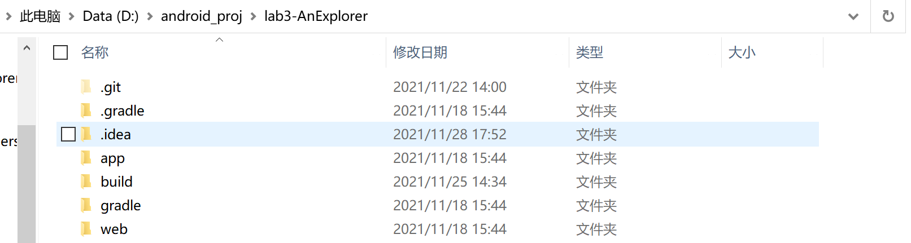
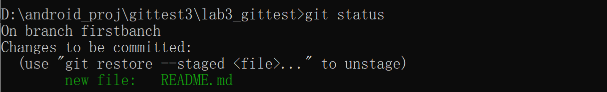
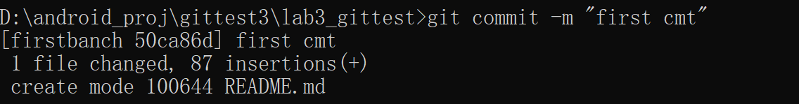
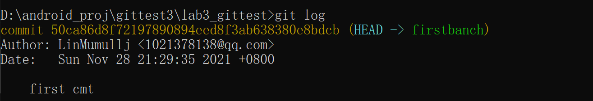

# 

#### 一，实验名称

项目协同开发管理与工具集成环境实验

#### 二，实验内容

**1.安装 git，在本地将你的开源项目目录初始化为 git 仓库 (如已有.git 文件夹请先删除)**

在开源项目目录下打开 cmd 或 powershell 或 "右键-git bash here"，输入`git init`命令即可初始化git仓库

**2.切换分支操作**

**3.**

使用git status查看仓库状态

add文件之后的git status，则同步更新add的内容：

git commit添加的内容：

可以通过git log看到刚刚修改的内容：

merge分支，打上标签：

push到远程仓库，再进行PR操作即可

#### 三，实验收获

##### 1.使用git的好处

（1）分布式开发时，可以git clone克隆一个本地版本，然后在本地进行操作提交，本地可以完成一个完整的版本控制，在发布的时候，使用git push来推送到远程即可；

（2）git分支的本质是一个指向提交快照的指针，速度快、灵活，分支之间可以任意切换，本地拥有版本库，随时进行版本后退；

（3）冲突解决，多人开发很容易就会出现冲突，可以先pull远程到本地，然后在本地合并一下分支，解决好冲突，在push到远程即可；

（4）离线工作，如果git服务器出现问题，也可以在本地进行切换分支的操作，等联网后再提交、合并等操作。

##### 2.使用远程仓库的好处

（1）项目储存在远程仓库，在不同的使用不同的设备都可以方便地同步；使用远程仓库可以实现项目的开源和分享，他人可以参与到项目的完善中,而且在远程仓库，例如GitHub可以接触到最新的最前沿的 IT 技术，并且可以学习到很多知识。

##### 3.在开发中使用分支的好处

（1）可以让项目的版本迭代更加清晰；

（2）开发效率提升很多，在不同的分支实现不同的需求，可以让编程目的更明确，可以让开发思路更明了；

（4）不同的分支包含不同的版本，当在开发过程中出现问题可以随时参考其它的版本，所以有助于对开发过程中的问题进行处理。

（6）开发团队利用分支处理不同的任务，可以减少代码相互间的影响，提高效率。

**4.其他git功能：**

git reset 和git revert 的区别：git revert是用一次新的commit来回滚之前的commit，git reset是直接删除指定的commit。

未完待续

