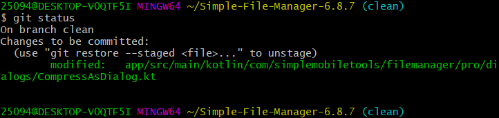
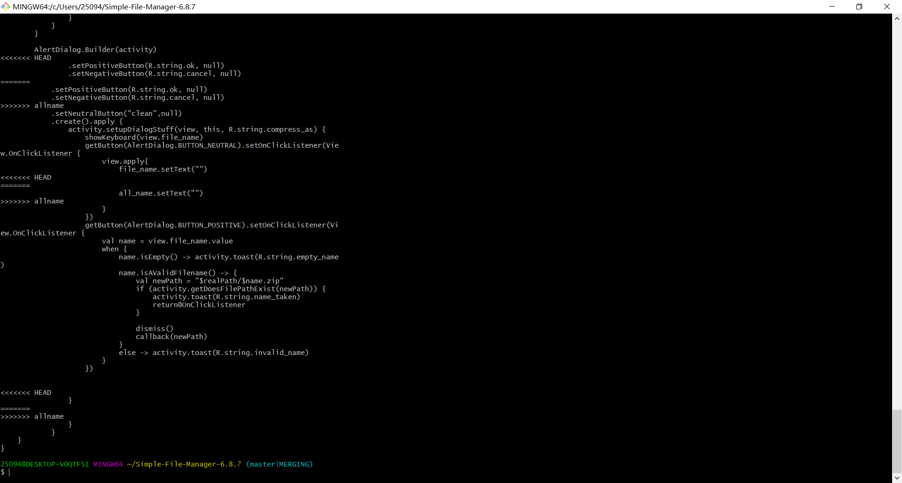

## 南京大学 计算机科学与技术系

### 实验名称 项目协同开发管理与工具集成环境

#### 191220062 刘东旭

## 1，在本地尝试修改、提交、回退等过程，在报告中展示你的操作，并使用git diff, git log, git status 等命令展示操作前后的区别

git log，提交前后的log，提交后生成的日志

git diff，在修改了文件之后，显示出所修改的位置的代码

git status，在git add 之前以及add 之后commit之前以及commit之后的操作截图，最后working tree cleaning

在修改完图示的文件之后发生冲突，解决方法为在master所在分支，修改冲突文件，然后git add git commit

### 2，根据实验三针对几个页面进行微调的任务，在本地为每个子任务创建一个分支并在各分支上进行开发，最终将所有修改合并到master 分支上；如有冲突请尝试解决。在报告中展示你的操作，并使用git log --graph 命令展示分支合并图

打标签

## 3.在报告中回答以下问题：

• 使用 git 的好处？

可以保存自己编写代码过程中的历史版本，防止自己错误操作，而导致无法找回代码，提高边工效率

 • 使用远程仓库 (如 github/gitee 等) 的好处？

能够将代码开放给其他工作人员，既可以当作备份，又可以请其他人来协助

 • 在开发中使用分支的好处？你在实际开发中有哪些体会和经验？

能够在开发不同功能时互不影响，也可以多个人员同时开发不同功能，提高办公效率，开发过程中更改各种功能互不影响，非常方便

## 4.如果你额外学习并实践了关于 git/github 的其他进阶操作 (如 merge 和 rebase 的区 别、reset 和 revert 的区别、stash, cherry-pick 的使用等)，可在报告中展示

merge合并会有许多的分叉，发生冲突时要重新合并push,产生很多分叉，rebase把原本分叉的提交变成一条直线了，但本地的分叉提交被修改过了，rebase的目的是使得我们在查看历史提交的变化时更容易，因为分叉的提交需要三方对比

 revert 后会多出一条commit，这里可进行回撤操作 ，reset 是直接把之前 commit 删掉

`stash`会把所有未提交的修改（包括暂存的和非暂存的）都保存起来，用于后续恢复当前工作目录。

cherry-pick命令的作用，能将指定的提交（commit）应用于其他分支
