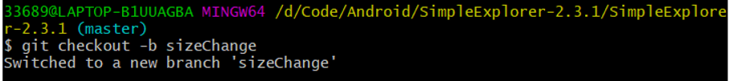
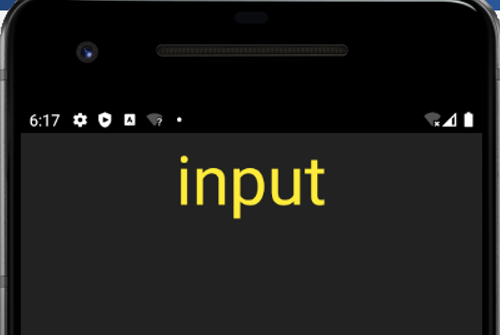

# 南京大学 软件工程实验报告
 计算机科学与技术系 191220063 刘昊坤
 ## 实验名称

项目协同开发管理与工具集成环境实验

 ## 实验完成情况

1. 学习了`git`的基本操作，并用`git`完成了开发流程；
1. 回答了思考题；
1. 学习了手册中的一些`git`进阶指令；
1. 部署了`jenkins`并进行了远程`Gradle`构建

 ## 实验内容

- **使用git完成开发流程**

   git的官方使用建议是先创建一个分支，在分支中进行代码更改，确认更改时合并分支即可。现在假设我们要完成字体和颜色的更改，按照流程：

   我们首先要用`git init`创建一个版本库，然后使用`git checkout`创建一个新分支，参数`-b`可以在创建的同时切换到对应分支。

   

   coding实现相关内容后，效果如下：

   

   字体大小修改验证完成，我们使用`git add`、`git commit`命令将修改存入暂存区并提交。其中我们使用了`git status`查看暂存区与当前版本代码的差异：

   

   `git status`显示我们暂存区有一个文件与当前版本不同。

   

   `git commit`后，暂存区清空了，没有不同。`-m`参数用来给这次提交插入信息。

   同时我们还可以使用`git diff`查看不同版本或者暂存区与当前版本的不同。此时可以把分支合并到master完成更改了。但为了更好的展示，我们再实现一个有冲突的功能后一起合并。使用`git switch`切换回`master`，并`git log`查看，发现只有`master`的`log`。除`git reset`外，这也是一种回溯版本的方法。再次运行，字体确实变回去了，回到了我们没有修改的版本。

   

   接下来，我们在`master`分支上完成颜色的更改，更改后进行了`git add`、`git commit`操作，此处不再重复展示。修改效果如下：

   

   假设此时我们发现颜色实现效果不理想，我们可以使用`git reset`命令回退版本：

   

   这条指令将版本回退到上一条。我们查看代码或运行也发现确实回到之前的版本了。

   但如果我们如果又想回到刚刚实现的版本，我们可以使用`commit id`来获取超前的版本：

   

   `commit id`不是总可以通过`git log`获得，但可以通过`git reflog`来查看历史指令获得：

   

   接下来我们要合并功能了，先使用`git branch`来查看分支情况：

   

   确实有两个分支，`*`表示我们当前处于的分支

   现在尝试`git merge`来合并分支：

   

   但提示我们存在冲突，我们可以使用`git status`来显示冲突文件：

   

   在`git bash`中使用`vim`可以标示出不同的具体内容：

   

   我们看到了对于一个控件的配置是不同的。接下来我们进行手动解决冲突，将大小与颜色修改统一后提交，使用`git log --graph`查看。并运行查看：

   

   

   接下来我们使用`git remote add origin ......`将本地仓库与远程仓库关联起来，之后尝试推送到远程。但中间遇到了一些网络连接问题，浏览器可以访问`github`而`git bash`不能，后来通过手动设置端口：

   

   

   上图使用`git config`设置代理端口，`--local`指令表示只设置此`git`仓库的配置。随后通过`git push `指令把`master`分支推送到远端。

   下面用`git tag`命令创建标签，同时该命令也能查看现有标签。

   

   `git push`命令同时也能推送标签到远程库：

   

   到远程查看：

   

   查看标签：

   

   成功。

   **上述开发流程用到的命令总结：**

   | 命令           | 简要       |常用参数|
   | -------------- | ---------- | -------------- |
   | `git init`     | 创建版本库 ||
   | `git checkout` | 切换分支 |`-b`|
   | `git add`      | 推入暂存区 ||
   | `git commit`   | 提交暂存区修改 |`-m`|
   | `git status` | 查看当前分支、暂存区、冲突文件等状态 ||
   | `git log` | 打印git日志 |`--graph`|
   | `git reset` | 版本切换 ||
   | `git reflog` | 查看命令日志 ||
   | `git branch` | 查看分支情况 ||
   | `git diff` | 查看不同版本、暂存区与当前版本间的不同 ||
   | `git config` | 设置`git bash`的配置文件 |`--local`|
   | `git remote add` | 关联远程库 ||
   | `git remote rm` | 删除远程库 ||
   | `git push` | 推送远程库或标签 |`-u`|
   | `git tag` | 查看或创建标签 ||

   

- **使用`jenkins`自动构建项目**

   我对`jenkins`理解是他是一个自动化处理大量代码构建的工具，用于解决大量的重复操作。经过体验，我能想到的一种使用情景是：

   多个人开发同一份安卓应用，他们将代码都推送到同一远程仓库。配置`jenkins`，对每一次提交或定时的对项目进行`gradle`构建，如果发生失败就向管理员发送邮件。这样，每一次代码更新后都会自动的尝试构建代码，可以便捷的找到哪一次提交使得代码构建失败，不需要事后发现构建失败再去排查。

   接下来介绍对`jenkins`的使用：

   我采用`.war`文件进行直接运行并安装，使用管理员权限启动`cmd`命令行， 然后 `java -jar jenkins.war --httpPort=8080` 启动`jenkins`服务：

   

   在浏览器中输入 localhost:8080，并完成安装：

   

   接下来我们创建一个风格自由的`job`来对我的`Simple Explorer`来进行自动的`Gradle`构建：

   

   需要进行不少的设置，先设置描述和旧构建的留存数：

   

   

指定留存的旧构建数可以节省空间。接下来设置`github`仓库和账号，这样就可以自动的同步远端并构建了：

接下来要设置同步远程后`jenkins`要干什么，我们要先在全局设置中配置`Gradle`版本：

接下来设置`Build`操作为`Gardle`构建，并设置`Build`后的操作：

其中`Post-build Actions`设置的是`Build`失败后发邮件。

接下来可以单击`Build Now`开始构建了，经过许多次尝试与解决问题，最终在第六次成功`Build`：

对项目进行修改后，再次推送到远端，然后使用`jenkins`构建，成功：

其实刚刚的尝试并没有完全展现出`jenkins`的全部功能，经过探索`jenkins`还有以下功能：

设置`Build`触发器，`jenkins`可以自动构建，完全无需认为干预。如可以设置定期构建、每次提交构建等。

又如更加完整的邮件功能。

## 问题回答

- 思考题的回答

  1. 使用 `git` 的好处？

     拥有本地版本库，可以进行版本回溯，以撤销更改并防止coding时犯下不可挽回的错误；

     可以创建分支后修改代码，防止源码污染；

     进行代码管理时比手动文件操作更高效，可以方便的分支、合并、备份等；

  2. 使用远程仓库 (如 `github/gitee` 等) 的好处？

     `github/gitee`是基于`git`的版本管理工具，可以将代码存于云端，防止丢失并进行方便的远程合作；

     它还是一个代码交流平台，有许多开源的项目，我们可以参与其中；许多工具都在平台上开源发布；

     我们可以在平台上参观强者的代码，学习知识；

  3. 在开发中使用分支的好处？你在实际开发中有哪些体会和经验？

     - 分支的好处

       `git`官方建议创建分支`->`修改代码`->`合并分支，这样可以防止源代码被污染；同时有利于版本回退；
     
       分支还能让不同版本间有清晰的区分，提高隔离性；
     
       每个开发人员都可以有独立的分支，提高开发的并行性；
       
     - 体会与经验
     
       使用分支后，可以使用`git switch`来回溯，比使用`git reset`确实更加清晰。`git log`时也可以更好地了解自己的开发流程；

- 额外学习的指令

  1. `git rebase` 和 `git merge`的区别

     `merge`合并分支会产生许多的分叉，发生冲突时要重新合并。`rebase`把原本分叉的提交变成了一条直线，可以使我们更容易查看历史提交时发生的变化。

  2. `git reset` 和`git revert`的区别

     `reset`是在`Dag`图中把`HEAD`指针回指。而`revert`是通过创建一个新的版本，这个版本的内容与我们要回退到的目标版本一致，`HEAD`指针指向这个新生成的版本。

  3. `git stash`

     会把所有未提交的修改都保存起来，用于后续恢复当前工作目录。

## 问题解决与实验感受

1. 解决`git bash`的网络问题

   查阅资料后，找到了自己的代理端口，通过使用`git config`手动设置代理解决：

   

2. 解决`jenkins`的网络问题

   起初`jenkins`总是无法访问`github`，我曾认为和上一个问题一样是代理的问题；但最后经过查阅网络，其实是`jenkins`的配置问题。要在配置仓库的同时提供自己的`gihub`账号与密码：

   

3. 实验感受

   本次实验让我感受最深的是`jenkins`，就像前面提到的：我对`jenkins`理解是他是一个自动化处理大量代码构建的工具，用于解决大量的重复操作。经过体验，我能想到的一种使用情景是，多个人开发同一份安卓应用，他们将代码都推送到同一远程仓库。配置`jenkins`，对每一次提交或定时的对项目进行`gradle`构建，如果发生失败就向管理员发送邮件。这样，每一次代码更新后都会自动的尝试构建代码，可以便捷的找到哪一次提交使得代码构建失败，不需要事后发现构建失败再去排查。
