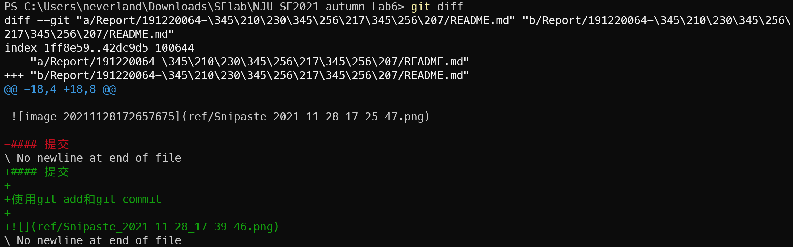
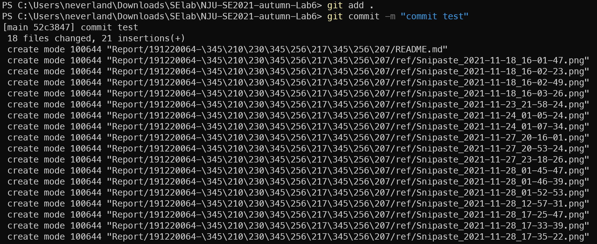

 ## 软件工程实验报告

###个人信息

刘宏宇191220064

邮箱：llhhhyyyy@gmail.com

### 目录

[TOC]

### git基础操作

#### 修改

添加存放实验报告的文件夹，可以看到git中多了一个Untracked files

修改实验报告,并使用git diff查看修改

#### 提交

使用git add和git commit

使用git log可以看到提交.

#### 回退

使用git reset HEAD^回退到上一个版本，重置暂存区的文件与上一次的提交保持一致，但是工作区文件内容保持不变。

### 实验三

对实验三中项目源代码文件夹初始化，并添加远程仓库

提交一次并push到远程仓库

创建三个新的分支，分别是dev1，dev2，dev3

不同的任务切换到不同的分支上开发，在不同的分支上提交，使用git switch切换分支，切换分支会自动更改工作区文件，最好提交之后再切换分支。

任务完成后将分支合并到master分支上，首先切换到master分支，再使用git merge合并分支。

分支合并图如下：

使用git log给稳定版本打上标签

打上标签后的版本如下

最后用git push --tags将标签推送到远程仓库

### Q&A

• 使用 git 的好处？

​		可以方便地实现软件的版本控制，实现代码远程备份，实现多人合作开发管理。

• 使用远程仓库 (如 github/gitee 等) 的好处？ 

​		可以安全的备份代码，可以共享自己的代码给开源社区，也可以学习别人的代码。

• 在开发中使用分支的好处？你在实际开发中有哪些体会和经验？

​		好处是可以使软件的更新迭代更加清晰明了，而且可以有效解决多人开发时的冲突问题，每个人可以再自己的独立分支上进行开发。