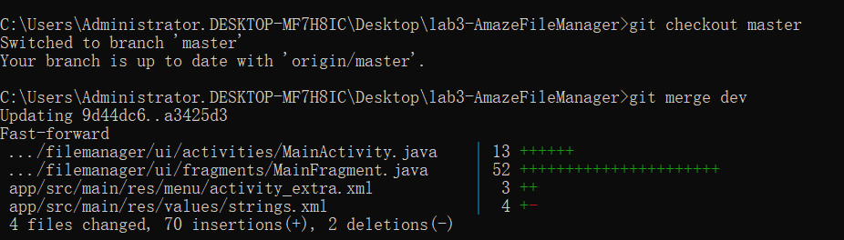

## 南京大学 计算机科学与技术系
##软件工程实验报告
<html>
<table>
   <tr>
     <td>实验名称</td>
     <td>项目协同开发管理</td>
   </tr>
   <tr>
     <td>学号</td>
     <td>191220066</td>
   </tr>
    <tr>
     <td>姓名</td>
     <td>刘京龙</td>
     </tr>
   <tr>
      <td>指导教师</td>
     <td>张天</td>
    </tr>
    <tr>
    <td>实验时间</td>
    <td>2021.11.18-2021.11.22</td>
    </tr>
</table>
</html>
###一、实验名称
项目协同开发管理
###二、实验环境

    App:Amaze File Manager3.6.3
    Android 虚拟机版本 Pixel 2 API 30
    Runtime version:11.0.10+0-b96-7249189 amd64

    win10
    git version 2.26.0.windows.1
    vscode
    cmd

###三、实验内容
了解协同开发与持续集成过程
学会使用项目协同开发管理工具 `git/github`

安装 git，在本地将你的开源项目目录初始化为 git 仓库
在本地尝试修改、提交、回退等过程，在报告中展示你的操作，并使用` git diff, git log, git status `等命令展示操作前后的区别

根据实验三针对几个页面进行微调的任务，在本地为每个子任务创建一个分支并在各分支上进行开发，最终将所有修改合并到 master 分支上；如有冲突请尝试解决。在报告中展示你的操作，并使用` git log --graph `命令展示分支合并图

给你的某个稳定版本的代码打上标签

注册 github 账号，在账号中创建远程仓库 (权限请设置为 public)；
把本地的所有分支和标签推送到远端

实现情况见第四部分的实验结果 

###四、实验结果

####1、git 本地基本操作展示
以下界面是vscode的terminal,比cmd美观一些
修改，提交，回退，git log, git status在lab-3 git使用展示有详细说明
下面另外建立一个本地仓库说明

首先init新建仓库，新建分支 a，创建文件b.txt和空文件夹a
status发现没有commit，并告知Untracked file
然后git add . 将b.txt加入暂存区，再次git status，告诉变化，但是没有加入工作区
commit 加入工作区。由于文件夹a为空，所以暂时没有内容加入git

然后git diff没有任何返回，随后在b.txt中添加一行字符串hello world，git diff

显示了修改的变化

然后merge 到master
然后add,commit提交，git log 显示日志
提交后再查看status，显示这个分支没有忘记提交的内容了

然后我们新建分支b(复制分支a)并在b分支上回退到commit1，查看内容，发现hello world没有了，查看log,没法回到hello，因此如果不备份分支，不提交到远程，reset --hard 是非常危险的操作!!
然而我早有准备，回到分支a,发现又回到a的hello commit，hello world 字符串赫然显示在b.txt中!

和远程仓库相关的操作(push,pull在下一部分介绍)

####2、lab-3 git使用展示
在github注册账号(已经注册)
创建仓库，设为public,并将本地仓库与远程仓库关联(已完成)
在以前，我都是在远程github建好仓库，再clone到本地，需要提交时push即可。这次尝试现在远程建立空仓库，本地git init建立本地仓库，然后将二者关联

---

首先master分支提交一次。然后新建dev分支和ljl分支,在ljl分支修改
第一个修改后commit

在两个文件中添加了10行代码(当然,在其他一些文件中加print调试帮助理解代码，最终删除了这些无用代码)
由于原系统已经比较完成，功能非常齐全，在理解后只要增加少量代码即可完成预期目标

第一次merge到dev分支

显示在在两个文件分别增加了7行和3行代码

第二次commit和merge,在一个文件添加了5行代码

最后merge到master

一共增加了15行代码，修改2个文件

是稳定版本，打上tag并提交到远程

____
然后新建另一个分支，修改代码

修改本地分支名

合并到dev，合并到master

涉及4个文件，70行代码

master推送到远程

打tag和graph

提交后,发现github有自动build android，用的是远程的服务器和cpu(实测我的笔记本没有很响的声音)，但是build失败，有红叉叉

细看是没有权限

因为github构建用的是ubuntu，需要加权限，而本地是win
解决方案是

(为尝试，又新建了一个分支build)
并尝试远程merge:使用pull request

实现了远程分支合并

然而还是没有build成功，解决方案是远程修改android-main.yml，将jdk版本改成jdk8.0.232,删除代码格式检查

代码格式检查 使用gradlew spotlessJavaCheck,然而我在本地尝试时，遇到太多的问题。经搜索，其实最好设置commit之前就检查并修改格式，然而我修改完了才发现这个功能，打算在下次开发时尝试使用。
最后到master分支测试，yml文件多了testcase和publish testcase，后者是关于代码风格的，以后注意,这次先过了testcase,知道了有这么一个过程，以后在写业务时要注意代码质量。

最后，我想回退到init初始状态，再创建一个分支push到远程，在回到当前的状态：利用 __reset__ 回退，利用 __pull__ 拉取远程更新

然后可以清楚看见代码修改的数量
(9个文件增加93行(其实很多被注释掉)减少10行(大多是空行))

最后的最后log --graph

其实master不应该有这么多commit,主要是build分支开始，直接在远程master修改android-build.yml(经过实测，yml保存在远程，每个分支不一样，一个分支修改了，不能merge到另一个分支)多了很多commit，应当删掉一些,第一张图保留一个commit就可以了

###五、实验思考
####使用 git 的好处？
方便版本管理。
很多时候需要尝试修改代码/文档，有时候修改的结果并不是我们想要的，这时候需要回退到修改前。如果不适用git等版本控制工具，需要在修改器复制副本，这是非常麻烦且容易忘记。使用git可以在达到一定的进度时提交，并带上注释说明更改情况，如果不对，可以回退到之前的版本
####使用远程仓库 (如 github/gitee 等) 的好处？
可以跨设备开发，团队开发，软件发布。
如果只在本地开发，不方便多人协作。且万一本地系统(很多时候使用的是虚拟机或docker)出现问题，将造成难以预料的后果，使用远程仓库，在需要开发时clone下来，并及时Pull，up stream拉取更新，避免了这个问题
可以fork别人的仓库修改，提交，贡献代码，方便多人开发的项目管理
可以在github上面找到很多可以直接使用的资源/库

另外，这次还发现了
可以利用远程服务器构建某些项目,运行测试用例(比如这次的android),不耗费本机资源
可以对提交内容进行check，提前告知可能的错误

####在开发中使用分支的好处？你在实际开发中有哪些体会和经验？
可以方便多人合作开发。
可以现在自己的分支开发，等到比较稳定的版本再merge到master
有删改代码，在merge时会要求解决冲突，确认你的操作，有时候会麻烦，但可以对比之前的写法和现在的写法，毕竟merge到这个分支的应当是比较稳定的版本。仅增加代码不会产生冲突，这很大程度地要求我们设计时对修改关闭，对扩展开放。在二次开发(不是重构)时，最好可以用增加代码，但不修改原始代码的方法扩展功能

有时候需要多个版本的系统或资源，可以放在多个分支。比如本学期《计算机图形学》课程作业要求每月提交一次，我就在每个月新建一个分支