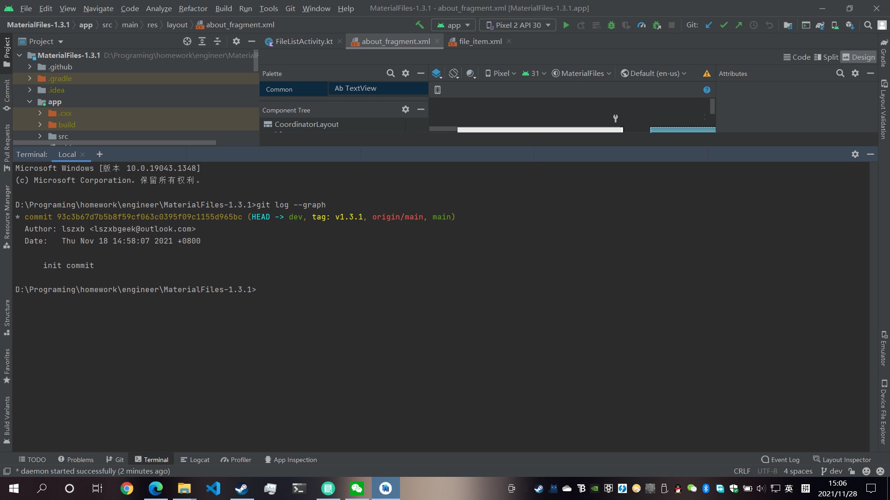
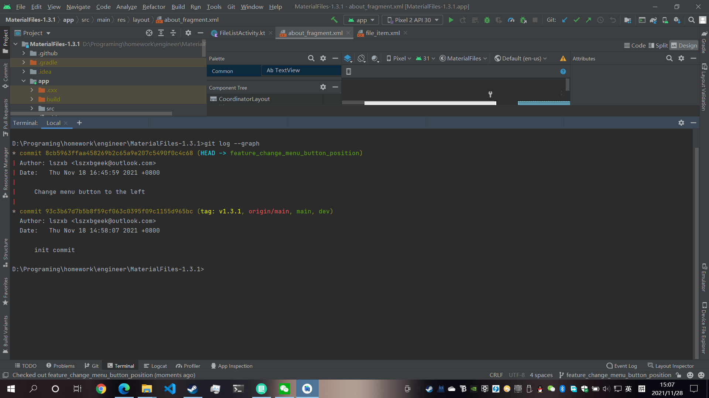
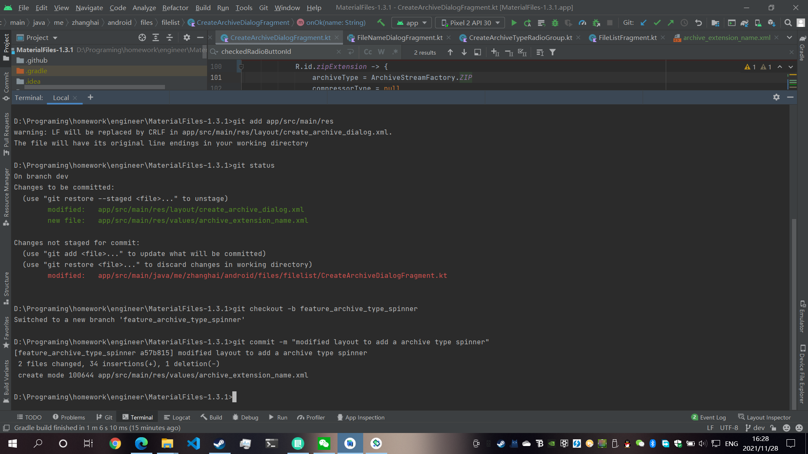
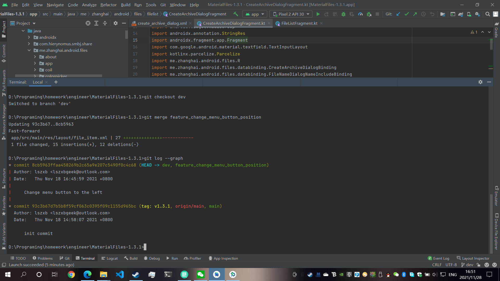
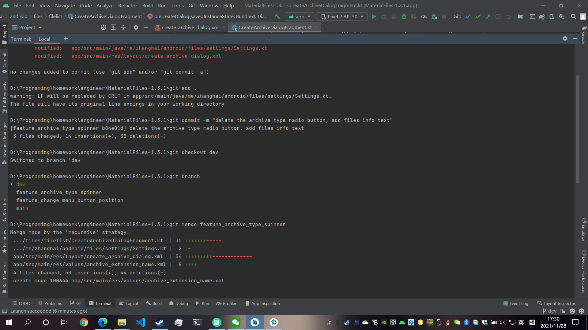
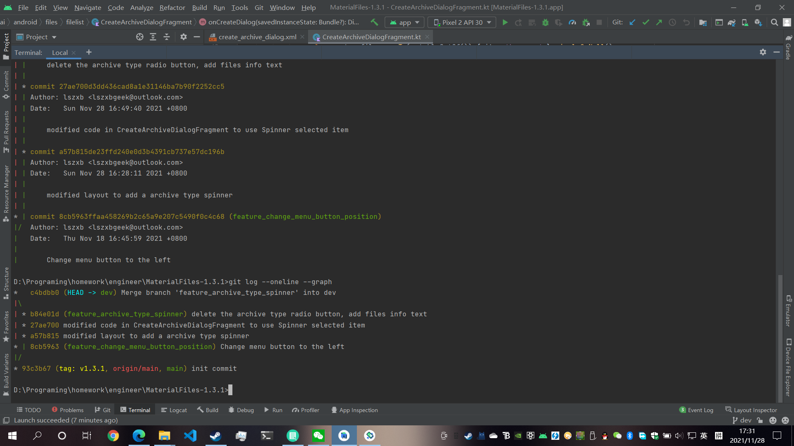
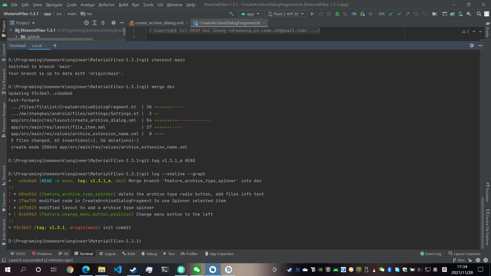
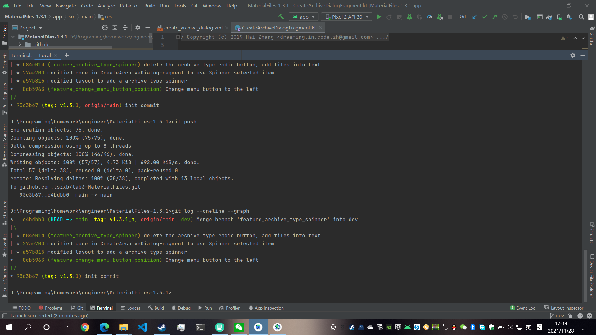

# 软件工程 实验6

## 项目协同开发管理与工具集成环境实验

191220067 刘斯哲 liusz@smail.nju.edu.cn

## 实验内容

熟悉git工具的使用，在实验三的项目上进行修改、提交、回退等操作，用git管理实验三的项目。

## 实验结果

1. 创建dev分支，为初始状态添加tag"v1.3.1"：

   ```sh
   git checkout -b dev
   git tag v1.3.1 HEAD
   ```

   

2. 对项目进行了修改菜单栏位置的更改。执行以下命令，创建`feature_change_menu_button_position`分支并提交。

   ```sh
   git checkout -b feature_change_menu_button_position
   git add .
   git commit -m "Change menu button to the left"
   ```

   

3. 初步修改了压缩文件对话框，创建了`feature_archive_type_spinner`分支。

   ```sh
   git add app/src/main/res
   git checkout -b feature_archive_type_spinner
   git commit -m "modified layout to add a archive type spinner"
   ```

   

4. 在dev分支上合并`feature_change_menu_button_position`分支。

   ```sh
   git checkout dev
   git merge feature_change_menu_button_position
   ```

   

5. 完成压缩文件对话框的修改，在`feature_archive_type_spinner`分支上提交，并合并到dev分支。

   ```sh
   git add .
   git commit -m "delete the archive type radio button, and files info text"
   git checkout dev
   git merge feature_archive_type_spinner
   ```

   

   

6. 将dev分支合并到main分支，并打上标签"v1.3.1_m"。

   ```sh
   git checkout main
   git merge dev
   git tag v1.3.1_m HEAD
   ```

   

7. 将main分支的修改结果提交至远程仓库。

   ```sh
   git push
   ```

   

## 回答的问题

1. 使用git的好处？

   git可以用于多人、多设备协同开发的多版本管理。其可以保存软件多个版本的记录，方便进行开发管理，以及出现问题时进行追溯。同时还可以方便多人进行协作，可以相对独立地进行开发，最终进行合并。其分布式的特性也可以在不依赖于中心服务器的情况下使用。

2. 使用远程仓库的好处？

   使用远程仓库可以方便在多个设备上、多人进行开发，在每个设备上都可以在任何时候从远程仓库上获取代码，并进行提交。除此以外，开放的远程仓库还可以方便分享自己的代码，以及接收开源社区的贡献。

3. 在开发中使用分支的好处？

   在开发中使用分支可以将不同特性的开发放到不同的分支中，使得每次只需要专注于一个特性的开发，可以对不同的特性进行单独的开发测试。在实际开发中，将复杂的更改分开进行可以大大减小心智负担。