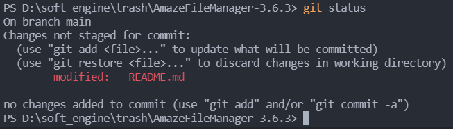

# Experiment6 项目协同开发管理与工具集成环境实验 Report

姓名：罗昊  
学号：191220073  
联系方式：191220073@smail.nju.edu.cn  
- - -

### 一.git基础操作

##### 1.初始化项目

  如下图，在一删去.git文件夹的项目内初始化git存储库。

##### 2.修改一些文件并使用status、diff等指令

  简单修改README文件，并查看相应的status、diff指令。

  提交commit，并打印log。

  对测试提交使用reset指令。

##### 3.分支系列操作

  如下操作，创建了四个分支，即dev分支同三个不同方向的feature分支。

  在不同feature分支上进行开发：

  首先在dev分支下对以上3个feature分支进行合并：

  如上图发现在合并feat1以及feat2时，存在合并冲突。以下解决合并冲突问题：

  如此，全部合并完成并将dev分支合并至main分支后结构图如下：

##### 3.标签操作

  为提交添加相应的标签较为容易，以下为具体操作：

##### 4.远程仓库诸设置

  添加远程仓库：

  推送全部分支以及相应的标签：

### 二.需回答诸问题

##### 1.使用git的好处?

  git是一个便利的本地版本管理系统，其性能良好，具有高可靠性。使用git能够避免修改、提交大量代码的风险，减少了项目开发者管理大规模项目的心智负担。

##### 2.使用远程仓库(如github/gitee等)的好处?

  某种意义上，git与其他版本控制系统不同之处在于其**分布式**特性。在一个分布式的版本控制系统中，所有的节点在实现上都是等同的，只要有权限，它们都可以一次获取其他仓库中的全部数据。而**远程仓库可以成为较为便利的分发节点**，我们可以使用 git clone 命令将某一个仓库中的全部数据下载到本地并在本地创建分支、修改和提交，也可以选择将新的改动推送到其他的节点上或者等待其他节点的拉取。

##### 3.在开发中使用分支的好处?你在实际开发中有哪些体会和经验?

  分支可以提供一个**细分环境**，在这个环境中，开发者可以只考虑其目前的需求。同时，分支的使用为团队协作带来了方便，它将冲突置于最后处理使得不同的开发者在现实开发之中能够简单负责自己的开发部分。

  对于我的实际开发，分支为我提供了一个简易的功能分类。在新增一个项目时，我不需要去考虑新增事物之间可能的互相影响(*虽然最后合并时要考虑*),能够专心于现有的开发进度之中。
### 三.其余操作

##### 1.merge, rebase之区别

  就我本人的使用体感而言，merge指令一概生成一个新的merge提交，而后将分支的历史做关联。这好处在现有的分支不会改变。但实际使用中会因多个merge造成log指令内容不直观——比如上文全部合并完成并将dev分支合并至main分支后结构图，实际上很难直截了当地分析提交历史。

  rebase更类似与合并提交的“重放”，这使得这一指令往往能形成比较清晰的直线型提交记录，但实践中对已然被共享的commit进行rebase操作使得项目更为混乱。
##### 2.reset, revert之区别

  reset直接修改HEAD指向来实现提交回退，而revert更像一种反演——依照原有的提交进行相反的操作，以此实现回退。

  是以revert实际上会生成提交，只是这一提交是反演成为过往提交而已。

##### 3.stash使用

  个人感觉stash类似于一个“临时提交”。在修改到一半时临时需要对原有分支提交进行修改。此时执行一次没有修改完全的提交(commit信息不好写)，或是使用stash充作临时中转站。

##### 4.cherry-pick使用

  该指令没有使用过，但就文档看来似乎是可以制定合并终点的merge指令?

### 四.持续集成工具的使用

  实验文档中要求使用*Jenkins*工具，然而*Jenkins* 和 *GitHub Actions* 都允许创建能自动构建、测试、发布、发行和部署代码的工作流程。*Jenkins* 和 *GitHub Actions* 的工作流程配置亦有一些相似之处。

  恰好，我分配到的开源APP中已经使用了*Github Actions*，于此我认为不必再次配置持续集成工具。以下为其运行报告：

  可以看到，经过相应的修改，新的提交已经可以通过相应测试。

  以上GitHub Actions内Build的具体任务配置。