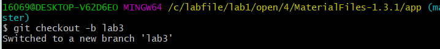
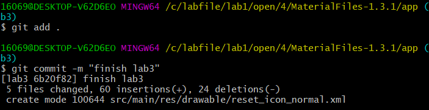
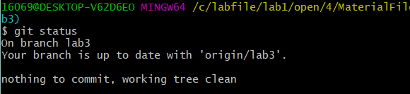
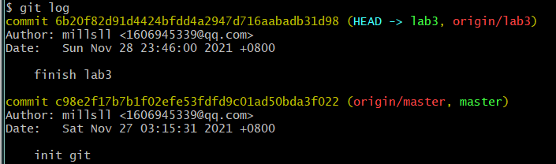
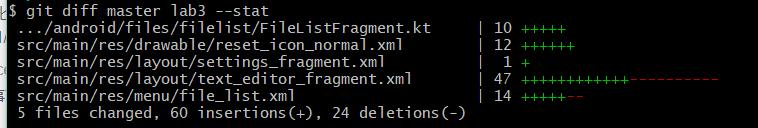
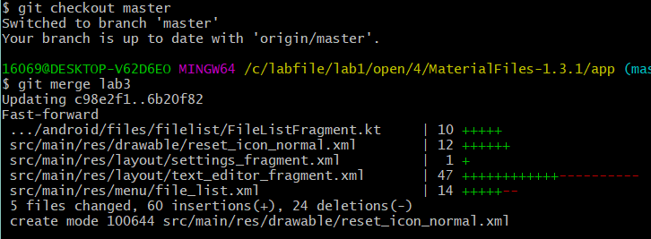
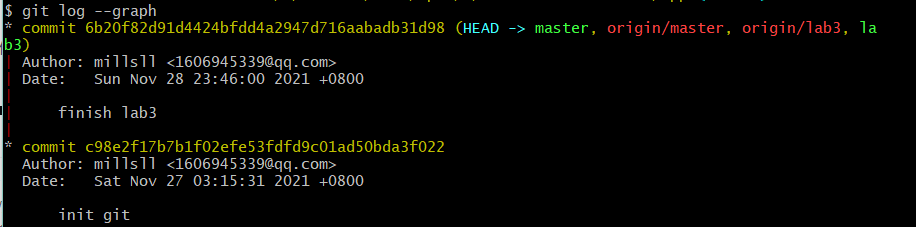

# 软件工程实验Lab6

罗禄宗191220074 **1606945339@qq.com**

## 实验操作

- 创建实验3开发分支

  

- 完成实验三后提交

  

- 查看git状态

  

- 查看提交记录

  

- 查看分支区别

  

- 合并分支

  

- 查看graph

  

## 实验问题

1. 使用git的好处？
      - 方便管理版本，git对每一个提交都进行记录，可以对提交打上tag，便于版本管理。

      - 便于测试调试。git可以创建分支，利用分支对项目进行测试调试可以避免对原项目造成改动产生难以修复的错误。

      - 可以避免项目文件损失，git可以使用远程仓库备份项目文件，在项目文件丢失损坏时可以用备份恢复。

2. 使用远程仓库的好处？
   - 可以备份项目文件防止损坏和丢失。
   - 可以快捷分享项目文件
   - 可以方便与他人一起协作开发项目

3. 在开发中使用分支的好处
   - 可以对每一个开发任务创建分支，使得每个任务的开发变得更清晰更有条理。
   - 可以在进行测试debug时对独立分支进行操作，防止修改产生难以恢复的错误。
   - 可以与他人合作开发，每人在不同的分支上开发，方便协作。
