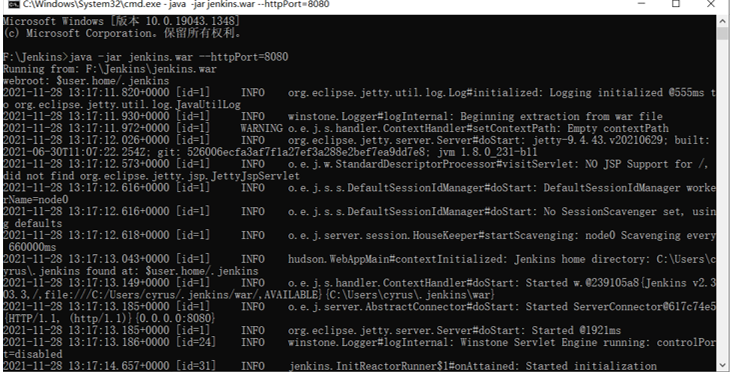

# SE2021 Lab6实验报告

|  姓名  |   学号    |       邮箱        |
| :----: | :-------: | :---------------: |
| 吕玉龙 | 191220076 | 1931015836@qq.com |


## 实验内容

1.新建一个目录，并初始化为git仓库同时与github上建立的远程仓库进行关联

```git
echo "# NJU_SE2021_Lab6" >> README.md
git init
git add README.md
git config --global user.email "1931015836@qq.com"
git config --global user.name "Cyrus-k"
git commit -m "first commit"
git branch -M main
git remote add origin https://github.com/Cyrus-k/NJU_SE2021_Lab6.git
git push -u origin main
```

2.创建新的分支进行实验

```git
git checkout -b modify_one
```

3.在目录文件夹下新建一个test.txt，该文本文件用来在本地尝试修改、提交、回退等过程，首先使用git status查看文件状况。


4.使用命令git add test.txt并再次使用git status查看文件状态，发现文件状态由untracked变为to be committed


5.使用命令git commit -m “commit”并再次使用git status查看文件状态，发现commit后，work tree已经clean


6.使用git log查看提交记录，可以发现在modify_one上有一次commit提交记录


7.对test.txt文件进行内容修改，将hello改成helloworld,然后使用git diff查看文件的修改情况


发现确实体现出了我们修改的地方

8.使用git reflog查看版本，并使用git reset dc9e回退版本后，再次使用git log查看记录，发现确实回退到test.txt未被提交的版本


9.接下来对实验三中要求的内容进行修改（在modify_one上只做一处修改），随后进行分支合并，使用git checkout main以及git merge modify_one进行分支合并


10.每次做完一处修改之后就进行一次合并，一共做了三次修改，此时用git log --graph查看分支情况


11.使用git tag为这个稳定的版本打上标签，同时可以使用命令查看该版本信息


12. 使用git push将代码推送到远端


## 问题回答

#### 1.使用git的好处

Git是目前世界上最先进的分布式版本控制系统，它可以创建分支、进行版本之间的回退等操作，便于开发过程中的管理各个修改步骤。同时它支持多人分别在不同设备上在不同的分支同时进行开发，可以和若干不同的远端代码仓库进行交互，提高团队合作效率。

#### 2.使用远程仓库的好处

github/gitee是基于git的版本管理工具，可以将代码存于云端，防止丢失并进行方便的远程合作；它还是一个代码交流平台，有许多开源的项目，我们可以参与其中；它支持多人分别在不同设备上在不同的分支同时进行开发，更加便捷。

#### 3.在开发中使用分支的好处？你在实际开发中有哪些体会和经验？

分支的好处：git官方建议创建分支->修改代码->合并分支，这样可以防止源代码被污染；同时有利于版本回退；可以方便的进行多人协同开发以及对不同子任务的同时开发，提高开发的并行性。

体会与经验：使用分支后，可以有效且更加便捷地进行版本的回溯，使得代码管理更加的方便。


#### merge和rebase区别

rebase操作可以把本地未push的分叉提交历史整理成直线，它的目的是使得我们在查看历史提交的变化时更容易，因为分叉的提交需要三方对比。merge合并分支会产生许多的分叉，发生冲突时要重新合并，同时它会保留merge分支上的commit。

#### reset和revert的区别

reset是回退，将HEAD指针指向要回退到的版本，取消该版本后的修改；revert是通过创建一个新的版本，这个版本的内容与我们要回退到的目标版本一致，HEAD指针指向这个新生成的版本。

#### git stash

将目前还不想提交的但是已经修改的内容进行保存，后续可以在某个分支上恢复出这些内容


## 关于Jenkins

首先安装Jenkins，由于电脑是win10家庭版，所以只能采用.war文件的方式进行安装，在cmd中输入

```swift
java -jar jenkins.war --httpPort=8080
```

并在浏览器窗口中输入localhost:8080进行Jenkins的安装。



安装完成后


接下来在全局工具配置和系统设置中配置好 JDK 地址、Gradle 地址、 ANDROID_HOME 地址和 JAVA_HOME 地址，其中ANDROID_HOME 地址和 JAVA_HOME 地址之前已经配置好


接下来我们新建一个freestyle project的项目


设置描述和旧构建的留存数后，填写项目的github地址，并且在Credentials中填写自己github的账号密码


然后点击build now进行构建，在经历了几次失败后，由于github的默认分支不再是master，而是main分支，导致构建失败，修改之后，构建成功。


对项目进行少部分修改


再次push到远程仓库并重新构建


