#### Lab6 Report

------

院系：计算机科学与技术

学号：191220078

姓名：马润

------

###### Git基本操作

- 基本指令操作

  ```
  git status
  ```

  命令用于显示工作目录和暂存区的状态。使用此命令能看到那些修改被暂存到了, 哪些没有, 哪些文件没有被Git tracked到。`git status`不显示已经`commit`到项目历史中去的信息

  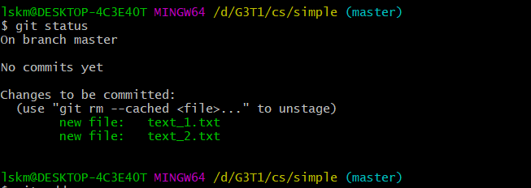

  ```
  git diff
  ```

  命令用于显示提交和工作树等之间的更改。此命令比较的是工作目录中当前文件和暂存区域快照之间的差异,也就是修改之后还没有暂存起来的变化内容，用法如下：

  ```
  git diff <file> # 比较当前文件和暂存区文件差异 git diff
  
  git diff <id1><id1><id2> # 比较两次提交之间的差异
  
  git diff <branch1> <branch2> # 在两个分支之间比较
  git diff --staged # 比较暂存区和版本库差异
  
  git diff --cached # 比较暂存区和版本库差异
  
  git diff --stat # 仅仅比较统计信息
  ```

  如下图所示：

  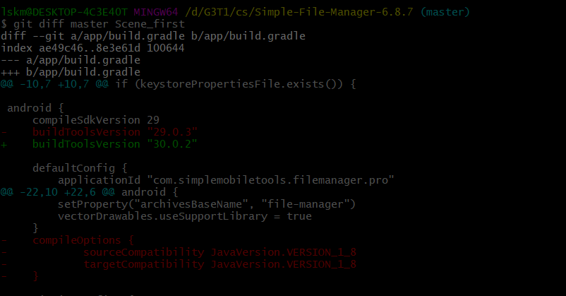

  是分支之前的差别

  ```
  git log
  ```

  命令用于显示提交日志信息,如下图：

  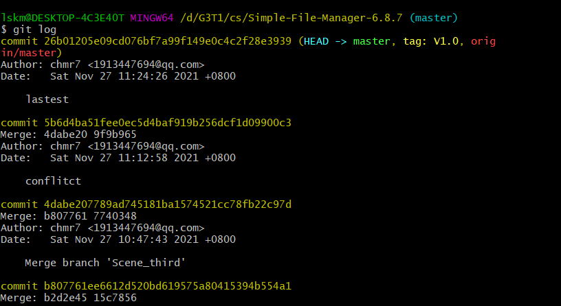

  ```
  Git reset
  ```

  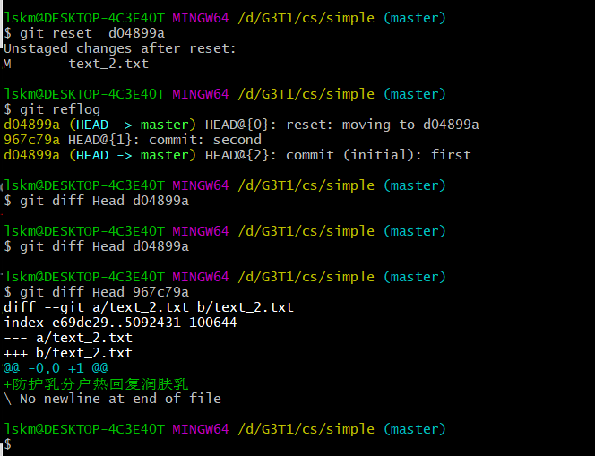

  回退到第一版之后，查看Head的指针与第一版和第二版之间的区别，发现与第一版没有区别，与第二版有区别，则成功回退。

- 实验三相关

  - 首先将原来的初始版本commit，并打标签为V0.0

    如下：

    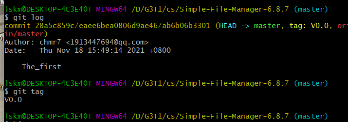

  - 然后创建不同的分支并在不同的分支上进行修改以及commit，如下：

    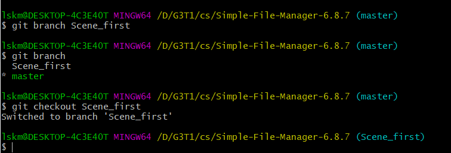

    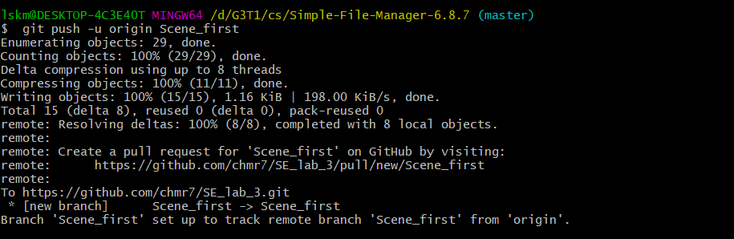

    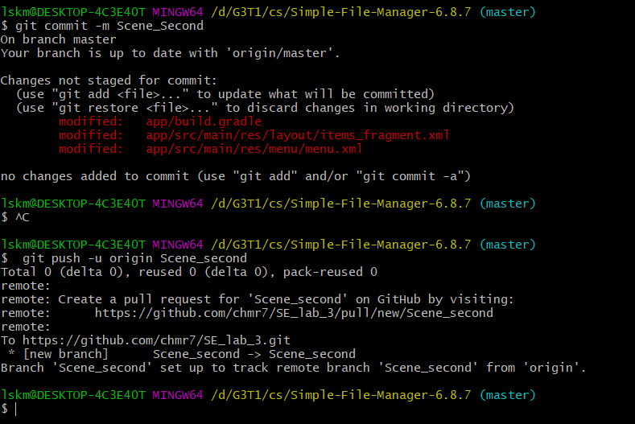

  - 进行分支之间的合并 ，使用`Git merge`命令，如下：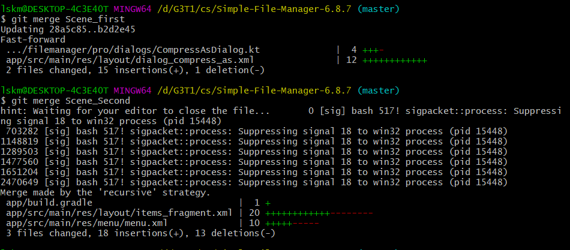在第四个分支合并的时候，出现了冲突，然后手动解决冲突，之后将冲突的文件再次commit，如下：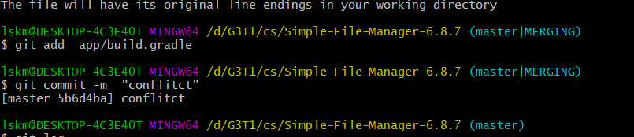

  - 使用 `Git log --graph`查看记录

    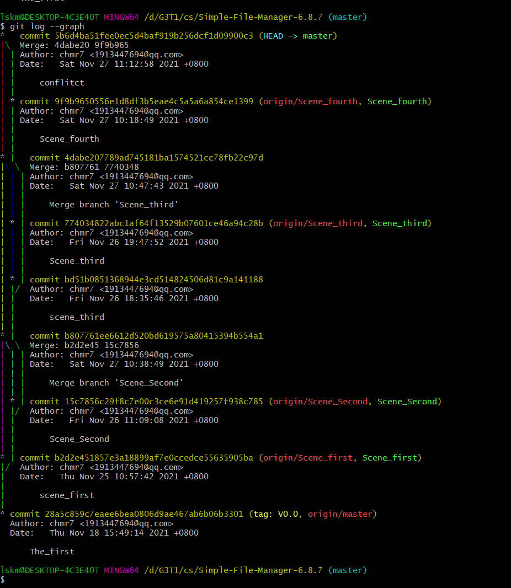

  - 最后提交当前版本，并且打标签为V1.0

    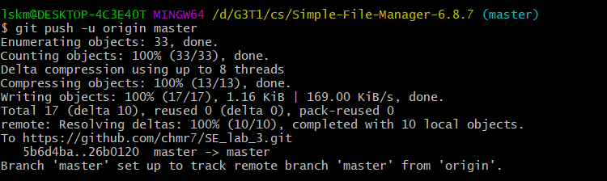

    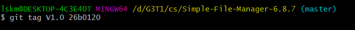

###### 问题：

- 使用Git的好处？

  - 本地拥有版本库，可以随时进行版本后退

  - 可以建立分支，然后在分支上修改，修改之后commit到该分支对应的本地库的位置，分支开发失败之后不会影响其他代码，可以防止污染源代码
  - 适合于分布式开发，

- 使用远程仓库的好处？
  - 将项目的数据同步到云端，将数据备份，可以防止本地数据丢失
  - 适合协同开发，不同的地方不同的电脑都可以拉取项目开发。

- 在开发中使用分支的好处？
  - 在版本控制过程中，同时推进多个任务，我们为每个任务创建单独分支
  - 可以把自己的工作从开发主线上分离开来，开发自己分支的时候，不会影响主线分支的运行
  - 同时并行推进多个功能开发，提高开发效率
  - 各个分支在开发过程中，如果某一个分支开发失败，不会对其他分支有任何影响

- 你在实际开发中有哪些体会和经验？
  - 在项目开发中使用Git以及远程仓库的是十分有用的，方便项目开发管理。

- merge和rebase的区别？

  - 当要合并两个分叉的分支时，merge的方式是将待合入分支和当前分支不同的部分，在当前分支新建节点，而rebase会将合入分支上超前的节点在待合入分支上重新提交一遍，看起来会变成线性历史。

    