# 软件工程 Lab6

### 一、实验名称

项目协同开发管理与工具集成环境实验

### 二、实验目的

1. 了解协同开发与持续集成过程
2. 学会使用项目协同开发管理工具 git/github
3. 了解持续集成并使用 jenkins 自动构建项目

### 三、实验环境

1. 软件：JDK 1.8, Android Gradle Plugin 2.3.0, Gradle 3.3
2. 硬件
   1. 安卓模拟器版本：Android Studio Monitor, Pixel 2, API 30 (Google Play)
   2. 系统：Windows 10.0, Intel i7-9750
3. 项目名称：filemanager-0.5 (App 2)

### 四、实验内容

### 五、实验结果与说明

#### 0、init 代码仓库，并初次提交

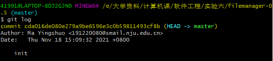

#### 1、先随便修改、提交、回退一下

在仓库中修改一下 com.michaldabski.filemanager.folders.FolderActivity (把最上面的 CopyRight 注释去了)

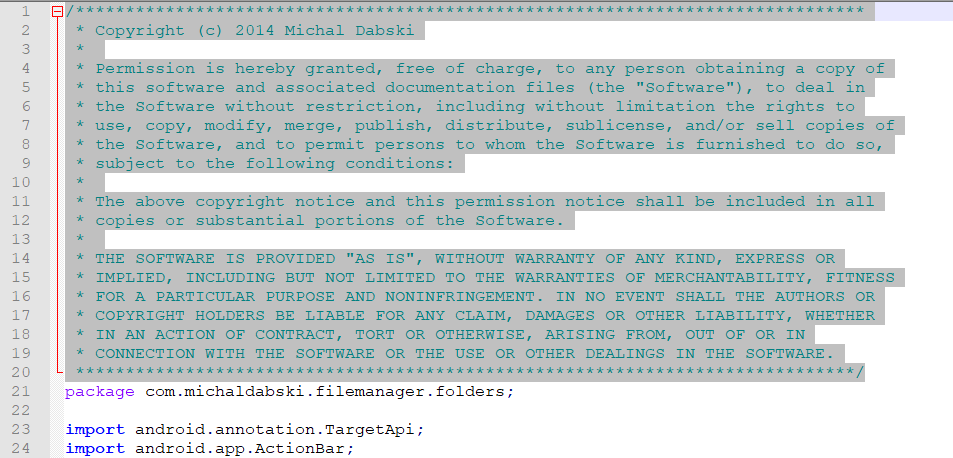

之后我们 git status 看一下

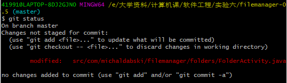

可见 git 已探测到工作区变化。

现在用 git diff 看一下具体情况

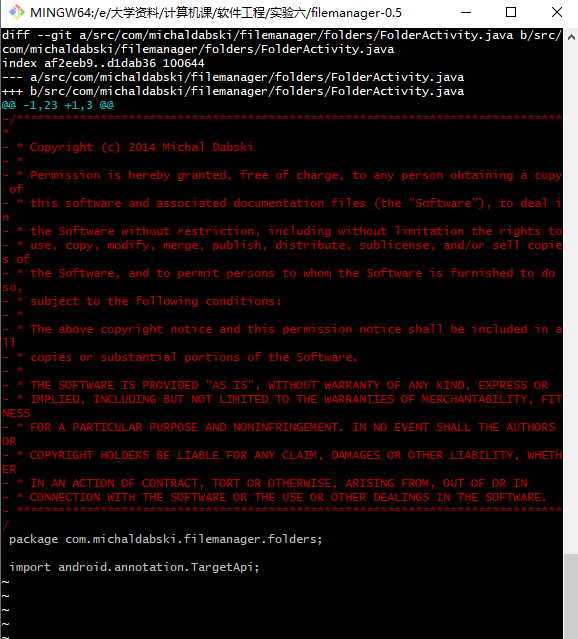

然后我们 add、提交，看一下 git log

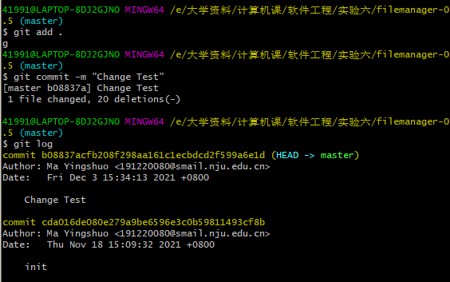

由于这只是做个测试随便玩一玩 git，所以我们 git reset 回退到 init

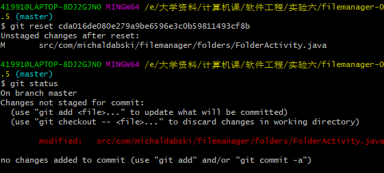

其实这个回退只是版本回退，工作区没变。我们现在想把工作区也就是实际代码回退，那么只需要 git reset --hard。

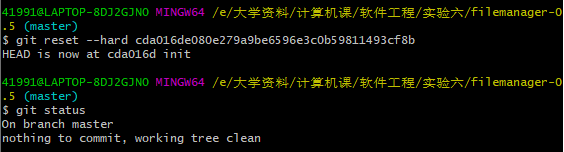

如此，代码便回到最初状态；此时之前的 Change Test 提交也没了。

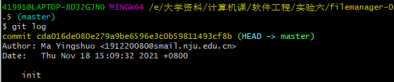

#### 2、实验三的分支开发

实验三我新增了个“新建文件”功能。于是我们创建分支 newfile：

##### 分支 newfile

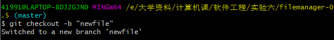

完成功能后，检查一下状态：

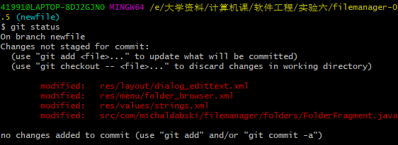

接下来我们提交一下

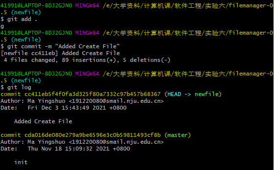

##### fix 分支

在实验四中还有一个尝试修复 errors 或尝试解决 warnings 的操作，我这里完善了各种 values 文件夹下的 strings.xml，然后 git status 看一下：

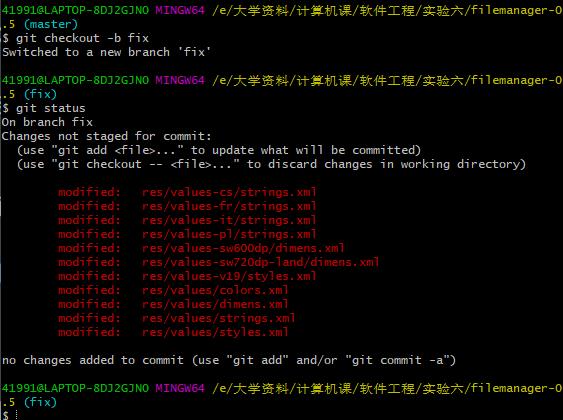

之后提交：

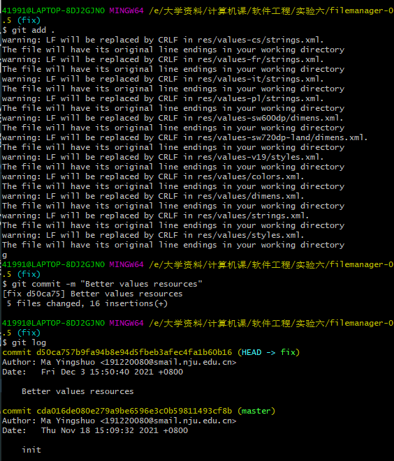

ok，现在回到 master 分支 (git checkout master)，merge 两个分支

首先 merge newfile 分支，由于 newfile 分支仅仅比 master 分支多一次 commit，所以就像是在 master 分支上提交了一次：

之后 merge fix 分支，由于 fix 分支和此时的 master 分支不是版本历史包含关系，需要输入一个 merge 信息。

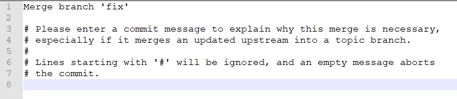

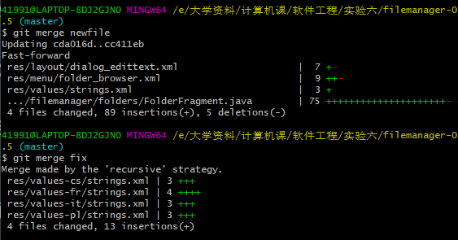

本次 merge 两个分支没有出现 conflicts，不需要解决冲突。

接下来看看 git log --graph：

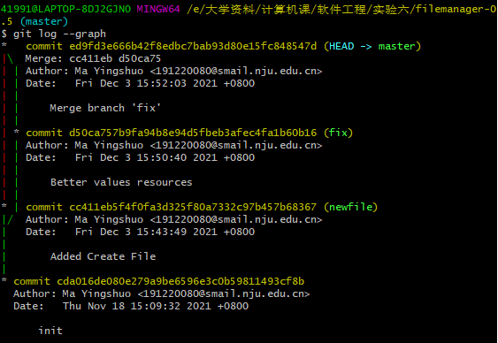

给最新版打上标签：

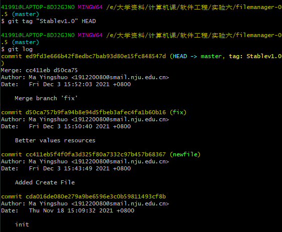

#### 3、推送到 Github

首先加入远端仓库地址：

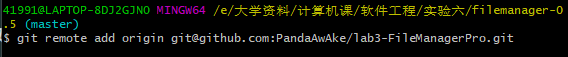

之后把三个分支推送上去：

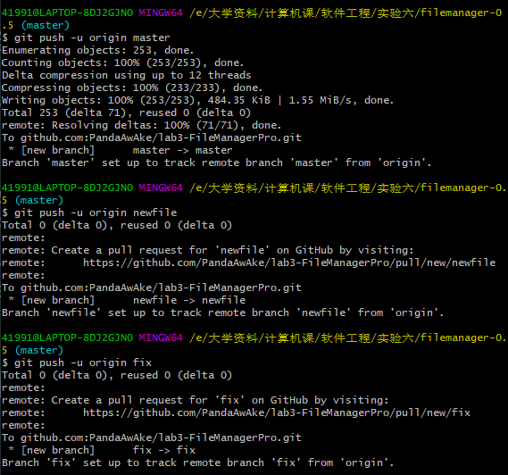

这个时候 Github 仓库中并没有标签，我们 push 的时候加上 --tag：

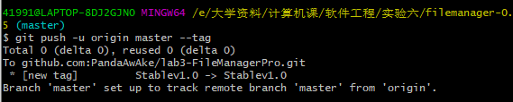

之后便可以在 Github 上看到标签：

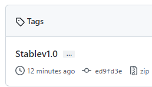

#### 4、Jenkins 集成构建尝试

我先安装、配置好了 Jenkins，然后构建了一次 (#2)，之后修改一点代码 push 到远端仓库，然后再构建一次，过程如下：

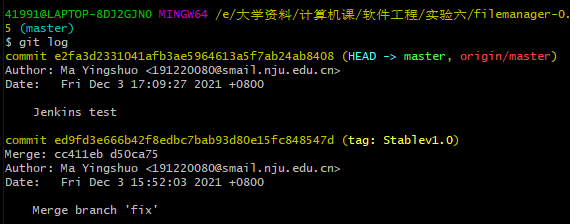

### 六、问题与讨论

1. **使用 git 的好处？**
   * 已经成为当今大系统开发必不可少的一部分；
   * 本地有版本库，可以随时进行版本回退；
   * 建立分支简单，方便多人多设备同时开发，分布式开发，效率很高；
   * 速度快、效率高，本地修改，统一推送；
   * 可以与多个不同远端代码仓库交互；
   * 能查看代码修改历史，每一个文件都有历史，每一个版本如何修改都有记录。

2. **使用远程仓库 (如 github/gitee 等) 的好处？**
   - 进行高效分布式、协同开发；
   - 相当于是云备份的一份数据，可以方便地在多个设备上对同一个仓库进行开发，也可以防止本地数据意外丢失。

3. **在开发中使用分支的好处？你在实际开发中有哪些体会和经验？**
   - 分支极大地方便了不同开发组的工作，使开发不同功能模块的开发组互不干扰；
   - 实际开发中，我在某开发小组中进行代码编写。这个仓库中有若干个分支，我所在的项目研发小组则只需要在其中一个特定的分支进行开发，即使研发小组内在这一个分支内的提交可能会产生 conflicts；但其他项目研发组不会干扰我们的开发，我们的开发因分支而独立。在开发过程中只需处理小组内的 conflicts，这样的话开发效率很高。最后只需要集成到 main 分支即可完成产品交付。
4. git stash 的使用
   - 有时，我们在工作区进行一些新功能开发，但假定另一个分支的代码突然急需我们去修改，而手头的这个分支在工作区的变化不适合作为一次 commit 提交，怎么办？这时就需要 git stash 了。
   - 我们可以 git stash 将工作区的变化先存起来，此时便可以 checkout 到其他分支；
   - 当我们解决好其他分支的问题，再回到这个分支，此时只需 git stash pop 即可恢复工作区状态，继续我们之前的开发。