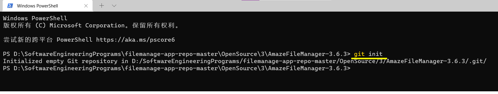

<b>南京大学 计算机科学与技术系</b>

<b>软件工程实验报告</b> 

<b>
    &nbsp&nbsp&nbsp&nbsp
    实验名称：
    <u>&nbsp&nbsp
    项目协同开发管理与工具集成环境实验
    &nbsp&nbsp</u>
     &nbsp&nbsp&nbsp&nbsp
    学&nbsp&nbsp&nbsp&nbsp号：
    <u>&nbsp&nbsp&nbsp&nbsp&nbsp&nbsp&nbsp&nbsp&nbsp&nbsp&nbsp&nbsp&nbsp&nbsp
    191220081
    &nbsp&nbsp&nbsp&nbsp&nbsp&nbsp&nbsp&nbsp&nbsp&nbsp&nbsp&nbsp&nbsp&nbsp&nbsp</u>
     &nbsp&nbsp&nbsp&nbsp
    姓&nbsp&nbsp&nbsp&nbsp名：
    <u>&nbsp&nbsp&nbsp&nbsp&nbsp&nbsp&nbsp&nbsp&nbsp&nbsp&nbsp&nbsp&nbsp&nbsp&nbsp
    毛彦杰
    &nbsp&nbsp&nbsp&nbsp&nbsp&nbsp&nbsp&nbsp&nbsp&nbsp&nbsp&nbsp&nbsp&nbsp&nbsp&nbsp&nbsp</u>
	 &nbsp&nbsp&nbsp&nbsp
    指导教师：
    <u>&nbsp&nbsp&nbsp&nbsp&nbsp&nbsp&nbsp&nbsp&nbsp&nbsp&nbsp&nbsp&nbsp&nbsp&nbsp&nbsp
    张天
    &nbsp&nbsp&nbsp&nbsp&nbsp&nbsp&nbsp&nbsp&nbsp&nbsp&nbsp&nbsp&nbsp&nbsp&nbsp&nbsp&nbsp&nbsp</u>
     &nbsp&nbsp&nbsp&nbsp
    实验地点：
    <u>&nbsp&nbsp&nbsp&nbsp&nbsp&nbsp&nbsp&nbsp&nbsp&nbsp&nbsp&nbsp
    实验楼乙区211
    &nbsp&nbsp&nbsp&nbsp&nbsp&nbsp&nbsp&nbsp&nbsp&nbsp&nbsp&nbsp&nbsp</u>
     &nbsp&nbsp&nbsp&nbsp
    实验时间：
    <u>&nbsp&nbsp&nbsp&nbsp&nbsp&nbsp&nbsp&nbsp&nbsp&nbsp&nbsp&nbsp&nbsp
    2021.11.24
    &nbsp&nbsp&nbsp&nbsp&nbsp&nbsp&nbsp&nbsp&nbsp&nbsp&nbsp&nbsp&nbsp&nbsp&nbsp</u>
    </b> 

### 一. 实验名称

**项目协同开发管理与工具集成环境实验**

### 二. 实验要求

1. 了解协同开发与持续集成过程。
2. 学会使用项目协同开发管理工具git/github。
3. 了解持续集成并使用jenkins自动构建项目。

### 三. 实验环境

​	1.软件（JDK，Android SDK，Gradle）：

​		JDK : JDK1.8

​		Android SDK : Android 12.0 (S)

​		Gradle : 6.7.1

​	2.硬件（安卓模拟器版本）：Android 11.0 x86_64

​	3.项目名称：AmazeFileManager-3.6.3

### 四. 实验内容

-  安装git，在本地将你的开源项目目录初始化为git 仓库(如已有.git 文件夹请先删除)

-  在本地尝试修改、提交、回退等过程，在报告中展示你的操作，并使用git diff, git log, git status 等命令展示操作前后的区别

- 根据实验三针对几个页面进行微调的任务，在本地为每个子任务创建一个分支并在各分支上进行开发，最终将所有修改合并到master 分支上；如有冲突请尝试解决。在报告中展示你的操作，并使用git log --graph 命令展示分支合并图

- 给你的某个稳定版本的代码打上标签

- 注册github 账号，在账号中创建远程仓库(权限请设置为public)；把本地的所有分支和标签推送到远端

-  使用pull request 提交自己的代码和报告(作业提交说明里细 )

- 在报告中回答以下问题：

  ​	·使用git 的好处？
  ​	·使用远程仓库(如github/gitee 等) 的好处？
  ​	·在开发中使用分支的好处？你在实际开发中有哪些体会和经验？

- 如果你额外学习并实践了关于git/github 的其他进阶操作(如merge 和rebase 的区
  别、reset 和revert 的区别、stash, cherry-pick 的使用等)，可在报告中展示

  

  

### 五. 实验结果与说明

#### 1. 将开源项目目录初始化为git仓库

在开源项目目录下打开 cmd 或 powershell 或 "右键-git bash here"，输入`git init`命令即可初始化git仓库

#### 2.在本地尝试修改、提交、回退等操作

在项目文件夹下添加文本文件test.txt

输入命令`git add .` 再输入`git commit -m "test1"`

输入`git log`可查看提交历史

往空的test.txt中写入"hello world"内容并保存

使用`git status`查看当前仓库状态，可见test.txt被修改过了，但还没有提交修改。

使用`git diff`查看做了什么修改,可以发现是加上了内容hello world

再次`git add .` `git commit -m "test2"` 进行提交，通过 `git log` 可见当前有两次提交，当前处于的提交版本是test2

使用`git reset --hard HEAD^` 回退到上一个版本，使用`git reset --hard 版本号` 回退到指定版本，版本号可在git log中查看，如上图红色框框出的部分。执行完git reset命令后，通过git log可以看到现在已经回到了test1版本。

此时再打开test.txt可以发现之前添加的内容已经消失

#### 3.在本地为实验三的每个微调任务创建一个分支，并在各分支上进行开发

使用`git switch -c dev` 命令创建并切换到dev分支(不稳定的测试版本分支),使用`git branch` 查看分支信息如图

再`git switch -c feature1`创建并切换到feture1分支进行第一个子模块的开发

feature1开发完后，`git add .` + `git commit` 提交到feature1分支上

`git switch dev` 切换回dev分支，再使用`git merge --no-ff -m "feature1 complete" feature1` 在禁用Fast Forward的情况下将feature1合并到dev中，同时提交。

使用`git log --graph --pretty=oneline --abbrev-commit` 查看精简版图形化分支如下图所示，其中`--pretty=oneline` 参数是将每条日志都只显示一行，`--abbrev-commit` 参数是使得每个版本号只精简显示最前面几个字符，而不全部显示。

同理，建立feature2和feature3分支并在最后一起合并到dev分支上，再次检查确定没有问题后合并到master分支，视为发布的稳定版本。使用命令`git log --graph --pretty=oneline --abbrev-commit` 查看精简版分支图如下所示：

为master分支上的最终版本打上标签：

最后删除feature1,feature2,feature3分支：

#### 4.把本地的所有分支和标签推送到远端

使用`git remote add origin [URL]` 添加远程仓库；

第一次push需要创建主分支`git push --set-upstream origin master` 

使用`git push --tags` 将所有标签进行推送

#### 5.使用pull request 提交的代码和报告

在fork分支下点击`Create pull request` 然后将push的远程仓库提交PR。

待原仓库所有者批准后即可成功pull request

#### 6. 相关问题回答

##### 1）使用git的好处？

- 可以建立分支，适合分布式开发。任意两个开发者之间可以很容易的解决分支冲突。

- 支持离线工作。随时可以在本地版本库进行版本回退，速度快、灵活。公共服务器压力和数据量都不会太大。

- 可以指定和多个远端代码仓库进行交互，可以根据需要设定不同的协作流程，比如层次模型式的工作流。

  

##### 2）使用远程仓库(如github/gitee等)的好处？

- 更方便团队的协作开发。

- 将数据保存在远端，还相当于网络备份，可以避免本地设备原因导致数据丢失。

- 更有利于开源社区的建设，使得不同的开发者可以互相查看和下载自己需要的代码，更有利于开发者学习和改进开源项目。

  

##### 3）在开发中使用分支的好处？你在实际开发中有哪些体会和经验？

​	**使用分支的好处：**

- 不同版本代码的开发互不影响，可同时进行，提高了开发效率。
- 保护了主分支的干净稳定、完整可用，也使得项目的版本迭代更加清晰。

​	**我的体会**：

- 在学习git前我在开发项目时经常是做一个功能就手动拷贝备份一次，非常麻烦，但又因怕bug导致程序崩溃而不得不做这样的备份。使用git后大大提高了开发效率。

- 进行分支操作使我开发每个功能的逻辑更加清晰，原本是一维线性地开发项目，加完一个功能再加下一个，现在两个功能可以同时进行开发，有种每个功能就是一条产品线的感觉。另外如果两种功能是相辅相成，以前只能把一个功能完全做好再接着做另一个，现在建立分支进行开发就更加方便两个功能同步开发和调试了。

- 熟练在命令行使用git后，感觉在命令行进行git操作比使用SourceTree之类的git的图形化工具要更方便。

  

#### 7. git其他功能

##### 1）`git rebase`和`git merge` 的区别 

`git rebase` 把分叉的提交历史“整理”成一条直线，看上去更直观。缺点是本地的分叉提交已经被修改过了。

而`git merge` 会把保留所有分支commit，只是把每个分支末端合并。

##### 2) `git reset` 和`git revert` 的区别

1. git revert是用一次新的commit来回滚之前的commit，git reset是直接删除指定的commit。
2. 在回滚这一操作上看，效果差不多。但是在日后继续merge以前的老版本时有区别。因为git  revert是用一次逆向的commit“中和”之前的提交，因此日后合并老的branch时，导致这部分改变不会再次出现，但是git  reset是之间把某些commit在某个branch上删除，因而和老的branch再次merge时，这些被回滚的commit应该还会被引入。
3. git reset 是把HEAD向后移动了一下，而git revert是HEAD继续前进，只是新的commit的内容和要revert的内容正好相反，能够抵消要被revert的内容。

##### 3) `git stash` 

使用起因为【Git】pull错误：error: Your local changes to the following files would be overwritten by merge。

想要保存本地修改，同时将远程仓库拉取下来进行合并，故使用`git stash` 把本地快照，然后再进行git pull操作。

##### 4) `git cherry-pick [版本号]` 

当我们需要在本地合入其他分支的提交时，如果我们不想对整个分支进行合并，而是只想将某一次提交合入到本地当前分支上，那么就要使用`git cherry-pick`了。

如上图，起初的分支结构是这样的：

a→b									(master)

↓

c→d→e→f→g					(feature1)

想要只把feature1分支的g这个点的提交合到master的后面，使用`git cherry-pick [g的提交版本号]` 命令后就可以只将g并到b后面了:

a→b→g								(master)

↓

c→d→e→f→g					(feature1)

