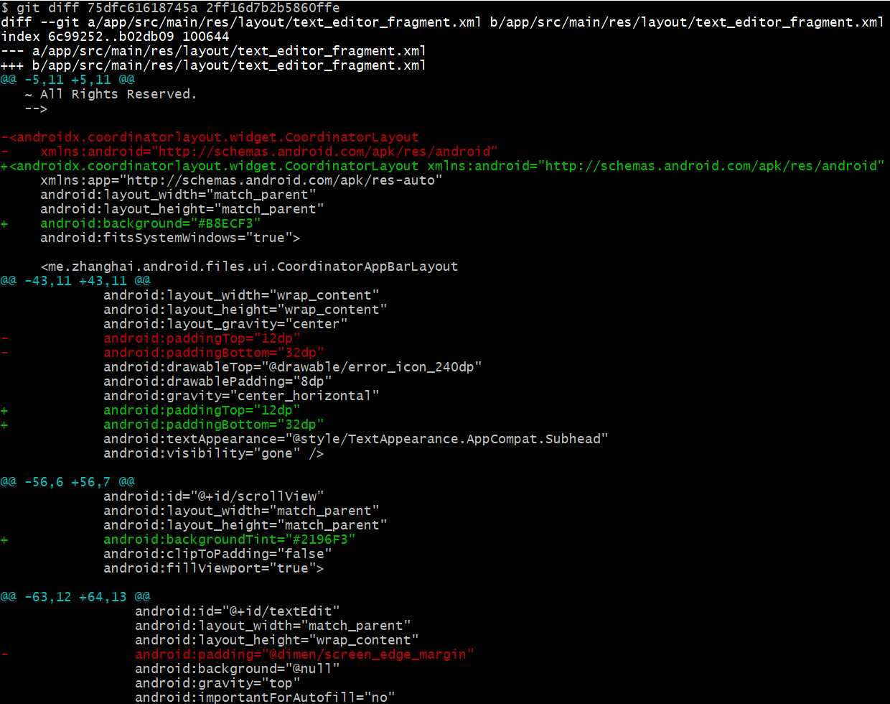

# Exp6

## git的使用

#### 在报告中回答以下问题： 

​	• 使用 git 的好处？ 

​		可以轻松的整体回退，不需要手动修改，也可以通过切换分支基于一定版本进行不同方式的修改；可以进行代码修改的统计；可以对不同版本进行标注，方便查看，比较简练的文本不需要附加文本。

​	• 使用远程仓库 (如 github/gitee 等) 的好处？

​		git配合github进行存储、异地同步比直接传输代码文件更加方便；

​		方便团队之间修改同一个架构下的代码并且方便查看、审核不同提交者的代码提交

​	• 在开发中使用分支的好处？你在实际开发中有哪些体会和经验？

​		可以进行不同的尝试而不需要担心代码之间互相冲突

#### 实际操作

+ git checkout -b 建立新分支并且切换以后命令行上会有显示

+ git merge 发现修改没有保存 清除不需要的修改之后再次merge成功

+ git status 提交后的工作区是空的

查看两次commit（初始和merge后的最终版本的差别） [参考](https://git-scm.com/docs/git-diff)

+ git log --graph 最终的分支图 读懂分支图 [参考资料](https://juejin.cn/post/6844903669758951432) 

最近一次提交与最开始的提交构成分支 新建分支并不会在图中反应，只有commit的时候才会反应

+ git tag 给当前版本加tag 当前是修改后的稳定版本 [参考](https://git-scm.com/book/zh/v2/Git-%E5%9F%BA%E7%A1%80-%E6%89%93%E6%A0%87%E7%AD%BE)

+ rebase和merge的区别: rebase后分支是一条直线，没有分叉；而merge会保留分叉，是基于commit的时间来存储的，并且认为不同分支上的commit不能合并，是不同的修改

git reset & git revert

通过commit号来回到特定的分支，如果想取消reset，需要提前记录特定的commit号，通过reset跳回。实际上是删除了commit

使用revert并没有删除commit 而是做了逆向的操作，记录上commit是增加的

