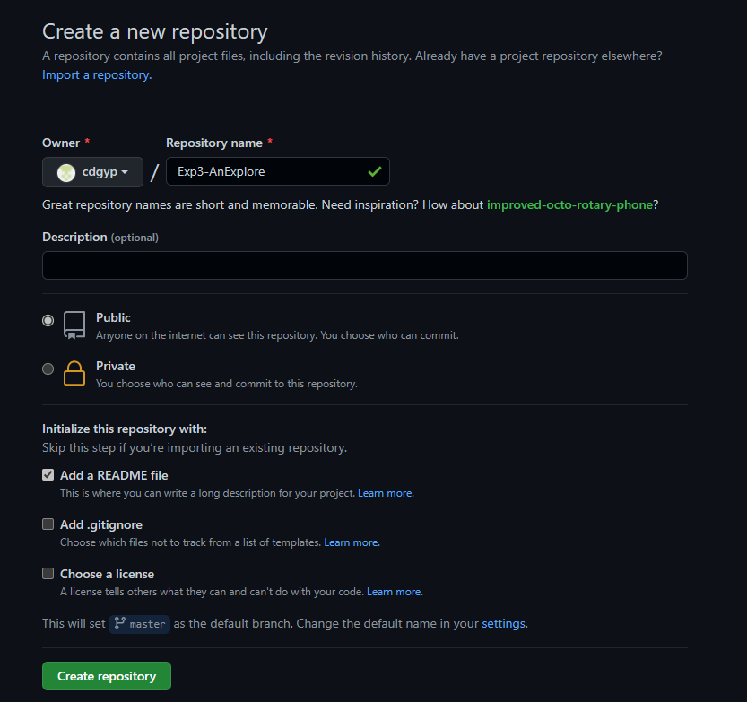
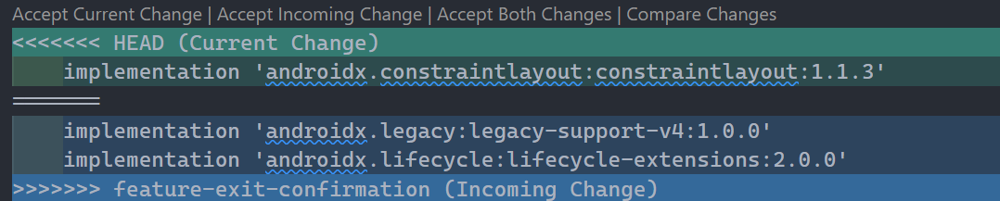
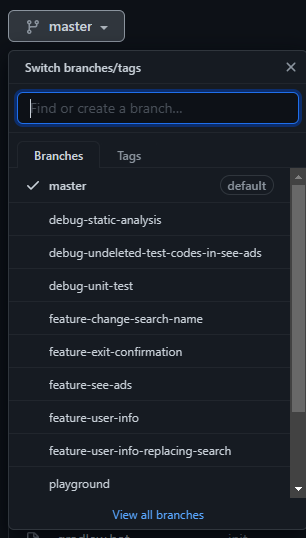
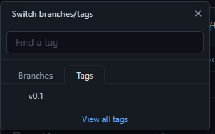

# 软件工程实验6实验报告

191220085 彭泽

## 实验名称

项目协同开发管理与工具集成环境实验

## 实验目的

1. 了解协同开发与持续集成的过程
2. 学会使用项目协同开发工具git/github

## 实验环境

1. 软件：JDK8_u231, Android SDK 26.1.1, Gradle 5.4.1, git version 2.22.0.windows.1
2. 硬件：Pixel 2 API 30

## 实验过程

### 仓库初始化

在项目目录下删除原有`.git`文件夹后，使用如下命令初始化git仓库：

```bash
git init
```

#### 远程仓库

在github的账号内新建公开代码仓库 Exp3-AnExplorer



然后将远程仓库添加到本地仓库中：

```bash
git remote add origin git@github.com:cdgyp/Exp3-AnExplorer.git
git pull origin master
```

#### 提交已有的本地文件

使用

```bash
git add .
git commit -m "init"
```

添加并提交所有已有文件。初始的项目文件存在依赖问题导致无法编译，修复该问题后，使用如下命令将所有被修改的文件提交

```bash
git add .
git commit -m "fix build problem"
```

使用`git diff`命令比较修改前后的文件，其效果为

```diff
diff --git a/app/build.gradle b/app/build.gradle
index fe09156..0f894ae 100644
--- a/app/build.gradle
+++ b/app/build.gradle
@@ -144,6 +144,7 @@ dependencies {
     debugImplementation 'androidx.multidex:multidex:2.0.1'
 }
 
+/*
 android.signingConfigs.release.storeFile rootProject.file(props.keyStore)
 android.signingConfigs.release.storePassword props.keyStorePassword
 android.signingConfigs.release.keyAlias props.keyAlias
@@ -153,3 +154,4 @@ if (getGradle().getStartParameter().getTaskRequests().toString().contains("Free"
     apply plugin: 'com.google.gms.google-services'
     apply plugin: 'io.fabric'
 }
+*/
diff --git a/build.gradle b/build.gradle
index 855e7eb..ee66513 100644
--- a/build.gradle
+++ b/build.gradle
@@ -7,7 +7,7 @@ buildscript {
         maven { url 'https://maven.fabric.io/public' }
     }
     dependencies {
-        classpath 'com.android.tools.build:gradle:3.5.0-beta04'
+        classpath 'com.android.tools.build:gradle:3.5.2'
         classpath 'com.google.gms:google-services:4.3.0'
         classpath 'io.fabric.tools:gradle:1.28.1'
 

```

随后在git的辅助下进行实验3。在实验3中，我将对 AnExplorer 作出3项界面修改，分别是：增加用户信息页面和按钮、增加广告页面、增加退出询问。为此，新建三个feature分支分别进行开发：

```bash
git checkout master
git checkout -b feature-user-info
git checkout master
git checkout -b feature-see-ads
git checkout master
git checkout -b feature-exit-confirmation
```

### feature开发

对于三个feature，分别在三个分支上进行开发。每当完成一定程度的修改，就是用`git add <被修改的文件名>`和`git commmit -m <更新内容描述>`将修改提交到分支上。

在进行feature-see-ads上的开发时，故意遗留了一段没有完全删除、会妨碍编译的实验性代码以模拟bug。

### 分支合并

每完成一个分支的开发后，就将其合并到master分支上

```bash
git checkout master
git merge feature-xxx-xxx
```

在完成feature-exit-confirmation并将其合并到master时，发生了如下错误：

```log
git merge feature-exit-confirmation
Auto-merging app/src/main/res/values/strings.xml
Auto-merging app/src/main/java/dev/dworks/apps/anexplorer/DocumentsActivity.java
Auto-merging app/build.gradle
CONFLICT (content): Merge conflict in app/build.gradle
Automatic merge failed; fix conflicts and then commit the result.
```

说明 app/build.gradle 中存在无法自动解决的冲突，需要手动解决。打开该文件，发生冲突的位置被 git 用`<<<<<<<`和`>>>>>>`指出并标注来源：

```
<<<<<<< HEAD
    implementation 'androidx.constraintlayout:constraintlayout:1.1.3'
=======
    implementation 'androidx.legacy:legacy-support-v4:1.0.0'
    implementation 'androidx.lifecycle:lifecycle-extensions:2.0.0'
>>>>>>> feature-exit-confirmation
```

采用 feature-exit-confirmation 的依赖，故将来自`HEAD`的内容和标注删除。此外，这些标注会被 IDE 或文本编辑器识别，可以方便地选择：



然后重新运行`git merge`命令，成功将 feature-exit-confirmation 分支合并到master

在完成 feature-see-ads 分支后，将其合并至 master 分支：

```bash
git checkout master
git merge feature-see-ads
```

遇到如下错误：

```
git merge feature-see-ads
Auto-merging app/src/main/res/values/strings.xml
Auto-merging app/src/main/AndroidManifest.xml
CONFLICT (content): Merge conflict in app/src/main/AndroidManifest.xml
Auto-merging app/build.gradle
CONFLICT (content): Merge conflict in app/build.gradle
Automatic merge failed; fix conflicts and then commit the result.
```

说明 app/src/main/AndroidManifest.xml 和 app/build.gradle 中存在无法自动解决的冲突。

打开 AndroidManifest.xml，可见冲突为：

```
<<<<<<< HEAD
        android:theme="@style/Theme.AppCompat"
        android:supportsRtl="true"
        android:usesCleartextTraffic="true"
        tools:replace="android:label">
        <activity android:name=".UserInfoActivity"></activity>
=======
        android:supportsRtl="true"
        android:theme="@style/Theme.AppCompat"
        android:usesCleartextTraffic="true"
        tools:replace="android:label">
        <activity android:name=".SeeAdsActivity"></activity>
>>>>>>> feature-see-ads
```

采用 feature-see-ads 的版本，将上方的内容和 git 产生的标注删除。

打开 app/build.gradle，可见冲突为：

```
<<<<<<< HEAD
    implementation 'androidx.legacy:legacy-support-v4:1.0.0'
    implementation 'androidx.lifecycle:lifecycle-extensions:2.0.0'
=======
>>>>>>> feature-see-ads
```

采用来自 feature-see-ads 的内容，将上方的内容和 git 产生的标注删除。随后重新运行`git merge`命令，成功将其合并至 master 分支。

合并 feature-user-info 时没有遇到冲突。

### bug 修复

在合并了三个分支的 master 中尝试编译运行 APP，由于之前故意遗留的bug失败。定位到错误后，为了对其修正，新建 debug 分支：

```bash
git checkout master
git checkout -b debug-undeleted-test-codes-in-see-ads
```

在其中删除遗留代码并编译、运行成功后，将其合并回 master 分支：

```bash
git checkout master
git merge debug-undeleted-test-codes-in-see-ads
```

之后在 master 中可以正常编译、运行 APP。

### 添加 tag

目前 master 可以视为一个稳定的版本，为其增加 tag：

```bash
git tag v0.1
```

### 向远程仓库推送

使用如下命令将 master 分支推送至远程仓库：

```bash
git push origin master
```

然后将几个 feature 分支也推送至远程仓库：

```bash
git push origin feature-user-info
git push origin feature-see-ads
git push origin feature-exit-confirmation
```

将 tag 也推送到远程仓库

```bash
git push origin v0.1
```

或将所有分支和 tag 推送到远程仓库（如实验要求）：

```bash
git push origin --all
git push origin --tags
```

## 实验结果和思考

### git log

运行`git log --graph`得到如下的提交记录：

```log
* commit e5178a01e9fe185843f13a2ff76f9c4c8e3ccc08
| Author: cd <gyp>
| Date:   Sun Nov 21 21:25:44 2021 +0800
| 
|     移除SeeAdsActivity中的未删除的实验代码
|   
*   commit ddd55b29fd816c87fe8160901a6787817a304dea
|\  Merge: 103d64f 49b4742
| | Author: cd <gyp>
| | Date:   Sun Nov 21 21:23:00 2021 +0800
| | 
| |     将dev-see-ads合并到master
| | 
| * commit 49b4742e48e4730df8a107cf324a2f2aee79e227
| | Author: cd <gyp>
| | Date:   Sun Nov 21 18:23:06 2021 +0800
| | 
| |     在广告页面添加返回按钮
| | 
| * commit adc9faa4bec82f791d647447c406d2d71759912b
| | Author: cd <gyp>
| | Date:   Sun Nov 21 18:19:25 2021 +0800
| | 
| |     在AbountActivity中添加通向广告页面的按钮
| | 
| * commit 3cb8a09deb262469e009dae0ef467fc7f1384e0f
| | Author: cd <gyp>
| | Date:   Sun Nov 21 18:12:10 2021 +0800
| | 
| |     添加广告页面
| |   
* |   commit 103d64f0338257443f14c8f7f5fc3e97f5da51c0
|\ \  Merge: 4061b1d 9f0490b
| | | Author: cd <gyp>
| | | Date:   Sun Nov 21 20:23:51 2021 +0800
| | | 
| | |     将dev-exit-confiermation合并到master
| | | 
| * | commit 9f0490b4f0e5db35c7d032a84b98b66627f6e422
| |/  Author: cd <gyp>
| |   Date:   Sun Nov 21 18:04:39 2021 +0800
| |   
| |       添加（使用菜单退出）退出确认
| | 
* | commit 4061b1d2038dea714dca3943b91ca351e84e3af4
| | Author: cd <gyp>
| | Date:   Sun Nov 21 20:15:31 2021 +0800
| | 
| |     将User Info按钮的处理移入menuAction函数
| | 
* | commit 0fd7f542b04e995b4337cba115771cf28c84149e
| | Author: cd <gyp>
| | Date:   Sun Nov 21 17:17:04 2021 +0800
| | 
| |     使UserInfo界面的控件布局更整齐
| | 
* | commit c25373b03f036242d8b026b03013ff158fdd2063
| | Author: cd <gyp>
| | Date:   Sun Nov 21 17:11:56 2021 +0800
| | 
| |     将UserInfo界面的修改保存
| | 
* | commit d0ad0304a737cef66db19ff9fa475c1f7cfcf68f
| | Author: cd <gyp>
| | Date:   Sun Nov 21 16:53:38 2021 +0800
| | 
| |     将UserInfo封装成类
| | 
* | commit 25c74ed518c8bd502d230845be4d98cc76e18aa9
|/  Author: cd <gyp>
|   Date:   Sun Nov 21 02:38:56 2021 +0800
|   
|       添加UserInfo活动及其在工具栏上的入口按钮
| 
* commit 0dad4282341dea702a1c347a8fb8745e3c0c0342
| Author: cd <gyp>
| Date:   Thu Nov 18 15:41:09 2021 +0800
| 
|     fix build problem
| 
* commit d8edfc825e4e4a02a0ea69b1742318129a09136f
| Author: cd <gyp>
| Date:   Thu Nov 18 15:36:13 2021 +0800
| 
|     init
| 
* commit 5c687dcf567806aa3330bd6877e83ddb9b41e6ea
  Author: cdgyp <787586229@qq.com>
  Date:   Thu Nov 18 14:51:36 2021 +0800
  
      Initial commit
```

### 远程仓库

将所有分支推送到远程仓库后可以在远程仓库处查看所有分支和 tag 的情况：





其中许多分支是实验4、5中增加的，playground 分支是实验3早期对 APP 代码进行试探性修改的分支。


### 使用 git 的好处

git 使版本控制被自动化，无需手动备份旧版本。版本切换、分支合并的过程自动进行，能够处理大部分情况的冲突处理功能让分工开发更加便捷。方便的版本控制鼓励多次提交，让开发过程更加清晰，也可以在旧版本中检查 failure 或 error 的存在性来加速对 fault 的定位。

git 通过储存变化来储存各个版本，节约磁盘空间。

### 使用远程仓库的好处

远程仓库让程序员可以在不同设备间同步代码。

远程仓库提供了分工开发、合并成果的场所。公开的代码仓库可以被社区人员阅读，一般也提供 pull request 等功能，是开源社区的重要工具。

程序员可以将 debug 分支等保留在本地仓库，让提交到公共远程仓库中仅储存重要的分支和版本。

远程仓库可以配合自动化测试、集成工具使用。

### 使用分支的好处

在进行实验3/6时我学习了 [a successful git branching model](https://nvie.com/posts/a-successful-git-branching-model/) 中的分支使用方法，但因为实验3较为简单、不存在 release 等，故没有区分 master, dev 和 release 分支，仅为每个 feature 和每个 bug 的修复单独新建分支。

分支使得多个版本可以互不干涉地同时存在，让源自同一份代码的两个版本可以用分支维护，也让不稳定版本的代码可以被提交但不会显示在稳定版本中。

使用分支开发一个 feature 时，可以避免其他 feature 的提交的干涉，只需关注 feature 自身的代码和提交，直到 feature 完成并进行分支合并。这使得分工更好进行，因此和远程仓库间的协作和 pull request 等都是以分支为基础。

在实验时合并 feature-see-ads 到 master 后，发现 master 的提交记录类似直接在 master 分支上进行提交。查询资料后，知应当使用`--no-ff`选项让这次分支合并被直接显示。